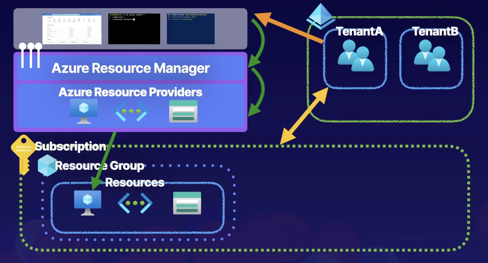

- Chapter 1 - Introduction
- Chapter 2 - Supplementary
- [Chapter 3 - Azure Administration](#chapter-3---azure-administration)
- [Chapter 4 - Governance and Compliance](#chapter-4---governance-and-compliance)
- [Chapter 5 - Identity](#chapter-5---identity)
- [Chapter 6 - Role-Based Access Control](#chapter-6---role-based-access-control)
- [Chapter 7 - Azure Storage](#chapter-7---azure-storage)
- [Chapter 8 - Virtual Networking](#chapter-8---virtual-networking)
- [Chapter 9 - Intersite Connectivity](#chapter-9---intersite-connectivity)
- [Chapter 10 - Azure Virtual Machines](#chapter-10---azure-virtual-machines)
- [Chapter 11 - Network Traffic Management](#chapter-11---network-traffic-management)
- [Chapter 12 - Web Apps and Containers](#chapter-12---web-apps-and-containers)
- [Chapter 13 - Monitoring](#chapter-13---monitoring)
- [Chapter 14 - Backup and Recovery](#chapter-14---backup-and-recovery)
- Chapter 15 - Wrap-up and Practice

# Chapter 3 - Azure Administration

- [Azure Resource Manager](#azure-resource-manager)
- [Azure Portal and Cloud Shell](#azure-portal-and-cloud-shell)
- [Azure CLI and PowerShell](#azure-cli-and-powershell)
- [ARM Templates](#arm-templates)

## Azure Resource Manager

### Azure Cloud Fundamentals

What are clouds made of?
**Resources:**

- An entity managed by Azure.
- VMs, storage accounts, and virtual networks.
- Logically grouped into resource groups.
  **Resource Groups:**
- Logical container for grouping resources.
- Based on common lifecycle and security.
- Associated with Azure subscriptions.
  **Azure Subscriptions:**
- Logical construct that groups resources groups and associated resources.
- Billing unit for Azure Cloud.
- Controlled by Azure Resource Manager (ARM).

### Describing ARM

**Azure Resource Manager:**

- The orchestration layer for managing the Azure Cloud.
- Uses REST API endpoints.
- Connects to resource providers.
- Resource providers complete the requests.

### Overview of Azure Cloud



## Azure Portal and Cloud Shell

### Describing the Azure Portal

- Web-based portal for the Azure Cloud.
- Create and manage Azure resources.
- Use Cloud Shell.

## Azure CLI and PowerShell

### Describing Azure CLI

- A command-line utility for managing Azure resources.
- Create & manage resources without logging into Azure Portal.
- Create scripts to automate tasks.

### Describing Azure PowerShell

- A set of cmdlets for managing Azure resources.
- Create & manage resources without logging into Azure Portal.
- Create scripts to automate tasks.

### Basic Operations

Example: create resource groups:

```ps
New-AzResourceGroup -ResourceGroupName $rg -Location $location
```

```sh
az group create -name $rg -location $location
```

### Demo

To display available parameters for a cmdlet:

```ps
Get-AzResourceGroup -
```

To create a variable:

```ps
$rg = Get-Az-ResourceGroup
```

To display the variable object and/or specific properties:

```ps
$rg
$rg.ResourceId
```

To create a VM with the CLI:

```sh
az vm create `
--resource-group $rg.ResourceGroupName `
--location $rg.Location `
--name <name> `
--image UbuntuLTS `
--admin-username <username> `
--generate-ssh-keys `
--no-wait
```

To get storage information about Cloud Shell with PowerShell:

```
Get-CloudDrive
```

To get resources in table format with PowerShell:

```ps
Get-AzResource | Format-Table
```

Here is a cleaner script to delete all resources.

> [!note]
>
> **This operation is destructive. Be careful.**

`removeAll.json`

```json
{
  "$schema": "https://schema.management.azure.com/schemas/2019-04-01/deploymentTemplate.json#",
  "contentVersion": "1.0.0.0",
  "parameters": {},
  "functions": [],
  "variables": {},
  "resources": [],
  "outputs": {}
}
```

```ps
$rg = az group list --query [].name -o tsv
az deployment group create --resource-group $rg --mode Complete --template-file ~/removeAll.json
```

## ARM Templates

### Explanation

- Infrastructure as Code (IaC).
- Deploy environments quickly.
- Repeatable deployments.

### Components

Skeleton template:

```json
{
  "$schema": "https://schema.management.azure.com",
  "contentVersion": "1.0.0.0",
  "parameters": {},
  "variables": {},
  "resources": [],
  "outputs": {}
}
```

- Parameters and variables components are used to pass information to the template.
  - `parameters` - for runtime.
  - `variables` - hard-coded.
- The `resources` component is used to define resources in the template.
- The `outputs` component is used to return output from the execution of the template.

# Chapter 4 - Governance and Compliance

- [Managing Subscriptions](#managing-subscriptions)
- [Management Groups](#management-groups)
- [Azure Policy](#azure-policy)
- [Tags](#tags)
- [Locking and Moving Resources](#locking-and-moving-resources)
- [Managing Azure Costs](#managing-azure-costs)
- [Building a Cloud Governance Strategy](#building-a-cloud-governance-strategy)

## Managing Subscriptions

### Description

- Billing unit that aggregates all costs of underlying resources.
- Contain resource groups and their associated resources.
- Scoping governance and security.

### Types

- Free Trial
- Pay-as-you-Go
- Azure for Students
- etc

### Naming Conventions

- **Prod/Dev/Staging** - based on environments.
- **Department/Teams** - based on the department or team the subscription is intended for so that billing can then be easily associated with a given business unit.
- **Region** - based on the region of business that uses the subscription.

## Management Groups

### Definition

- **Managing Subscriptions** - organize and manage subscriptions by logically grouping them into management groups.
- Organizational hierarchy.
- Provides another scope for enforcing governance and compliance.

**Parent-Child Relationship**

- Root management group is the top-level.
- Management groups and subscriptions can have a single parent.
- Support 6 levels of hierarchy.

**Compliance Support**

- Azure Policies.
- Azure role-based access control (RBAC).

### Hierarchy


- Root management group access is not given by default.
- Root management group cannot be moved or deleted.
- Azure RBAC is supported for management groups.
- **Global Administrators** must be elevated to **User Access Administrator** of root group.

## Azure Policy

### Definition

**Enforce Compliance and Enable Auditing**

- Implement enterprise-level governance and compliance capabilities.

**Prohibit Resources**

- Control costs
- Restrict service access

**Allowed Locations**

- Geographical compliance

### Components

**Policy Definition**

- Defines the evaluation criteria for compliance, and defines the actions that take place. Either audit or deny should something be outside of compliance.

**Policy Assignment**

- The scope at which we will assign our policy. The scope could be a management group, subscription, resource group, or resource.

**Initiative Definition**

- A collection of policies that are tailored to achieving a singular high-level goal together (ensuring that VMs meet standards).

### Example

**Require Tags**

- Policy Definition - if a VM is being created with our tag `Project:az104`. If the VM is missing the tag, then deny creation of the resource.
- Policy Assignment - assign the policy at the scope of the resource group where the VMs will be created.

## Tags

### Description

A `name:value` pair :

- `dept:marketing`
- `Env:Prod`

Name can be 512 characters, and value can be 256 characters.
Storage accounts can have a name with only 128 characters.

### Hierarchy

- Tags are not inherited from Resource Groups by default.
- A resource can have 50 tags.

### Demo

To update Resource Group tags with Azure CLI:

```sh
az group update -n <name> --tags key1=value1 key2=value2
```

To remove tags for a VM:

```sh
az vm update -g <resource-group-name> -n <name> update --remove tags
```

To update tags for a VM:

```sh
az vm update -g <resource-group-name> -n <name> update \
--set tags.key1=value1 \
--set tags.key2=value2
```

To update tags for a Virtual Network:

```sh
az network vnet update -g <resource-group-name> -n <name> \
--set tags.key1=value1 \
--set tags.key2=value2
```

## Locking and Moving Resources

### Description

- Locks allow you to override permissions to resources.
- You can lock subscriptions, resource groups, or resources.
- Lock restrictions apply to all users and roles.

### Types of Resource Locks

- **Read-Only** - Allows authorized users to read a resource, but they cannot delete or update the resource.
- **CanNotDelete** - Allow authorized users to read and modify a resource, but they cannot delete the resource.
- Locks are inherited from the parent scope.

### Moving Resources

> [!note]
>
> Moving resources is a **write** operation.

## Managing Azure Costs

### What Impact Costs

- **Subscription Types** - Free, Pay-as-you-Go, Enterprise Agreement, and Cloud Solution Provider (CSP).
- **Resource Types** - storage account Blob storage vs Table storage.
- **Usage Meters** - utilities like overall CPU time, ingress/egress network traffic, and disk size.
- **Resource Usage** - the costs of actually using a resource.
- **Location** - cost for services varies across geographical regions.

### Cost Best Practices & Tools

**Best Practices**

- Select the appropriate resource for the use case.
- Understand resource needs (sizing).
- Deallocate resources when not needed.
- Use cloud capabilities where possible (scalability, elasticity).
- Plan costs prior to purchase.

**Cost Tools**

- Pricing Calculator
- Total Cost of Ownership (TCO) Calculator
- Microsoft Cost Management

## Building a Cloud Governance Strategy

### Definition

- Rules
- Policies
- Compliance Standards
- Control over resources
- Enforce rules, policies, and standards

### Planning a Cloud Strategy

- **Define** - define the cloud governance needs of the organization.
- **Plan** - plan which tools will be used to implement governance.
- **Ready** - understand how those tools will be used to implement governance.
- **Adopt** - implement governance for the organization using a cloud strategy.

### Governance Services

- **Management Groups & Subscriptions** - organize subscriptions into hierarchical structures.
- **Azure RBAC** - provide access to resources at varying scopes.
- **Policies** - implement policies to enforce standards.
- **Locks & Tagging** - lock resources to prevent deletion, and tag resources to categorize.

# Chapter 5 - Identity

- [Conceptualizing Azure Active Directory](#conceptualizing-azure-active-directory)
- [Managing Tenants](#managing-tenants)
- [Managing Users](#managing-users)
- [Managing Groups](#managing-groups)
- [Creating Administrative Units](#creating-administrative-units)
- [Configuring SSPR](#configuring-sspr)
- [Azure AD Device Management](#azure-ad-device-management)

## Conceptualizing Azure Active Directory

### Identity & Access Management (IAM) Basics

- **Principal** - an unauthenticated entity that will seek to authenticate as an identity.
- **Identity** - an identity profile that is authenticated against using credentials.
- **Authorizations** - actions that are permitted/prohibited for an identity to perform.

### What is Azure AD

**Identity & Access Management (IAM)**

- A global cloud-based identity service for Azure that provides an identity repository.

**Create identity Resources**

- Create users and groups.

**Manage Identity Security**

- Enable MFA, control resource access, and provide policy-based controls.

### Azure AD Tenant Architecture

> [!note]
>
> Azure Active Directory is a **global** service.


### Azure AD Features

- **IAM Platform** - IAM for Azure cloud-based resources.
- **Identity Security** - additional security with MFA and Privileged Identity Management (PIM).
- **Collaboration and Development** - Azure AD B2B for collaboration and Azure B2C to support development.
- **Monitoring** - audit logs, security monitoring, identity protection, and risk management.
- **Identity Integration** - hybrid identity and single sign-on (SSO) using Azure AD Connect and Azure AD Domain Services.
- **Enterprise Access** - additional security for apps and devices both on-premises and in the cloud.

### Active Directory vs Azure AD

| Active Directory            | Azure AD                   |
| :-------------------------- | -------------------------- |
| Organizational Units (OUs)  | Administrative Units       |
| Group Policy Objects (GPOs) | SAML, WS-Federation, OAuth |
| Kerberos, LDAP, NTLM        | Flat directory structure   |
| Hierarchical                | Cloud-based solution       |
| On-Premises                 | Global                     |

## Managing Tenants

### Planning our Organization

**Designing Tenants**

- Planning out the design of our tenant will support easy adoption.

**Build Secure Foundations**

- Set up best practices (SSPR, MFA, backup global admin, and privileged users) for specific tasks.

**Populate Identity Resources**

- Add users, create groups, add devices, and set up hybrid identity.

**Manage Apps**

- Identify apps to be used from the app gallery, and register apps from on-premises.

**Monitor & Automate**

- Monitor administrators, perform access reviews, and automate user lifecycles.

### Demo: Creating a Tenant

- In the Portal, search for `Azure Active Directory`.
- Select `Manage Tenants`.
- Select `Create`.
- Select:
  - `Azure Active Directory` - for internal use.
  - `Azure Active Directory (B2C)` - for providing outsiders access to public-facing apps.
- Enter `Organization name`.
- Enter `Domain name`.
- Select `Country/Region`.
- Select `Review + create`.

You can the also manage:

- Password resets
- Manage mobile devices - Mobility (MDM and MAM)
- Custom domain names
- Azure AD Connect for connecting to on-premises Active Directories
- Licenses
- Register devices
- External identities
- Roles and administrators

## Managing Users

### Description

Consists of:

- Administrators
- Members
  - Have default permissions.
  - These identities are JSON objects.
  - Each user can have role assignments.
  - Each user can have object ownership.
- Guests

### Types

- Administrators - users with an administrator role assigned.
- Members - regular users that are native to Azure AD.
- Guests - external users that are invited to the Azure tenant.

### Demo: Creating Users

Methods:

- Azure Portal - Navigate to Azure AD services > Select `Users` > `New user`.
- Azure CLI - `az ad user create`.
- Azure PowerShell - `New-AzureADUser`.

### Demo: Bulk Adding Users

You can bulk create users using a `csv` file. The file must have the right amount of property delimiters - commas.

## Managing Groups

### Description

**Owners & Members**

- An owner of the group or a member of the group.

**Type of Group**

- A security group or a Microsoft 365 group.

**Membership Type**

- Assigned, dynamic user, or dynamic device.

### Practical Use


## Creating Administrative Units

### Description

Allows the creation of logical containers that to separate duties of administrative users.

### Business Use Cases


### Demo

**Plan the Organization**

- Plan & evaluate its needs to determine the value that administrative units can provide for managing identities, like groups and users.

**Create an Administrative Unit**

- Logically divide the organization and allow for scoping.

> [!note]
>
> Microsoft Entra ID > Administrative units.

## Configuring SSPR

### Description

**Self-Service Password Reset (SSPR)**

- Enable users to change or reset passwords
- Increased productivity
- Decrease admin overhead

### Process

Localization > Verification > Authentication > Password Reset > Notification

### Authentication Methods

**Mobile App**

- Authentication via app notification - Microsoft Authenticator App.

**Mobile App Code**

- Authentication via time-based codes - Microsoft Authenticator App.

**Email**

- Authentication via an email external to Microsoft using codes sent to that email address.

**Mobile Phone**

- Authentication via mobile number using a phone call or SMS that provides a code. (Less recommended)

**Office Phone**

- Authentication via a non-mobile phone using phone call that prompts the user to press `#`.

**Security Questions**

- Authentication via answering a set of security questions. (Least recommended)

### Considerations

**Enable and manage SSPR via Azure AD groups**

- Required methods - one or more of the available authentication methods is required for SSPR.
- SSPR for Admins - security questions not available for admins. Admins must register for MFA methods.
- Required Licenses - Azure AD P1 or P2, Microsoft Apps for Business, or Microsoft 365 licensing is required for SSPR.

### Demo

> [!note]
>
> Microsoft Entra ID > Password reset > Self service password reset enabled

## Azure AD Device Management

### Basics of Device Identity

- Users are accessing Resources, Assets and Data.
- Devices are also accessing Resources, Assets and Data.

### Registration Options

- **Azure AD Registered** - Least restrictive option, allowing for bring your own device (BYOD) with a personal Microsoft or local account. Supports Windows 10, iOS, iPadOS, Android, and macOS.
- **Azure AD Joined** - Device is owned by the organization and accesses Azure AD through a work account. These identities exist only in the cloud. Supports Windows 10, and Server 2019.
- **Hybrid Azure AD Joined** - Similar to Azure AD Joined; however, these device identities exist both on-premises and in the cloud. Supports Windows 7, 8.1, 10, and Server 2008 or later.

### Demo

> [!note]
>
> Microsoft Entra ID > Manage > Devices.

# Chapter 6 - Role-Based Access Control

- [Understanding Roles in Azure](#understanding-roles-in-azure)
- [Assigning Access to Resources](#assigning-access-to-resources)
- [Creating Custom Roles](#creating-custom-roles)

## Understanding Roles in Azure

### Describing RBAC

**Who** can do **what**, **where**?

- **Security Principals** - Who
- **Roles** - What
- **Scope** - Where

### Describing Azure Roles

Roles for managing subscription resources.

- **Owner** - Full access to resources and delegate access.
- **Reader** - Can only view resources.
- **Contributor** - Create and manage resources.
- **User Access Administrator** - Can delegate access to resources.

### Describing Azure AD Roles

Roles for managing identities.

- **Global Administrator** - Can manage Azure AD resources.
- **Billing Administrator** - Can perform billing tasks.
- **User Administrator** - Can manage users and groups.
- **Helpdesk Administrator** - Can reset passwords for users.

### Azure Roles vs Azure AD Roles

| Azure Roles                                           | Azure AD Roles                                                  |
| :---------------------------------------------------- | --------------------------------------------------------------- |
| Manage access to Azure resources                      | Manage access to Azure AD resources                             |
| Scope can be at multiple levels                       | Scope is at tenant level                                        |
| Supports custom roles                                 | Supports custom roles                                           |
| Owner, Contributor, Reader, User Access Administrator | Global Administrator, User Administrator, Billing Administrator |

### RBAC Architecture


## Assigning Access to Resources

### Explaining Azure RBAC

Authorization System:

- Security Principal (Who)
- Role Definition (What)
- Scope (Where)

Implicit Deny -> Explicit Allow -> Explicit Deny

### Understanding Role Definitions

Contributor:

```json
"Actions": [
	"*"
],
"NotActions": [
	"Auth/*/Delete",
	...
],
"DataAction": [],
"NotDataActions": [],
"AssignableScopes": [
	"/"
]
```

### Lab

Login to an Azure tenant using a Service Principal:

```sh
az login --service-principal --username <username> --password <secret> --tenant <id>
```

List role definitions and assignments:

```sh
az role definitions list
az role assignments list --all
```

## Creating Custom Roles

### Description

- Custom role definition
- No built-in roles meets requirements
- **User Access Administrator** or **Owner** role for the account

Virtual Machine Contributor:

```json
"Actions": [
	"Compute/virtualMachines/*"
],
"NotActions": [],
"DataActions": [],
"NotDataActions": [],
"AssignableScopes": [
	"/"
]
```

### Creating Role Definitions

Custom role:

```json
"Actions": [
	"Compute/*/read",
	"Compute/virtualMachines/restart/action"
],
"NotActions": [],
"DataActions": [],
"NotDataActions": [],
"AssignableScopes": [
	"/"
]
```

### Demo

Custom role definition - `helpDeskAdminRole.json`:

```json
{
  "Name": "Helpdesk Administrator",
  "Description": "Can Read, Restart VMs, and log support tickets with Microsoft",
  "Actions": [
    "*/read",
    "Microsoft.Compute/virtualMachines/start/action",
    "Microsoft.Support/*"
  ],
  "NotActions": [],
  "DataActions:": [],
  "NotDataActions": [],
  "AssignableScopes": ["/subscriptions/subscriptionId"]
}
```

Create the role definition:

```sh
az role definition create --role-definition helpDeskAdminRole.json
```

# Chapter 7 - Azure Storage

- [Understanding Storage Accounts](#understanding-storage-accounts)
- [Conceptualizing Azure Blob Storage](#conceptualizing-azure-blob-storage)
- [Configuring Blob Object Replication](#configuring-blob-object-replication)
- [Configuring Blob Lifecycle Management](#configuring-blob-lifecycle-management)
- [Configuring Azure Files](#configuring-azure-files)
- [Configuring Azure File Sync](#configuring-azure-file-sync)
- [Storage Network Access](#storage-network-access)
- [Securing Storage Accounts](#securing-storage-accounts)
- [Using Azure Jobs](#using-azure-jobs)
- [Storage Utilities](#storage-utilities)

## Understanding Storage Accounts

### Description

Top-level storage solution for storage sub-services.

- **Azure Queue** - message-based storage for microservices.
- **Azure Table** - non-relational semi-structured data storage service.
- **Azure Files** - cloud-based file-sharing service.
- **Azure Blob** - object-oriented storage solution.

### Components

- **Account Type** - determines features and costs.
- **Performance Tier** - determines performance levels.
- **Replication** - determines infrastructure redundancy.
- **Access Tier** - determines access levels and data costs.

### Redundancy

- Regions
  - 1 or more Availability Zones (redundant power, cooling, networking)
    - 1 or more datacenters

> [!note]
>
> You want to have at least 3 copies of your data.

- **LRS (Locally Redundant Storage)** - All 3 copies of data inside a single Availability Zone.
- **ZRS (Zone Redundant Storage)** - a single copy of data inside each Availability Zone.
- **GRS (Geo-Redundant Storage)** - 3 copies of data inside a single Availability Zone in 2 Regions.
- **GZRS (Geo-Zonal Redundant Storage)** - a single copy of data inside each Availability Zone in primary Region and 3 copies of data inside a single Availability Zone in secondary Region.
- **RA-GZRS (Read Access Geo-Zonal Redundant Storage)**

## Conceptualizing Azure Blob Storage

### Description

- A sub-service or sub-resource of Azure Storage (storage accounts).
- Object-based and easily accessible from HTTP/REST.
- Images, videos, text, log, VHD (virtual hard disk) files.

### Components

- **Blob Service** - a sub-service for storage accounts.
- **Blob Container** - the container where blobs are stored.
- **Blobs** - the data stored in containers.

### Types

- **Block Blobs** - storing images or videos. Best suited for streaming.
- **Append Blobs** - log files.
- **Page Blobs** - virtual machine disks.

### Container Access Levels

**Access Control**

- By default, public access to blobs is granted at the storage account level.

**Container Access Levels**

- Private (no anonymous access)
- Blob (anonymous access to blob)
- Container (anonymous access to container and blobs it contains)

## Configuring Blob Object Replication

### Description

Object replication asynchronously copies block blobs between storage accounts.

- Requires source and destination storage accounts.
- Requires versioning and change feed.
- Supports cross-tenant replication.

### Conceptualizing Object Replication


### Benefits

- **Minimized Latency** - reducing latency for requests.
- **Increase Efficiency** - processing block blobs in different regions.
- **Data Distribution** - processing and analyzing data in one location that replicates to other regions.
- **Cost Optimization** - moving replicated data to the archive tier can reduce costs.

### Demo

Under Data management > Object replication.

> [!tip]
>
> Blob storage is a flat file structure, but prefixes `/` can be used to represent folders.

## Configuring Blob Lifecycle Management

### Description

**Lifecycle Management**

- Azure Blob Storage service feature that enables automation to manage lifecycle operations of blobs.

**Automate Blob Lifecycle**

- Switch blobs between tiers to meet access or usage needs.

**Optimize Costs**

- Save money by decreasing admin overhead and tiering blobs based on usage requirements.

### Conceptualizing Lifecycle Management


### Demo

Under Data management > Lifecycle management.

- Select `Add a rule`.
- Enter:
  - `Rule name`.
  - `Rule Scope` - Apply to all blobs OR limit blobs with filters.
  - `Blob type`.
  - `Blob subtype`.

### Key Takeaways

> [!note]
>
> **Storage Accounts**
> Support GPv2 storage accounts and Blob storage accounts.
>
> **Types and Subtypes**
> Support block and append blobs, and support subtypes, such as base blobs, snapshots, and version.
>
> **Filtering**
> Filter blobs in the rule using prefix or blob index matches.
>
> **Scoping**
> Scope at the storage account level or limit blobs with filters.
>
> **If/Then Logic**
> Uses logic in lifecycle rules to move blobs through access tiers based on modification and access times.

## Configuring Azure Files

### Description

- A sub-service/sub-resource of Azure Storage (storage accounts).
- A managed file share service.
- Features:
  - SMB/NFS connectivity
  - Supports Windows, Linux, and macOS
  - Extended by Azure File Sync
  - Traditional file structure

### Components

**File Service**

- A sub-service of Azure Storage storage accounts.

**File Share**

- The file structure we are connecting to locally.

**Files and Folders**

- The files and folders that exist in a file share.

### Connectivity

**Insecure Connectivity**

- REST, SMB 2.1, SMB 3.0

**Secure Connectivity**

- REST and SMB 3.0

**Security**

- Data encrypted at rest by default and in transit over HTTPS and SMB.

> [!tip]
>
> NFS connectivity is only supported internally.

### Key Takeaways

> [!note]
>
> **Managed File Share**
> Utilizes storage account redundancy and security.
>
> **Operating Systems**
> Windows, Linux and macOS support.
>
> **File Share Quota**
> 5 TB default size.

## Configuring Azure File Sync

### Description

- An extension of Azure Files that allows you to extend the capabilities of on-premises file servers.
- Features:
  - Locally cache frequently accessed files.
  - Requires Windows 2012 R2 or later.
  - SMB, NFS, and FTPS.
  - Requires File Sync agent.

### Components

**Storage Sync Service**

- High-level Azure resource.

**Cloud Endpoint**

- Azure file share utilized in File Sync.

**Registered Server**

- Trusted on-premises file servers.

### File Sync Cloud Tiering


### Key Takeaways

> [!note]
>
> **Extends On-Premises File Share**
> Increase storage capacity through cloud tiering.
>
> **Windows Only**
> Windows 2012 R2 or later file servers only.
>
> **Requires File Sync Agent**
> Download Azure File Sync agent onto local file server.

## Storage Network Access

### Storage Access Options

**Public Endpoint**

- All services are public by default using the service's public endpoint URL.

**Restricted Access**

- Storage account access can be restricted to virtual networks, IP address ranges via the storage account's firewall, and via specific resource instances.

**Private Endpoints**

- Allow private IP access for resources in an associated virtual network.

### Public Endpoints

`https://<accountName>.<subService>.core.windows.net/<resourceName>`


### Providing Network Access

- Each sub-service has an endpoint.
- Endpoints:
  - Public endpoint
  - Restricted access
  - Private endpoint

Under **Security + networking** > **Networking**

## Securing Storage Accounts

### Azure Storage Encryption

By default, all data stored (data at rest) in an Azure Storage service is secured using Storage Service Encryption (SSE). All data in transit can be secured using transport-level security (HTTPS).

### Azure Storage Authentication

There is a **Management Layer** and a **Data Layer**.

**Access Keys**

- Azure-generated keys that provide unlimited access to both the management and data layer of an Azure Storage solution.

**Shared Access Signature (SAS)**

- An access signature, generated from access keys, that provides limited access at either the account level or the service level.

**Azure AD Authentication**

- Uses Azure role-based access control (RBAC) and Azure Active Directory (AD) identities to provide authentication (instead of access keys).

### Demo

You can generate SAS tokens on the Storage Account, storage container and individual blob level.

### Key Takeaways

> [!note]
>
> **Access Keys**
>
> **Share Access Signature (SAS)**
>
> **Azure AD Authentication**

## Using Azure Jobs

### Description

Move large amounts of data between on-premises and Azure Storage.

- Move to/from Blob service.
- Move to Files service.
- Transport self-supplied drive.
  - HDD
  - SSD
  - SATA

### Importing vs Exporting Jobs

**Import Job**

- Prepare disks (WAImportExport)
- Create Job
- Ship drives
- Check job status
- Receive disks
- Check data in Azure Storage

**Export Job**

- Create job
- Ship drives (WAImportExport)
- Check job status
- Receive and unlock disks

### Moving Data

- Search for `import/export jobs`.
- Select `Create`.
- Download the latest WAImportExport tool to generate the `.jrn` file.

### Key Takeaways

> [!note]
>
> **Import Jobs**
> Send large amounts of data to the Azure cloud when network bandwidth won't support data migration.
>
> **Export Jobs**
> Receive large amounts of data on-premises from the Azure cloud when network bandwidth won't support data migration.
>
> **WAImportExport CLI Tool**
> Use to prepare disks for data and to estimate number of disks needed.
> **Windows Support Only** > **Azure Blob and Files**

## Storage Utilities

### Description

**Storage Explorer**

- A Graphical User Interface (GUI) tool for working with storage accounts. Supported for Windows, Linux and macOS.

**AzCopy**

- A command-line utility for working with storage accounts. Supported for Windows, Linux and macOS.

### Key Takeaways

| Storage Explorer                                                 | AzCopy                                                           |
| :--------------------------------------------------------------- | ---------------------------------------------------------------- |
| Manage storage accounts                                          | Manage storage accounts                                          |
| Use Azure Active Directory (AD) or Shared Access Signature (SAS) | Use Azure Active Directory (AD) or Shared Access Signature (SAS) |
| GUI-provided                                                     | Scripting capabilities                                           |
| Uses AzCopy under the hood                                       |                                                                  |

# Chapter 8 - Virtual Networking

- [Conceptualizing Virtual Networks](#conceptualizing-virtual-networks)
- [Creating Virtual Networks](#creating-virtual-networks)
- [Deploying Network Resources](#deploying-network-resources)
- [Routing Virtual Networks](#routing-virtual-networks)
- [Network Security Groups](#network-security-groups)
- [Using Azure DNS](#using-azure-dns)
- [Using Azure Firewall](#using-azure-firewall)
- [Using Service Endpoints](#using-service-endpoints)
- [Using Private Endpoints](#using-private-endpoints)

## Conceptualizing Virtual Networks

### Describing Networks

**Purpose of a Network**

- A network allows you to have an isolated network where resources can communicate with one another and with outside networks.
- Users accessing file servers.
- Print sharing.
- Web servers.
- App server accessing database servers and internet.

### Traditional vs Virtual Networks


### Describing Virtual Networks

**Isolated Network**

- VNets are isolated networks on Azure cloud

**Private Network Access**

- Provides private connectivity between resources like VMs or App Service.

**Network Integration**

- Allows connectivity between VNets, on-prem networks, and remote user devices.

### Components

**Address Space**

- The private address space for the isolated network. Required to provide resources with private IPs.

**VNet**

- The isolated network on Azure cloud where Azure resources like VMs are deployed.

**Subnet**

- The segmentation of the isolated network into smaller sub-networks where resources will exist.

### Key Takeaways

> [!note]
>
> **Isolated Network**
> VNets are isolated networks on Azure cloud.
>
> **Private Network Access**
> Provides private connectivity between resources like VMs or App Service.
>
> **Network Integration**
> Allows connectivity between VNets, on-prem networks, and remote user devices.

## Creating Virtual Networks

### Designing a Network

**Determine IP CIDR**

- Select a **Classless Inter-Domain Routing (CIDR)** notation that allows for growth and integration.

**Subnetting Requirements**

- Determine how to segment the solution to meet your needs, such as segmenting for n-tiers.

**Connectivity Needs**

- Determine what type of connectivity is needed: Internet, resource to resource, resource to service, etc.

### VNet Features

**Subnetting**

- Azure VNet uses subnets to segment address spaces.
- Reserved IP addresses are `x.x.x.0-3` and `x.x.x.255`.

**Private Networking**

- Azure VNet supports DHCP for private IP addressing for resources.

**Public Networking**

- Azure VNets supports public IP addressing (IPv4) and (IPv6) so that resources can have public connectivity.

**Peering**

- Azure VNet supports peering between Azure VNets.

**Network Gateway**

- Azure VNet uses gateway subnets to make VPN connections.

**Monitoring**

- Azure VNet makes monitoring easy.
- View logs, monitor connectivity, and view a topology of the virtual network.

### Demo


### Key Takeaways

> [!note]
>
> **Default Connectivity**
> By default, intra-network traffic and outbound internet traffic is allowed.
>
> **Address Restrictions**
> Use of private addresses using RFC 1918 provide best results. The smallest VNet/subnet size allowed is `/29` and the largest is `/8`.
>
> **Reserved IPs**
> Azure reserved IPs are `x.x.x.0-3` and `x.x.x.255`.
>
> **DNS and DHCP**
> Azure-provided DNS or custom DNS. For VNets, DHCP is built-in.
>
> **Network Integration**
> VNets are built for integration with one another, hybrid connectivity using VPNs, and ExpressRoute.
>
> **Supported Protocols**
> VNet support TCP, UDP, and ICMP protocols.

## Deploying Network Resources

### IP Addressing

**Private Connectivity**

- VNets can be used to provide private communications between resources.

**Public Connectivity**

- VNets can be used to provide publicly resolvable address for resources.

**IP CIDR Planning**

- Plan networks to prevent overlap in network address space to allow for network integration.

### Types of IPs

**Private IPs**

- Statically or dynamically assigned addresses that allow private connectivity between resources.

**Public IPs**

- Statically or dynamically assigned addresses that allow public connectivity from the internet to a resource.

### Public IP SKUs

**Basic SKU**

- Statically or dynamically assignable PIP that is accessible by default and requires an NSG to restrict traffic. Does not support availability zone deployments.

**Standard SKU**

- Statically assignable PIP that is not accessible by default and requires an NSG to allow traffic. Supports availability zone deployments.

### NIC IP Configurations

**Network Interface Card (NIC)**

- Private IP: `10.0.0.4`
- Public IP `x.x.x.x` (optionally)

### Key Takeaways

> [!note]
>
> **Private IPs**
> Statically or dynamically assigned addresses that allow private connectivity between resources.
>
> **Public IPs**
> Statically or dynamically assigned addresses that allow public connectivity from the internet to a resource. Two types of public IP SKUs:
>
> - Basic
> - Standard

## Routing Virtual Networks

### Describing Routing

**Routes = Paths for Connectivity**

- Routes are paths through which traffic can flow.
- For example, a route allowing virtual machines to communicate with the internet outbound.

### Routing Types

**System Routes**

- **Default routes** built-in to virtual networks that 10.0.0.**cannot** be modified.

**Custom Routes**

- **User-defined routes** or border gateway protocol (BGP) routes that **override system routes**.

### Routing Scenarios

**User-Defined Routes**

- Routes created by users that take precedence over all routes.
- For example, overriding routes to the internet to either go to nothing or go to a network virtual appliance (NVA) like Azure Firewall.

**BGP Routes**

- Routes that are exchanged between integrated networks.
- For example, hybrid networks or VNet peering scenarios.

### Key Takeaways

> [!note]
>
> **System Routes** > **Default routes** built-in to virtual networks that **cannot** be modified.
>
> **Custom Routes** > **User-defined routes** or BGP routes that **override system routes**.
>
> **Custom > BPG > System** routes.

## Network Security Groups

### Defining NSGs

**Control the Flow of Traffic**

- A network security group controls the traffic flowing through a virtual network.
- This is done so by:
  - Creating rules that define what is allowed/denied.
  - Controlling security at the subnet or NIC network layers.
  - Specifying rule priority.

**Filter Traffic**

- Determining what traffic will be allowed or denied inbound and outbound.

**Rules**

- Evaluating default rules that cannot be deleted and user-defined rules that can be created.

**Priority**

- Specifying priority to order the precedence of rules. The lower the number, the higher the priority.

**Association**

- An NSG has no effect unless associated to either a subnet or network interface card (NIC).

**Precedence**

- "Let the traffic guide you" into evaluating which rules are processed. Once a rule is matched, no other rule is read.

### Architecting NSGs


### Key Takeaways

> [!note]
>
> **Traffic Filtering**
> Allow or deny traffic using rules that are defined by properties such as priority, port, protocol, source, destination, and action.
>
> **Association**
> NSGs can be associated with subnets or NICs of virtual machines. When unassociated, they have no effect on traffic.
>
> **Rules**
> Default rules that cannot be deleted and user-defined rules that can be created.
>
> **Follow the Traffic**
> Evaluate rules by following the traffic. Inbound traffic checks the subnet, then the NIC for NSGs. Outbound traffic checks the NIC, then the subnet for NSGs. Intra-net traffic is affected.

## Using Azure DNS

### Describing Azure DNS

- A Domain Name System (DNS) hosting service that provides name resolution.
- Implemented using:
  - Records/record sets.
  - Supports `A`, `AAAA`, `CNAME`, `TXT`, `MX`, `PTR`, `SRV`, and `SOA`.
  - Private/public zones.

### Describing Record Sets

The ability to create a set of records to different public IP addresses for if a resource is hosted in different places.

### Describing Alias Records

A record that allows you to assign a record to another resource name instead of a public IP address.

### Creating a DNS Zone

If you want a DNS zone to be authoritative for a domain, you need to update your current DNS registrar with the Azure DNS name servers.

You can add a virtual network link to a Private DNS zone.

### Key Takeaways

> [!note]
>
> **Features:**
>
> - Role-Based Access Control (RBAC)
> - Activity logs
> - Resource locking
> - Private DNS zone
> - Alias records

## Using Azure Firewall

### Description

- Filter traffic with a Platform as a Service (PaaS) firewall.
- Fully qualified domain name (FQDN) support.

> [!tip]
>
> An `AzureFirewallSubnet` has to be created with a `/26` or lower CIDR range, because the firewall will use those IP addresses for scaling.


### Features

**DNAT and SNAT**

- Configure inbound/outbound NAT rules for networks.

**Network Rules**

- Configure network (layer 4) rules for what traffic is allowed.

**App Rules**

- Configure rules to filter websites visited from your network.

**Threat Intel**

- Identify malicious IPs and domains.

**Monitoring**

- Integrate with Azure Monitor to capture firewall traffic.

### Implementation


> [!tip]
>
> The route table's next hop type has to be configured to a **Virtual Appliance** and the next hop address has to be the **private** IP address of the firewall.

### Lab: Attaching a Firewall to a VNet in Azure

- Create a subnet called `AzureFirewallSubnet`.
- Create an **Azure Firewall**.
- Select the same region as the VNet.
- Select **Firewall Policy** or **Firewall rules** for Firewall management.
  - Create a **Firewall Policy**.
- Select the VNet.
- Add a new **public IP address** for the firewall.
- Add a new **public IP address** for firewall management.

---

- Create a **Route Table**.
- Select the same region as the VNet.
- Add a route from the **internet 0.0.0.0/0** to the **private IP address** of the firewall.
  - Next hop type needs to **virtual appliance**.
- Associate the route table to a **subnet**.

---

- Add **DNAT rules**.
- For RDP,
  - The **Source** is **all**.
  - **Destination Ports** is `3389`.
  - **Destination (Firewall IP)** is the **public IP address** of the firewall.
  - **Translated address** is the **private IP address** of the virtual machine.
  - **Translated Port** is `3398`.

---

- Add **Network rules**.
- For DNS,
  - The **Source** is the CIDR of the **subnet**.
  - The **Protocol** is `UDP`.
  - **Destination Ports** is `53` (DNS).
  - **Destination** is Google DNS name servers `8.8.8.8`,`8.8.4.4`.
- Add Google DNS name servers to the virtual machine's **NIC** (this will restart the virtual machine).

---

- Add **Application rules**.
- For `www.microsoft.com`.
  - The **Source** is the CIDR of the **subnet**.
  - The **Protocol** is `http:80`,`https:443`.
  - The **Destination Type** is `FQDN`.
  - The **Destination** is `www.microsoft.com`.

---

You can now login to the virtual machine using the **firewall's public IP address**.

### Key Takeaways

> [!note]
>
> The firewall is secured by:
>
> - NAT rules
> - Network rules
> - Application rules
> - OR Azure Policy

## Using Service Endpoints

### Accessing PaaS Services

- By default, Microsoft services have a public endpoint.
- For example, a VM will access an Azure file share from a storage account using a public endpoint.

### Describing Service Endpoints

- Provide private connectivity to a service from inside your virtual network.
- For example, a VM will access an Azure file share from a storage account using a service endpoint.

### Considerations

- Enabled per subnet.
- **Not** all services are supported.
- Support services differ per region.
- Does **not** give services a private IP.
- Provides source IP as private IP.
- Firewalls can enhance security (optional).

### Configuring a Service Endpoint

To list the available service endpoints for a region:

```sh
az network service-endpoint list --location <region>
```

- A service endpoint can be added on a subnet.
- You can create service endpoint policies and network security group (NGS) rules to secure traffic.

### Key Takeaways

> [!note]
>
> Enable private connectivity to your services.
>
> - Decreased attack surface.
> - Enables use of NSG rules.
> - Enhanced routing.

## Using Private Endpoints

### Description

Using Azure Private Link, you can connect your services a **connected resources** in your network with a **private IP** known as a private endpoint.

- Azure services
- Customer/partner services

Provides direct service (sub-resource) mapping.

> [!tip]
>
> Network Security Groups on subnets are **disabled for Private Endpoints only** in the subnet.

### Hybrid Network Environments


### Creating a Private Endpoint

Search for **Private Link**.

### Key Takeaways

> [!note]
>
> - A private IP for your connected services.
> - Connectivity to Azure services.
> - Connectivity to customer/partner services.
> - Direct service (sub-resource) mapping.

# Chapter 9 - Intersite Connectivity

- [Azure VNet Peering](#azure-vnet-peering)
- [Implementing VPNs](#implementing-vpns)
- [ExpressRoute](#expressroute)
- [Virtual WAN](#virtual-wan)

## Azure VNet Peering

### Description

**Default Connectivity**

- While intra-network traffic and outbound internet traffic is allowed, virtual networks are isolated by default.

**VNet Peering**

- Bridge together virtual networks to allow connectivity between these networks.

**Non-reciprocal**

- Connect must be established in both directions.

**Global Connectivity**

- Peerings can be same region or cross-region (global).


### Benefits

- Low-latency, high-bandwidth connections.
- Cross-network communications.
- Data transfer between/across:
  - Subscriptions
  - AAD tenants via Azure roles
  - Azure regions

> [!tip]
>
> Avoid overlapping CIDRs when peering.

### Implementation

On a VNet under **Settings** > **Peering**.

### Key Takeaways

> [!note]
>
> **Types of Peering**
>
> - Virtual network peering.
> - Global virtual network peering.
>
> **Benefits**
>
> - Low-latency, high-bandwidth connections.
> - Cross-network communications.
> - Data transfer between/across subscriptions, AAD tenants via Azure roles, and regions.
>
> **Transivity**
>
> - Peering connections are non-transitive.
>
> **Reciprocity**
>
> - Peering connections are not reciprocal.

## Implementing VPNs

### VPN Gateway vs VNet Peering

Establishes connectivity between VNets, similar to VNet peering.

Components:

- VNet gateway or VPN Gateway
- Gateway subnet
- Public IP per VNet gateway
- IPSec tunnel for encryption

### Capabilities of VPN Gateways


### Routing Types & VPN Gateway SKUs

Routing Types

| Policy-based                           | Route-based                   |
| :------------------------------------- | ----------------------------- |
| Static routing via policy declarations | Static and dynamic routing    |
| Legacy on-premises VPN devices         | Resilient to topology changes |
| Only supports IKEv1                    | Can coexist with ExpressRoute |
| Only Basic SKU                         | Supports IKEv2                |

VPN Gateway SKUs

| SKU      | Site-to-site Tunnels | Throughput | BGP Support |
| :------- | -------------------- | ---------- | ----------- |
| Basic    | Max: 10              | 100 Mbps   | No          |
| VpnGw1AZ | Max: 30              | 650 Mbps   | Yes         |
| VpnGw2AZ | Max: 30              | 1 Gbps     | Yes         |
| VpnGw3AZ | Max: 30              | 1.25 Gbps  | Yes         |

> [!note]
>
> Basic VPN gateway should only be used in dev/test workloads and it does not support migrating between SKUs.

### Active-Active vs Active-Passive


### Implementing VPN Gateway


## ExpressRoute

### Description

Used to make a direct physical connection into Azure & Microsoft resources.

- Not a IPSEC VPN tunnel.
- Needs a Virtual Network Gateway
- On-prem needs a ASN number, a VLAN ID, 2 `/30` gateway subnets each with 4 addresses - 2 to maintain connection to ExpressRoute and have a BGP session to exchange routes, a shared key, and public IP addresses to advertise for Microsoft peering.


### Implementation

- Create ExpressRoute Circuit.
- Give a Service Key to Provider.
- Create Peering Configuration.
  - **Note:** this step will be part of step 2 if the provider only offers Layer 3 connectivity instead of Layer 2.
- Create Virtual Network Gateway
  - The gateway type must be ExpressRoute and it must be deployed into a gateway subnet.

### Configuration

> [!note]
>
> **ExpressRoute Direct** provides a direct connection into Microsoft without using a provider.

- Search for **ExpressRoute circuits**.

### Key Takeaways

> [!note]
>
> - Dedicated physical connection.
> - Built-in redundancy.
> - Connectivity to Microsoft.
> - Connectivity via private peering.
> - Dynamic routing via BGP.
> - 50 Mbps - 10 Gbps.
> - Not encrypted by default.

## Virtual WAN

### Description

A single operational interface to manage connections, firewalls, and routes - the entire network topology.


### Hub-to-Hub Connectivity

Allows the creation of full mesh networks.


### Virtual WAN SKUs

**Basic**

- Transitive peering not supported.
- S2S VPN connections only.
- Upgrade to Standard supported.

**Standard**

- Transitive peering supported.
- S2S VPN, P2S VPN, ExpressRoute and VNet-to-VNet connections.

### Key Takeaways

> [!note]
>
> - Connect networks using hub-spoke architecture.
> - Basic and Standard SKUs.
> - Connect S2S and P2S VPN gateways, global reach ExpressRoute, and VNets.
> - Secure with Azure Firewall and Firewall Manager.
> - Any-to-any connectivity.
> - Connections propagated to managed routes.
> - Managed Virtual Network.

# Chapter 10 - Azure Virtual Machines

- [Creating and Managing Virtual Machines](#creating-and-managing-virtual-machines)
- [Virtual Machine Disks](#virtual-machine-disks)
- [Virtual Machine Availability and Scale Sets](#virtual-machine-availability-and-scale-sets)
- [Automating Virtual Machine Deployments](#automating-virtual-machine-deployments)
- [Managing Virtual Machine Updates](#managing-virtual-machine-updates)
- [Automating Virtual Machine Configuration](#automating-virtual-machine-configuration)
- [Azure Bastion](#azure-bastion)

## Creating and Managing Virtual Machines

### Description

- Scalable cloud computing resource offered as Infrastructure as a Service (IaaS).
- Includes CPU, memory, storage, and networking resources.
- Can be created from the Azure Portal, Azure CLI, or PowerShell.

### Components

**CPU and Memory**

- Determined by VM sizing. Selected based on use case.

**Networking**

- VNets, Subnets, Network Interface Card (NIC), Public IP (PIP), and Network Security Group (NSG).

**Storage**

- Azure Disks, consisting of OS disk, temporary disk, and data disk.

### VM Types

| VM Family Type    | Description                                                                                                                                         |
| :---------------- | --------------------------------------------------------------------------------------------------------------------------------------------------- |
| General Purpose   | Balanced CPU-to-memory. Best for testing, development, or for small to medium workloads.                                                            |
| Compute Optimized | High CPU-to-memory. Good for medium traffic web servers, network appliances, batch processing, and app servers.                                     |
| Memory Optimized  | High memory-to-CPU. Works well for relational databases, caching, and in-memory analytics.                                                          |
| Storage Optimized | High disk throughput and I/O. Good for Big Data, SQL, NoSQL, and data warehousing. Works well for Online Transactional Processing (OLTP) databases. |
| GPU               | Specialized for heavy graphics rendering and video editing. Works well for Artificial Intelligence (AI) training and deep learning.                 |
| HPC               | Fastest and most powerful. Great for intensive workloads like large scale geophysics and advanced mathematics/sciences.                             |

### Properties

- Name
- Region
- Size
- Image

### Architecture


### Demo

**Create a Linux VM**

- Use Azure Portal, Azure CLI, and PowerShell via the Cloud Shell in the Cloud Playground.

**Configure Disks**

- Add a data disk to the VM.

**Configure Networking**

- Select/Create a VNet, subnet, NIC, PIP, and NSG.

**Install a Webserver**

- Install Nginx using custom data.

**Open NSG for HTTP**

- Manage security rules for the VM.

### Use Cases

**Linux/Windows Compute**
Deploy Linux/Windows VMs using Azure VM's IaaS model.

**Migrate Workloads**
Migrate compute workloads to Azure. For example, move web servers to Azure VMs.

**Cloud Computing Solutions**
Azure VM workloads with specific configurations and additional resources can provide solutions with high availability, fault tolerance, scalability, and elasticity.

### Key Takeaways

> [!note]
>
> **CPU/Memory**
> Sizing determines CPU and memory.
>
> **Networking**
> VMs use VNets, NICs, and NSGs to determine connectivity.
>
> **Storage**
> VMs use Azure Disks to store OS, non-persistent, and persistent data.

> [!tip]
>
> Security for VMs can be managed by opening ports on a NSG.

## Virtual Machine Disks

### What it is

**Virtual Hard Disks (VHDs)**

- A file representation of what is found on a hard disk.
- VMs use VHDs to store OS, apps, and data. VHDs utilize the underlying Microsoft storage infrastructure. They are stored as page blobs in the blob service.

### Purpose of VHDs

**OS Disk**

- Default with VMs.
- Stores the OS.
- Registered as a SATA drive.
- Labeled as the `C:` drive for Windows and mounted at `/` for Unix-like systems.
- Max capacity of 4095 GB.

**Temporary Disks**

- Default with VMs.
- Stores non-persistent data like page and swap files.
- Local disk for the underlying Microsoft infrastructure.

**Data Disks**

- Additional disks attached to VMs.
- Used for storing persistent data like files and databases.
- Registered as a SCSI drive.
- Max capacity of 32 767 GB.

### Unmanaged vs Managed Disks

| Unmanaged                         | Managed                          |
| :-------------------------------- | -------------------------------- |
| Not an ARM-managed resource       | ARM-managed resource             |
| Manually managed storage accounts | Azure-managed storage accounts   |
| Availability not guaranteed       | Availability supported           |
|                                   | Role-based Access Control (RBAC) |
|                                   | Snapshot support                 |
|                                   | Backup support                   |

### Major Disk Types

| Disk Type        | Scenario                                                                                                                                  |
| :--------------- | ----------------------------------------------------------------------------------------------------------------------------------------- |
| Ultra Disk (SSD) | I/O-intensive workloads like top tier Online Transactional Processing (OLTP), any transaction-heavy workloads (only used as a data disk). |
| Premium (SSD)    | Production and performance workloads.                                                                                                     |
| Standard (SSD)   | Web server, light enterprise applications, and dev/test workloads.                                                                        |
| Standard (HDD)   | Backup, non-critical workloads.                                                                                                           |

### Disk Encryption at Rest

**Storage Service Encryption (SSE)**

- Encryption of physical disks in the data center.
- Built into Azure platform.

**Azure Disk Encryption (ADE)**

- Optional encryption of the VHDs.
- Ensures a disk is only accessible by the VM that owns the disk.
- OS tools like BitLocker and DM-Crypt.

### Demo

**Add a Data Disk to a VM**

- Use Azure Portal in Cloud Playground to add a data disk.

**Enable Azure Disk Encryption**

- Create a Key Vault, create a key, and select encryption settings.

**Validate Encryption**

- Use PowerShell to validate encryption.

To get the disk encryption status of a disk on a VM:

```ps
Get-AzVMDiskEncryptionStatus -ResourceGroupname <name> -VMName <name>
```

### Key Takeaways

> [!note]
>
> Azure Disks = VHD
>
> - OS Disk
> - Temporary Disk
> - Data Disk
>
> The underlying datacenter disks are encrypted (SSE) and VHDs can also be encrypted (ADE).

## Virtual Machine Availability and Scale Sets

### Global Infrastructure and High Availability


### Purpose of Availability Sets

- Protect redundant VMs.
- Protect against underlying host failures.
- Prevent outages due to maintenance.

**Fault Domain (FD)**

- Underlying host failure, such as power or network outages. (Max FD: 3)

**Update Domain (UD)**

- Logical grouping of infrastructure for maintenance/updates. (Max UD: 20)

> [!note]
>
> Already existing VMs cannot be added to an Availability Set. They need to be added on creation.

### Purpose of Scale Sets

- Simplify scalings configurations.
- Save costs by aligning usage with demand.
- Scale to meet demand of traffic.

### Components

**VM Definition**

- Define VM size, OS, NICs, storage, etc.

**Autoscaling Definition**

- Define scaling actions, scaling in/out based on condition met (if CPU utilization > 80% then +1 VM).

**Scale-in Policy**

- Delete VMs by priority as scaling-in operations occur.

### Key Takeaways

> [!note]
>
> **High Availability**
> Design highly available solutions using zonal redundant deployments.
>
> **Availability Sets**
> Provide protection for redundant VMs by preventing outages related to faults and updates by logically grouping them into domains.
>
> **Scale Sets**
> Autoscale solutions to meet demands of traffic and scale in to decrease costs when demand goes down.

## Automating Virtual Machine Deployments

### Why Automate

- Patch/Update OS.
- Pre-install software (Apache2 web server).
- Preconfigure settings

### ARM Templates

**Infrastructure as Code (IaC)**

- Text-based (declarative JSON) definition of Azure resources and resource configurations.

**Deployment Consistency**

- Manage resource deployments using software deployment methodologies.

**Automation**

- Automate resource deployments and provide modular approach to resource deployments.

```json
Resource: "Virtual Machine" {
	Virtual Machine Properties: {
		Name: "VM1",
		Location: "East US",
		Size: "Standard_B1s",
		Storage: {
			OSImage: "Linux",
			DataDisk: "DataDisk1"
		},
		Network: {
			NIC: "NIC1"
		}
	}
}
```

### VHD Templates

**Prep Virtual Machine**

- Configure VM with required software, updates, and configuration.

**Generalize Virtual Machine**

- Prepare VM for imaging using `sysprep` (Windows) or VM agent `deprovision` (Linux).

### Demo

**Deploy VM Using ARM Template**

- Using an ARM template, deploy a Linux VM and modify the NSG rule properties.

**Generalize VM**

- Generalize the VM to prep for imaging as a VHD template.

**Deploy VM from Custom Image**

- Using the generalized image, deploy a Linux VM.

- Search for `templates`.
- Select `Add`.
- Enter a `Name` and `Description`.
- Enter the ARM template.
- Select `Add`.
- Select the template.
- Select `Deploy`.

> [!tip]
>
> You can export an ARM template from a VM under **Automation**.

Log in to a VM to deprovision it:

```sh
sudo waagent -deprovision+user
```

```sh
$rg = (Get-AzResourceGroup).ResourceGroupName
$vm = az vm list --query [].name -o tsv

az vm deallocate --resource-group $rg --name $vm
```

Generalize the VM:

```sh
az vm generalize --resource-group $rg --name $vm
```

Create a VM image:

```sh
az image create --resource-group $rg --name <image-name> --source $vm
```

- Search for `virtual machines`.
- Select `Add` > `Add Virtual Machine`.
- Select the newly create image.
- Optionally install extensions and/or write pre-install scripts in `Custom data`.

### Key Takeaways

> [!note]
>
> **ARM Templates**
> Deploy VMs quickly and manage infrastructure using change control using Infrastructure as Code (IaC).
>
> **VHD Template**
> Create a golden image of VMs to easily deploy VMs with consistent software and configurations.
>
> **Automate Management**
> Manage VM deployments using custom data and manage VMs using extension scripts.

### Lab: Using Custom Images for a VM Scale Set

```sh
RG=$(az group list --query [].name --output tsv)
VM=$(az vm list --query [].id --output tsv)
```

Create an image gallery:

```sh
az sig create --resource-group $RG --location westus --gallery-name imageGallery
```

Create an image definition:

```sh
az sig image-definition create \
--resource-group $RG \
--location westus \
--gallery-name imageGallery \
--gallery-image-definition imageDefinition \
--publisher pluralsight \
--offer ubuntu \
--sku Ubuntu-1804 \
--os-type Linux \
--os-state specialized \
--hyper-v-generation V1 \
--features IsAcceleratedNetworkSupported=True
```

Create an image version:

```sh
az sig image-version create \
--resource-group $RG \
--location westus \
--gallery-name imageGallery \
--gallery-image-defintion imageDefinition \
--gallery-image-version 1.0.0 \
--target-regions "westus=1" "eastus=1" \
--virtual-machine $VM
```

Get the image resource id:

```sh
IMAGE=$(az sig image-definition list --gallery-name imageGallery --resource-group $RG --query [].id --output tsv)
```

Create a VM scale set:

```sh
az vmss create \
--resource-group $RG \
--name myVmss \
--image $IMAGE \
--specialized \
--generate-ssh-key \
--location westus
```

## Managing Virtual Machine Updates

### Description

**Update Management**
Manages system updates and patches for workloads both in the Azure cloud and on-premises.

- Supports Linux & Windows VMs
- Provides capabilities for:
  - Scheduling
  - Compliance scanning
  - Reporting

### Components


### Enabling Update Management

On a VM > under **Operations** > **Guest + host updates**.

### Key Takeaways

> [!note]
>
> **Automation Account**
> Service for managing update configurations for VMs.
>
> **Hybrid Runbook Worker**
> Runbook for updates and configurations that will be run.
>
> **Log Analytics Workspace**
> Storage for logging details about update management processes.
>
> **Log Analytics Agent**
> Agent installed on OS for sending back data to workspace log.

## Automating Virtual Machine Configuration

### Describing Configuration Automation

**Config Automation**
Automates configuration management of virtual machines using an Automation account and PowerShell Desired State Configuration (DSC).

- Supports Windows and Linux VMs
- Built-in pull server
- PowerShell DSC uses declarative syntax

### Describing PowerShell DSC

```dsc
Configuration MyDscConfiguration {
	Node "localhost" {
		WindowsFeature MyFeatureInstance {
			Ensure = 'Present'
			Name = 'Web-Server'
		}
	}
}
```

### Use Case


### Key Takeaways

> [!note]
>
> **Automation Account**
> Service for managing update configurations for VMs.
>
> **PowerShell DSC**
> PowerShell scripts that declare desired state of VMs.
>
> **Local Configuration Manager**
> Sends current config state to pull server evaluation.

## Azure Bastion

### What It Is

- Fully-managed PaaS.
- RDP/SSH connectivity over SSL/TLS.
- Deployed per VNet.
- Connectivity to all VMs in VNet.
- HTML5 browser supported.
- No public IPs exposed.
- Only supports IPv4.
- Security is managed.

### Architecture


### Implementation

- Create VMs without public IPs.
- Select the VNet.
- Create another subnet in the VNet called `AzureBastionSubnet`.
- Create a Bastion.

### Key Takeaways

> [!note]
>
> **Private Traffic**
> Traffic from Bastion to target VM stays within VNets (peered included).
>
> **Hardened Bastion**
> NSGs are not needed because Bastion is hardened internally.
>
> **Service Integration**
> Bastion natively integrates with Azure Firewall.
>
> **Concurrent Connections**
> Total maximum connections is 25 with RDP and 50 with SSH traffic.
>
> **Audit Logs**
> Enable diagnostics for auditing Bastion connections.
>
> **Required Role**
> Reader role permissions are required on the Bastion, VM, and NIC in order to use Bastion.

# Chapter 11 - Network Traffic Management

- [Azure Load Balancer](#azure-load-balancer)
- [Application Gateway](#application-gateway)

## Azure Load Balancer

### Description

**Azure Load Balancer (LB)**
A networking solution for distributing traffic between backend compute.

- Layer 4 load balancing (TCP/UDP)
- High availability
- Backend resources must be redundant
- Virtual machines and VMSS

### Traditional vs Azure


### Components

**Frontend IP**

- Private or public endpoint for accessing the load balancing solution.

**Backend Pool**

- Compute solution underlying the load balancer.

**Health Probe**

- Probe that automatically checks the health of the backend pool to determine available nodes.

**NAT Rules**

- Load balancing or NAT rules configured for allowing inbound/outbound access.

### Key Takeaways

> [!note]
>
> **Load Balancing**
> Balance traffic between external or internal solutions.
>
> **Health Probing**
> Health check ports for nodes in the backend pool.
>
> **DNAT**
> Port forward inbound traffic to nodes in the backend pool.
>
> **SNAT**
> Port forward outbound traffic from nodes in the backend pool.
>
> **Availability Zones**
> Determine availability zone selection for deployment.

### Lab: Create a Load Balancer

```ps
$RG="resource-group-name"
$LOC="region"
$NSG="network-security-group-name"
$VNET="virtual-network-name"
$SNET="subnet-name"
```

Create the network interface for the first VM:

```ps
az network nic create `
--resource-group $RG `
--location $LOC `
--name myNicVM1 `
--vnet-name $VNET `
--subnet $SNET `
--network-security-group $NSG
```

Create the network interface for the second VM:

```ps
az network nic create `
--resource-group $RG `
--location $LOC `
--name myNicVM2 `
--vnet-name $VNET `
--subnet $SNET `
--network-security-group $NSG
```

Create a `cloud-init` file to install packages:

```ps
vim cloud-init.txt
```

```txt
#cloud-config
package_upgrade: true
packages:
	- nginx
	- nodejs
	- npm
write_files:
	- owner: www-data:www-data
	- path: /etc/nginx/sites-available/default
	  content: |
		server {
			listen 80;
			location / {
				proxy_pass http://localhost:3000;
				proxy_http_version 1.1;
				proxy_set_header Upgrade $http_upgrade;
				proxy_set_header Connection keep-alive;
				proxy_set_header Host $host;
				proxy_cache_bypass $http_upgrade;
			}
		}
	- owner: azureuser:azureuser
	- path: /home/azureuser/myapp/index.js
	  content: |
		var express = require('express')
		var app = express()
		var os = require('os');
		app.get('/', function (req, res) {
			res.send('Hello World from host ' + os.hostname() + '!')
		})
		app.listen(3000, function () {
			console.log('Hello world app listening on port 3000!')
		})
runcmd:
	- service nginx restart
	- cd "/home/azureuser/myapp"
	- npm init
	- npm install express -y
	- nodejs index.js
```

Create the first VM:

```ps
az vm create `
--resource-group $RG `
--location $LOC `
--name myVM1 `
--nics myNicVM1 `
--image debian11 `
--generate-ssh-keys `
--custom-data cloud-init.txt `
--zone 1 `
--no-wait
```

Create the second VM:

```ps
az vm create `
--resource-group $RG `
--location $LOC `
--name myVM2 `
--nics myNicVM2 `
--image debian11 `
--generate-ssh-keys `
--custom-data cloud-init.txt `
--zone 2 `
--no-wait
```

Create the load balancer's public IP address:

```ps
az network public-ip create `
--resource-group $RG `
--location $LOC `
--name myPublicIP `
--sku Standard
```

Create the load balancer:

```ps
az network lb create `
--resource-group $RG `
--location $LOC `
--name myLoadBalancer `
--sku Standard `
--public-ip-address myPublicIP `
--frontend-ip-name myFrontEnd `
--backend-pool-name myBackEndPool
```

Add a health probe to the load balancer:

```ps
az network lb probe create `
--resource-group $RG `
--lb-name myLoadBalancer `
--name myHealthProbe `
--protocol tcp `
--port 80
```

Create the load balancing rules:

```ps
az network lb rule create `
--resource-group $RG `
--lb-name myLoadBalancer `
--name myHTTPRule `
--protocol tcp `
--frontend-port 80 `
--backend-port 80 `
--frontend-ip-name myFrontEnd `
--backend-pool-name myBackEndPool `
--probe-name myHealthProbe `
--disable-outbound-snat true
```

Add the first VM to the load balancer pool:

```ps
az network nic ip-config address-pool add `
--address-pool myBackEndPool `
--ip-config-name ipconfig1 `
--nic-name myNicVM1 `
--resource-group $RG `
--lb-name myLoadBalancer
```

Add the second VM to the load balancer pool:

```ps
az network nic ip-config address-pool add `
--address-pool myBackEndPool `
--ip-config-name ipconfig1 `
--nic-name myNicVM2 `
--resource-group $RG `
--lb-name myLoadBalancer
```

Get the public IP of the load balancer:

```ps
az network public-ip show `
--resource-group $RG `
--name myPublicIP `
--query [ipAddress] `
--output tsv
```

## Application Gateway

### Description

A networking service for load balancing between backend compute.

- Layer 7 load balancing (HTTP/S)
- URL path-based routing
- Backend resources must be redundant
- Virtual machines, VMSS, App Service

### Azure Load Balancer vs Application Gateway


### Components

**Frontend IP**

- Private or public endpoint for accessing the load balancing solution.

**Backend Pool**

- Compute solution underlying the load balancer.

**Listener**

- Port, protocol, and certificate configurations.

**Rules**

- Load balancing rules, HTTP settings, and health probe.

> [!tip]
>
> The subnet for an Application Gateway has to be named `AppGatewaySubnet`.

### Key Takeaways

> [!note]
>
> **Load Balancing**
> Balance traffic between backend pools using HTTP/S.
>
> **SSL Termination**
> Terminate TLS/SSL at the application gateway.
>
> **URL Routing**
> URL path-based routing between multiple backend pools.
>
> **Security**
> Web Application Firewall security for the load balancing solution.
>
> **Autoscaling**
> Scale up/down the backend pools for the application gateway.

# Chapter 12 - Web Apps and Containers

- [App Service Plan](#app-service-plan)
- [Creating Web Apps](#creating-web-apps)
- [Configuring Web Apps](#configuring-web-apps)
- [Describing Containers](#describing-containers)
- [Azure Container Instances](#azure-container-instances)
- [Azure Kubernetes Service](#azure-kubernetes-service)

## App Service Plan

### Description

Defines a set of compute resources for a web app to run on.

### Components

- **Region** - azure geolocation where app is deployed.
- **Number of VMs** - the number of virtual machine instances running under a plan.
- **Size of VMs** - the size of virtual machine instances.
- **Pricing Tier** - Free, Shared, Basic, Standard, Premium, PremiumV2, PremiumV3, and Isolated.

### Compute Types

- **Shared** - runs apps on the same VM as other apps, including apps of other customers (Cannot scale out because of shared compute).
- **Dedicated** - run only apps using the same App Service Plan on a dedicated VM (Isolated compute).
- **Isolated** - runs apps using dedicated VMs and dedicated VNets (Isolated compute and networking).

### Traditional vs App Service

- Administer and manage hardware.
- Manage patching and security.
- Manage load balancing.


- Managed infrastructure.
- High availability.
- Scalability.


### Key Takeaways

> [!note]
>
> **App Service Plans**
> A plan that defines the compute resources and available features for a web app.
>
> **App Service Plan Compute Resources**
> Pricing tier, size of VM instances, number of VM instances, and region.
>
> **App Service Plan Compute Types**
> Shared, dedicated, and isolated. Each provides a different level of compute isolation, network isolation, and features like scaling.
>
> **App Service Plans and Web Apps**
> Provides PaaS to configure and host applications, rather than managing infrastructure. You just manage a few configuration details and your code.

## Creating Web Apps

### Features

**Managed Infrastructure**
No need to patch, maintain, implement, or configure underlying infrastructure components with this platform as a service.

**High Available**
Runs apps on multiple nodes to provide high availability.

**Autoscaling In/Out**
Similar to scale sets ensure you can meet the traffic demands of your app.

**Development Focused**
Development of app code is the focus for web app service deployments.

**Deployment Slots**
CI/CD DevOps provides features such as staging slots for deployments, e.g. production slot and staging slot.

**Azure Service Integration**
Integrates several Azure services, such as Azure AD as an identity provider or VNets for connecting App Service to resources within a virtual network.

### Architecture


### Demo: Deploy .NET App

```ps
$rg = (get-AzResourceGroup).ResourceGroupName
$appname = "<name>"
```

Create a dotnet app:

```ps
dotnet new mvc -o <web-app-name>
```

Publish the app:

```ps
cd <web-app-name>
dotnet publish -o pub
```

Zip the files:

```ps
cd pub
zip -r site.zip *
```

Deploy the app:

```ps
az webapp deployment source config-zip `
--src site.zip `
--resource-group $rg `
--name $appname
```

### Key Takeaways

> [!note]
>
> **Application Runtime**
> Host an app using a specific runtime that is selected as part of the provisioning process.
>
> **Public Accessiblity**
> Web Apps are publicly accessible by default, and can be accessed using the domain provided by Azure.
>
> **Publishing Tools**
> Publish your app code to web apps using various publishing tools including Azure DevOps, GitHub, Zip file, SCM, etc.
>
> **Database Support**
> Connect your database to your web app using a connection string.

## Configuring Web Apps

### Configuration Options

**Authentication**
Integrate with other identity providers - Facebook, Google, Twitter.

**Custom Domain**
Provide a custom domain to be used by the web application.


**Scaling**
Specify scaling options to scale up/scale out compute resources for your web apps.


**Deployment**
Deploy apps using DevOps strategies like deployment slots for a staging slot and a production slot.


**Network**
Manage network settings and integration by doing things such as connecting web apps with VNets, CDN, etc.


**Backup**
Back up web apps using full archival backups or incremental snapshots that are stored in a storage account via the Blob Storage Service.


### Key Takeaways

> [!note]
>
> **Scaling**
> Limited by pricing tier and compute type.
>
> **Deployment**
> Used for staging apps for a swap.
>
> **Network**
> Web App is public by default, and can be deployed into or integrated with a VNet.
>
> **Backup**
> Blob backups of app configs, file content, and database connections.

## Describing Containers

### Description

**Container**
A unit of software. This unit consists of code, its dependencies, and configurations to be shipped and run anywhere.


### Components

**Dockerfile**
A definition of all code and dependencies in a container solution.

**Container Image**
A template of a container built from a Dockerfile.

**Container**
An instance of a container image running.

**Container Host**
A platform for running container instances.

### Demo

**Create a Container**
Creating containers follows a similar process regardless of where they are hosted.

**Create a Container Registry**
Create the Azure Container Registry that will act as the repository.

**Push Container to Registry**
Push the container image to Azure Container Registry, which is a repository of container images.

Dockerfile:

```dockerfile
FROM nginx:alpine
WORKDIR /usr/share/nginx/html
COPY ./index.html ./
```

Build the image:

```sh
docker build --tag <name> .
```

Run the container:

```sh
docker run -p 1234:80 <name>
```

Login to the Azure Container Registry (credentials under Settings > Access keys):

```sh
docker login <registry-name>.azurecr.io --username <username>
```

Tag the image:

```sh
docker tag <name> <registry-name>.azurecr.io/<repo-name>/<name>:latest
```

Push to the registry:

```sh
docker push <registry-name>azurecr.io/<repo-name>/<name>:latest
```

### Key Takeaways

> [!note]
>
> **Development**
> Create and build a container so it can be shipped.
>
> **Registry**
> Manage a container registry (repository) of container images in a single place.
>
> **Host**
> Host a container image as an instance of a container on a hosting service.

## Azure Container Instances

### Description

**ACI** is a container hosting service much like Docker.

### Components

**Container Groups**
A collection of containers that share a lifecycle, resources, local networking, and storage.

**Container Storage**
Can use Azure file shares for persistent data storage.

**Container Networking**
Can deploy containers as either private or public resources.

### Demo

**Create a Container Group**
Create a container group using the image stored in the Azure Container Registry.

**Update a Container Group**
Update the container group with a FQDN.

**Deploy a Multi-Container Solution**
Using a JSON/YAML file to create a multi-container container group.

```ps
az deployment group create `
--resource-group (Get-AzResourceGroup).ResourceGroupName `
--template-file <name>.json
```

### Key Takeaways

> [!note]
>
> **Scaling/Sizing**
> No autoscaling options available, manual redeployment of a container group is required. You determine CPU, memory, and GPU.
>
> **Container Groups**
> A top-level resources in ACI. A collection of containers that are on the same host machine and share a lifecycle and resources.
>
> **Networking**
> A container group shares an IP address and fully qualified domain name (FQDN). Ports must be opened for external access. Localhost connectivity by default within the group. Can deploy as public, private, or none.
>
> **Storage**
> Persistent storage is available by mounting a storage volume. For example, an Azure file share in Azure Files.
>
> **Restart Policy**
> Restart of containers is available using policies: `Always`, `Never`, and `OnFailure`.
>
> **Environment Variables**
> Save plaintext and secure environment variables to be used by a container. For example, a database connection string.

## Azure Kubernetes Service

### Traditional Azure Container Instance (ACI)

- **Scalability** - manual redeployment is required to scale up a container group.
- **Management** - orchestrating multi-container container group solutions is cumbersome without an orchestration layer.

### Kubernetes Container Solution

- **Scalability** - can easily scale containers to meet demand.
- **Management** - provides an orchestration layer.

### Description

Azure Kubernetes Service (AKS) is a serverless platform for Kubernetes. It provides scalable container solutions.

AKS abstracts away the management of a Kubernetes cluster by managing most of the deployment and orchestration.

- **Autoscaling** - Pods and Clusters.
- **Identity and Access Management** - Azure AD integration.
- **Storage Volumes** - Azure storage.
- **Networking** - VNets, NSGs, and network policies.

### Features

**Management**
Autoscaling of clusters and horizontal scaling of pods. Manage node pool configurations, and Kubernetes versioning and upgrades.

**Identity**
Provide access to AKS cluster using Azure AD identity objects and Role-Based Access Control (RBAC). Provide an identity for the cluster to manage underlying resources.

**Networking**
VNet connectivity integrated via kubenet or Container Network Interface (CNI). HTTP app routing available. Manage traffic using network policies.

- kubenet - provides a private IP for each Node in the cluster.
- CNI - provides a private IP for each Pod in the cluster.

**Storage**
Implement storage volumes that are either static or dynamic.

**Registry**
Store container images in Azure Container Registry, Docker Hub, or other public/private repos. Docker images are supported.

> [!tip]
>
> To retrieve access credentials:

```sh
az aks get-credentials --name <name> --resource-group <name>
```

### Architecture


# Chapter 13 - Monitoring

- [Azure Monitor](#azure-monitor)
- [Setting Up Alerts and Actions](#setting-up-alerts-and-actions)
- [Azure Monitor Logs](#azure-monitor-logs)
- [Monitor Insights](#monitor-insights)
- [Application Insights](#application-insights)
- [Network Watcher](#network-watcher)

## Azure Monitor

### Description

**Full-Stack Monitoring**
Provides end-to-end monitoring for apps and underlying infrastructure.
Captures metrics and logs on monitored resources.

- Monitor Azure resources
- Monitor on-premises resources
- Monitor platform services
- Monitor application code


### Metrics vs Logs

| Metrics                            | Logs                              |
| :--------------------------------- | --------------------------------- |
| Short, time-based data             | Long, event-based data            |
| Frequently updated                 | Sporadically updated              |
| Near real-time data                | Free-form and/or structured       |
| Alerts based on numeric values     | Stored in Log Analytics Workspace |
| Visualization via Metrics Explorer | Built-in query language (Kusto)   |

### Monitoring Explained


### Key Takeaways

> [!note]
>
> **Metrics**
> Metrics are gathered on a per-resource basis.
> How to use metrics?
>
> - View metrics in Metrics Explorer.
> - Query in Log Analytics.
> - Alert and take action.
> - Export and archive.
>
> **Logs**
> Logs are not gathered by default by Azure.
> How to use logs?
>
> - Query in Log Analytics.
> - Archive.
> - Stream to third party.
>
> **Diagnostic Settings**
> Define how and where metrics and logs will be stored on a per-resource basis.
>
> - OS-level data.
> - App-level data.

## Setting Up Alerts and Actions

### Describing Azure Monitor Alerts

Alerts on signals that prompt you to take proactive actions and help automate monitoring and diagnostics.

**Signal Types**
Metric, activity, and log signals.

**Action Group**
The actions that will take place when an alert has been triggered.


> [!tip]
>
> An Action Group action could start an Automation Runbook - restart a VM.

## Azure Monitor Logs

### Description

**Log Analytics**
A service for aggregating log data in a single pane, where it can be analyzed, visualized, and queried.

**Internal Data**
Azure resource, Azure AD tenant, and subscriptions.

**External Data**
On-premises resources in hybrid environments.

### Components


### Key Takeaways

> [!note]
>
> **Log Analytics Agent**
> An extension installed on resource to allow for telemetry to be gathered into the workspace.
>
> **Azure Performance Diagnostics VM Extension for Windows**
> Azure Performance Diagnostics VM Extension for Windows is an agent in Azure Monitor that collects monitoring data from the guest operating system and workloads of Azure virtual machines and other compute resources.

## Monitor Insights

### Description

**Service Monitoring**
Service-specific monitoring features built into Azure Monitor.
Includes:

- VM insights
- Network insights
- Container insights
- Application insights

### VM and Network Insights

**VM Insights**
Monitoring service specific to virtual machines and virtual machine scale sets (VMSS).

- Requires Log Analytics workspace.
- Requires Log Analytics agent (installed when connected).
- Also known as Azure Monitor for VMs.

**Network Insights**
Monitoring service specific to virtual network resources.

- No agent installation required.
- Works in tandem with Network Watcher if enabled.
- Also know as Azure Monitor for Networks.

### Container and Application Insights

**Container Insights**
Monitoring service specific to containers for AKS clusters.

- Requires Log Analytics workspace.
- Requires Log Analytics agent.

**Application Insights**
Monitoring service specific to application code.

- App insights resource.
- Instrumentation of app code.

### Key Takeaways

> [!note]
>
> **VM Insights**
> Virtual machine and VMSS-specific monitoring service.
>
> **Network Insights**
> Virtual network-specific monitoring service.
>
> **Container Insights**
> Container or AKS-specific monitoring service.
>
> **Application Insights**
> Application code-specific monitoring service.

## Application Insights

### Description

A full-stack application monitoring solution that developers can use to monitor apps.

- Supports any app instrumented with Application Insights.
- Repository for events and metrics data.
- Telemetry data is streamed into an Application Insight resource.

### Features

**Metrics**
Live Metrics Stream for near-real-time metrics data and Metrics Explorer for viewing how metrics vary over time.

**Alerts**
Alerting on metrics or event data to notify app administrators of issues.

**Profiler**
Determine how requests are delivered, such as page elements and their performance.

**Application Map**
A topological view of apps and dependencies, used to identify dependency issues such as bottlenecks.

**Usage Analytics**
Analyze user metrics from client-side events like user interaction.

### Components


### Key Takeaways

> [!note]
>
> **Runtime Instrumentation**
> Code-less approach with Application Insights, no package implementation.
>
> **Build-Time Instrumentation**
> Code approach with Application Insights, package implemented via SDK.
>
> **Instrumentation Key**
> Key for implementing instrumentation in applications. Stored in Application Insights resource.

## Network Watcher

### Description

A service comprised of networking tools for monitoring and diagnostics.

- Overview of topologies.
- Monitor connectivity in Azure.
- Monitor connectivity in hybrid networks.
- Troubleshoot connectivity issues.
- Troubleshoot hybrid network solutions.
- Enable per region in a subscription.

### Key Takeaways

| Monitoring Tools                                                                                                                                         | Diagnostic Tools                                                                        |
| :------------------------------------------------------------------------------------------------------------------------------------------------------- | --------------------------------------------------------------------------------------- |
| **Topology** - View diagram of the resources in the virtual network.                                                                                     | **IP Flow Verify** - Test if traffic is allowed or denied inbound or outbound from VMs. |
| **Connection Monitor** - Monitor connectivity between Azure resources on the network.                                                                    | **Next Hop** - Determine how traffic hops from VM to DEST.                              |
| **Network Performance Monitor** - Monitor network performance and connectivity between VNets, datacenter, and/or ExpressRoute from centralized location. | **Effective Security Rules** - Determine effective security rules on a NIC.             |
|                                                                                                                                                          | **Packet Capture** - Capture packets to and/or from a VM for analysis.                  |
|                                                                                                                                                          | **Connection Troubleshoot** - Determine connectivity between SRC and DEST VM.           |
|                                                                                                                                                          | **VPN Diagnostics** - Diagnose and troubleshoot gateway issues.                         |

# Chapter 14 - Backup and Recovery

- [Understanding Disaster Recovery](#understanding-disaster-recovery)
- [Configuring Azure Backup](#configuring-azure-backup)
- [Azure Site Recovery](#azure-site-recovery)
- [Backup Reports](#backup-reports)

## Understanding Disaster Recovery

### Description

The process of recovering from a disaster, such as a datacenter power outage. Every business needs a business continuity and disaster recovery (BCDR) plan.

- Assess risks
- Determine critical workloads
- Decide backup technique

### RPO vs RTO


### Methods

**Backup**
A copy of business critical data.

**Cold Site**
A copy of critical infrastructure that needs preparation before disaster recovery is complete.

**Hot Site**
A copy of critical infrastructure and data that is ready to be swapped in as the production workload.

## Configuring Azure Backup

### Description

**Backup as a Service**
A managed service for backing up and recovering workloads.
Requires an Azure Recovery Services vault.
Supported workloads:

- Azure VMs
- On-premises machines
- SQL Server workloads
- SAP HANA workloads

### Components


### Key Takeaways

> [!note]
>
> **Workload**
>
> - Azure VMs
> - On-premises VMs
> - SQL Server workloads
> - SAP HANA workloads
>
> **Recovery Services Vault**
> Storage management service for all backup data.
>
> **Azure Backup**
> Cloud-managed backup service for configured backup frequency
> and retention.

## Azure Site Recovery

### Description

Provides a solution for automating disaster recovery.
Requires an Azure Recovery Services vault.

- Cross-zone
- Cross-region

### Components


### Key Takeaways

> [!note]
>
> **Replicated Items**
> The workload that will be replicated site-to-site by Azure Site Recovery
>
> **Replication Policy**
> Defines the frequency of snapshots and retention period of recovery points. Can be app-consistent or crash-consistent.
>
> **Recovery Plan**
> Automate and run test failover events with protected items and pre- and/or post-scripts.

## Backup Reports

### Description

Provides insight on backups from Azure Backup, and those insights can be used to inform items such as:

- Forecasts for cloud storage consumption.
- Audits of backup and restore events

Uses Log Analytics as its logging service.

### Components


### Key Takeaways

> [!note]
>
> **Backup Reports**
>
> - View backup policies.
> - View backup jobs.
> - View backup items.
> - View summary of estate.
