<Icon icon="aws" size={64} />

- Chapter 1 - Introduction
- [Chapter 2 - AWS Fundamentals](#chapter-2---aws-fundamentals)
- [Chapter 3 - Identity and Access Management](#chapter-3---identity-and-access-management)
- [Chapter 4 - Simple Storage Service S3](#chapter-4---simple-storage-service-s3)
- [Chapter 5 - Elastic Cloud Compute EC2](#chapter-5---elastic-cloud-compute-ec2)
- [Chapter 6 - Elastic Block Storage EBS and Elastic File System EFS](#chapter-6---elastic-block-storage-ebs-and-elastic-file-system-efs)
- [Chapter 7 - Databases](#chapter-7---databases)
- [Chapter 8 - Virtual Private Cloud (VPC) Networking](#chapter-8---virtual-private-cloud-vpc-networking)
- [Chapter 9 - Route 53](#chapter-9---route-53)
- [Chapter 10 - Elastic Load Balancing (ELB)](#chapter-10---elastic-load-balancing-elb)
- [Chapter 11 - Monitoring](#chapter-11---monitoring)
- [Chapter 12 - High Availability and Scaling](#chapter-12---high-availability-and-scaling)
- [Chapter 13 - Decoupling Workflows](#chapter-13---decouling-workflows)
- [Chapter 14 - Big Data](#chapter-14---big-data)
- [Chapter 15 - Serverlesss Architecture](#chapter-15---serverless-architecture)
- [Chapter 16 - Security](#chapter-16---security)
- [Chapter 17 - Automation](#chapter-17---automation)
- [Chapter 18 - Caching](#chapter-18---caching)
- [Chapter 19 - Governance](#chapter-19---governance)
- [Chapter 20 - Migration](#chapter-20---migration)
- [Chapter 21 - Front-End Web and Mobile](#chapter-21---front-end-web-and-mobile)
- [Chapter 22 - Machine Learning](#chapter-22---machine-learning)
- [Chapter 23 - Media](#chapter-23---media)

# Chapter 2 - AWS Fundamentals

- [Availability Zones and Regions](#availability-zones-and-regions)
- [Shared Responsibility Model](#shared-responsibility-model)
- [Compute, Storage, Databases, and Networking](#compute-storage-databases-and-networking)
- [The Well-Architected Framework](#the-well-architected-framework)
- [Quiz: Availability Zones and Regions](#quiz-availability-zones-and-regions)

## Availability Zones and Regions

### AWS Global Infrastructure

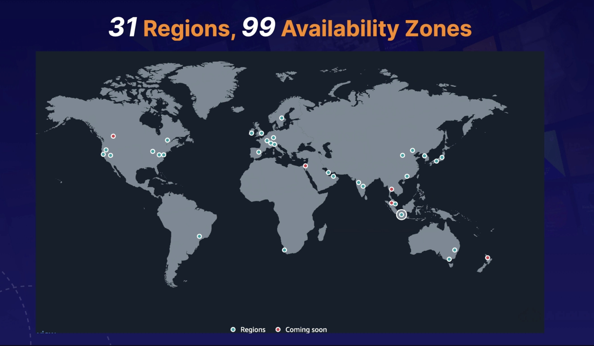

### Availability Zones

Think of an Availability Zone as a **Data Center**.

### Data Centers

A data center is just a building filled with **servers**.

An Availability Zone may be several data centers, but because they are close together, they are counted as **1 Availability Zone**.

### Regions

A geographical area. Each Region consists of **2 (or more) Availability Zones**.

<Note>
  **Upate:** AWS now defines Regions as **3 or more Availability Zones**.
</Note>

### Edge Locations

Endpoints for AWS that are used for caching content.

- Typically, this consists of **CloudFront**, Amazon's Content Delivery Network (CDN).
- There are **many more edge locations** that Regions.
- Currently, there are **over 215 edge locations**.

### Exam Tips

<Note>
**A Region** is a physical location in the world that consists of 2 or more Availability Zones (AZs).

**An AZ** is 1 or more discrete data centers - each with redundant power, networking, and connectivity - housed in separate facilities.

**Edge Locations** are endpoints for AWS that are used for caching content.

</Note>

## Shared Responsibility Model

### Renting Resources in the Cloud

Who's responsible for what?

| You              | Rental Company   |
| :--------------- | :--------------- |
| Not to damage it | Tire pressure    |
| Not to speed     | Full tank of gas |
| Pay tolls, etc   | Mechanics        |

### The Model

| Customer: Responsiblity for Security IN the Cloud            | AWS: Responsibility for Security OF the Cloud |
| :----------------------------------------------------------- | :-------------------------------------------- |
| Customer Data                                                | Software                                      |
| Platform, Applications, Identitiy & Access Management        | Compute, Storage, Database, Networking        |
| Operating System, Network & Firewall Configuration           | Hardware/AWS Global Infrastructure            |
| Client-Side Data Encryption & Data Integrity Authentication  | Regions                                       |
| Server-Side Encryption (File System and/or Data)             | Availability Zones                            |
| Network Traffic Protection (Encryption, Integrity, Identity) | Edge Locations                                |

### Exam Tips

<Note>
**Can you do this yourself in the AWS Managemenet Console?**

**If yes, you are likely responsible.** Security groups, IAM users, patching EC2 operating systems, patching databases running on EC2, etc.

**If not, AWS is likely responsible.** Management of data centers, security cameras, cabling, patching RDS operating systems, etc.

**Encryption is a shared responsiblity.**

</Note>

## Compute, Storage, Databases, and Networking

### Compute

You wouldn't be able to build an application without compute power - you need something crunching the data.

- EC2
- Lambda
- Elastic Beanstalk

### Storage

Like a giant disk in the cloud - it's a safe place to save your information.

- S3
- EBS
- EFS
- FSx
- Storage Gateway

### Databases

Like a spreadsheet - a reliable way to store and retrieve information.

- RDS
- DynamoDB
- Redshift

### Networking

A way for compute, storage, and databases to communicate and to live.

- VPCs
- Direct Connect
- Route 53
- API Gateway
- AWS Global Accelerator

### Exam Tips

<Note>
**Compute:** EC2, Lambda, Elastic Beanstalk.

**Storage:** S3, EBS, EFS, FSx, Storage Gateway.

**Databases:** RDS, DynamoDB, Redshift.

**Networking:** VPCs, Direct Connect, Route 53, API Gateway, AWS Global Accelerator.

</Note>

## The Well-Architected Framework

### AWS Whitepapers

AWS has hundreds of whitepapers available - `https://aws.amazon.com/whitepapers`.

### The 6 Pillars

**Operational Excellence**

Running and monitoring systems to deliver business value, and continually improving processes and procedures.

**Performance Efficiency**

Using IT computing resources efficiently.

**Security**

Protecting information and systems.

**Cost Optimization**

Avoiding unnecessary costs.

**Reliability**

Ensuring a workload performs its intended function correctly and consistently when it's expected.

**Sustainability**

Minimizing the environmental impacts of running cloud workloads.

### Exam Tips

<Note>**Read the Whitepaper.**</Note>

## Quiz: Availability Zones and Regions

<Note>
**Which statement best describes an Availability Zone?**

One or more discrete data centers with redundant power, networking, and connectivity in an AWS Region.

**Why is security one of the pillars of the Well-Architected Framework?**

Because security is the highest priority at AWS; if you don't have a securely built application, your customers won't trust you with their data.

**Which of the following is NOT an AWS storage service?**

EC2

**Which one of the following items are NOT managed by AWS according to the shared responsibility model?**

Customer data.

**What category would the VPC service fall into?**

Networking.

</Note>

# Chapter 3 - Identity and Access Management

- [Securing the Root Account](#securing-the-root-account)
- [IAM Policy Documents](#iam-policy-documents)
- [Permanent IAM Credentials](#permanent-iam-credentials)
- [Quiz: Identity and Access Management](#quiz-identity-and-access-management)

## Securing the Root Account

### What is IAM

Allows you to manage users and their level of access to the AWS console.

- Create users and grant permissions to them.
- Create groups and roles.
- Control access to AWS resources.

### What is the Root Account

The `root account` is the email address you used to sign up for AWS. It has full administrative access to AWS. It is important to secure this account.

### Exam Tips

<Note>
Enable multi-factor authentication on the root account.

Create an admin group for your administrators, and assign the appropriate permissions to this group.

Create user accounts for your administrators.

Add your users to the admin group.

</Note>

## IAM Policy Documents

### Permissions with IAM

We assign permissions using policy documents, which are made up of JSON (JavaScript Object Notation).

### JSON Example of Policy Documents

```json
{
  "Version": "2012-10-17",
  "Statement": [
    {
      "Effect": "Allow",
      "Action": "*",
      "Resource": "*"
    }
  ]
}
```

## Permanent IAM Credentials

### The Building Blocks of IAM

- **Users** - a physical person.
- **Groups** - Functions, such as administrator, developer, etc. Contains users.
- **Roles** - Internal usage within AWS.

### Best Practices: Policies

<Tip>It's best practice for users to **inherit permissions** from groups.</Tip>

### Best Practices: Users and People

Always work on the principle that one users **equals** one physical person. Never share user accounts across multiple people.

### The Principle of Least Privilege

Only assign a user the **minimum** amount of privileges they need to do their job.

<Tip>Some AWS policies are a **Job function** type.</Tip>

### Identity Providers

Allow you to connect IAM to external identity providers like **Azure AD**, under **IAM** > **Access management** > **Identity providers**.

### Exam Tips

<Note>
**IAM is universal:** It does not apply to regions at this time.

**The Root Account:** The account created when you first set up your AWS account and which has complete admin access. Secure it as soon as possible and **do not** use it to log in day to day.

**New Users:** No permissions when first created.

**Access key ID and secret access keys are not the same as usernames and passwords.**

**You only get to view these once.** If you lose them, you have to regenerate them. So, save them in a secure location.

**Always setup password rotations.** You can create and customize your own password rotation policies.

**IAM Federation:** You can combine your existing user account with AWS. For example, when you log on to your PC (usually using Microsoft Active Directory), you can use the same credentials to log in to AWS if you set up federation.

**Identity Federation in Azure:** Uses the `SAML` standard through Azure Active Directory (Azure AD), which enables seamless and secure authentication across various systems, allowing users to access multiple apps with a single set of credentials.

</Note>

### Lab: Create & Assume Roles

**Create the `S3RestrictPolicy` IAM Polciy**

- Navigate to **S3** and review the four provisioned buckets; two of them have `customerdata` in the name, and the other two have appconfigprod in the name. You will be restricting access in the `appconfigprod` buckets.
- Navigate to **IAM** by searching for it in the top search bar. Then, right-click and open **IAM** in a new tab.
- In the left navigation menu under **Access Management**, click Users and review the available users.
- In the left navigation menu under **Access Management**, click **Policies**.
- Click **Create Policy**.
- Under **Select a service**, click **S3**.
- Under **Actions allowed**, select **All S3 actions**.
- Under **Resources**, select the **Any in this account** checkbox for all the listed resources except for **bucket** and **object**.
- For **object**, select the **Any** checkbox.
- Navigate back to S3 browser tab.
- Copy the bucket name containing `appconfigprod1`.
- Return to the IAM browser tab.
- In **Resources**, next to **bucket**, click **Add ARNs**.
- In the **Resource bucket name** field, paste in the bucket name you just copied, and click **Add ARNs**.

<Note>Ensure there's no trailing whitespace after the bucket name.</Note>

- Return to S3 and repeat the process with the bucket name containing `appconfigprod2`.
- In IAM, once both buckets are added, click **Next**.
- On the **Review and create** page, next to **Policy name**, enter `S3RestrictedPolicy`, and click **Create policy**.
- Once the policy has been created, use the search bar to search for the `S3RestrictedPolicy`. Click on the + icon next to the policy and review the configuration.
- Click on the `S3RestrictedPolicy` policy to navigate into it.
- Click the **Entities attached** tab.
- Under **Attached as a permissions policy**, click **Attach**.
- Select the checkbox next to `user1`.
- Click **Attach policy**.

**Create the IAM Role**

- Click **Roles** in the left navigation menu.
- Click **Create role**.
- Under **Trusted entity type**, select **AWS account**.
- Under **An AWS account**, select **This account**.
- Copy the account ID in parentheses, and paste it to a text file as you'll need it later.
- Click **Next**.
- Use the search bar to look for the `S3RestrictedPolicy` and click the checkbox next to it.
- Click **Next**.
- In **Role name**, enter `S3RestrictedRole`. You should see that the trusted entity is your account number. This means that anything that is in this account can assume this role.
- Click **Create role**.

**Ensure `user2` Can Assume the Role**

- Click **Users** in the left navigation menu.
- Click `user2`.
- Under **Summary**, copy the **ARN**.
- Click **Roles** in the left navigation menu.
- In the **Roles** search bar, enter `S3`, and select the `S3RestrictedRole`.
- Click the **Trust relationships** tab.
- Click **Edit trust policy**.
- In line `7`, delete the ARN, and paste in the ARN you previously copied for `user2`. Make sure to leave the quotation marks.
- Click **Update policy**.

**Test IAM Policy and Role Configuration**

- Navigate to the upper right corner, and copy the account ID to your clipboard.
- Click **Sign out**.
- Click **Log back in**.
- For **Account ID**, paste in the account ID you previously copied.
- For **IAM user name**, enter `user1`.
- For **Password**, enter the password listed in the **Additional Information and Resources** section for `user1`.
- Once signed in, navigate to EC2 to check whether you have access; you should see **API Error**, meaning you cannot access anything within EC2.
- Navigate to **S3**, and click on one of the `customerdata` buckets. You should see that you do not have access to this bucket.
- Click on the **Buckets** breadcrumb at the top of the screen. Navigate to one of the `appconfigprod` buckets and open it; you should have access.
- Repeat steps 1-9 using the `user2` credentials provided in the **Additional Information and Resources** section. This time, you shouldn't have access to any of the buckets.
- Navigate to the upper right corner, and copy the account ID to your clipboard.
- Click **Switch role**.
- For account, paste in the account ID you previously copied.
- For **Role**, enter `S3RestrictedRole`. Make sure it's spelled correctly.
- Select the color of your choice, then click **Switch Role**.
- In the S3 console, you should now be able to see the `appconfigprod` buckets.
- Click on one of the `customerdata` buckets; you should see an **Insufficient permissions** message.
- In the upper left breadcrumb trail, click **Buckets**, then click on one of the `appconfigprod` buckets to confirm you have access.

<Note>
  Once you don't need the specified permissions, you can switch back to user2 by
  clicking on the account ID in the upper right corner and selecting Switch
  back.
</Note>

### Quiz: Identity and Access Management

<Note>
What does the "EAR" in a policy document stand for?

**Effect, Action, Resource**

Which of the following statements about policy documents are true?

**An explicit deny overrides an allow.**

What is a crucial step in securing your AWS account?

**Enable MFA on the root account, and on any admin user account.**

Which of the following is the recommended approach for securing your AWS account?

**Create user accounts for your administrators, add them to the admin group, assign the appropriate permissions to the group, and enable MFA on the root and any admin user account.**

Why is it dangerous to use the AWS root user account?

**The root user account has full permissions to every service.**

</Note>

# Chapter 4 - Simple Storage Service S3

- [S3 Overview](#s3-overview)
- [Securing your Bucket with S3 Block Public Access](#securing-your-bucket-with-s3-block-public-access)
- [Hosting a Static Website](#hosting-a-static-website)
- [Versioning Objects in S3](#versioning-objects-in-s3)
- [S3 Storage Classes](#s3-storage-classes)
- [Lifecycle Management with S3](#lifecycle-management-with-s3)
- [S3 Object Lock and Glacier Vault Lock](#s3-object-lock-and-glacier-vault-lock)
- [Encrypting S3 Objects](#encrypting-s3-objects)
- [Optimizing S3 Performance](#optimizing-s3-performance)
- [Backing up Data with S3](#backing-up-data-with-s3)
- [Lab: Set Up Cross-Region Bucket Replication](#lab-set-up-cross-region-bucket-replication)
- [Lab: Creating a Static Website Using S3](#lab-creating-a-static-website-with-s3)
- [Lab: Creating S3 Buckets, Managing Objects, and Enabling Versioning](#lab-creating-s3-buckets-managing-objects-and-enabling-versioning)
- [Quiz: Simple Storage Service S3](#quiz-simple-storage-service-s3)

## S3 Overview

### What Is S3

- **Object Storage** - provides secure, durable, highly scalable object storage.
- **Scalable** - store and retrieve any amount of data from anywhere on the web at a very low cost.
- **Simple** - easy to use, with a simple web service interface.

**Object-based Storage**

Manages data as objects rather than in file systems or data blocks.

- **Upload any file type** you can think of to S3.
- **Examples** include photos, videos, code, documents, and text files.
- **Cannot** be used to run an operating system or database.

### S3 Basics

- **Unlimited Storage** - the total volume of data and the number of objects you can store is unlimited.
- **Objects up to 5 TB in Size** - S3 objects can range in size from a minimum of 0 bytes to a maximum of 5 TB.
- **S3 Buckets** - store files in buckets (similar to folders).

### Working with S3 Buckets

- **Universal Namespace** - all AWS accounts share the S3 namespace. Each S3 bucket name is globally unique.
- **Example S3 URLs** - `https://bucket-name.s3.Region.amazonaws.com/key-name.
- **Uploading Files** - when you upload a file to an S3 bucket, you will receive an HTTP 200 code if the upload was successful.

### Key-Value Store

- **Key** - the name of the object.
- **Value** - the data itself, which is made up of a sequence of bytes.
- **Version ID** - important for storing multiple versions of the same object.
- **Metadata** - data about the data you are storing (e.g. `content-type`, `last-modified`, etc).

### Availability & Durability

The data is spread across multiple devices and facilities to **ensure availability** and **durability**.

- **Built for Availability** - built for 99.95% - 99.99% **service availability**, depending on the S3 tier.
- **Designed for Durability** - designed for 99.999999999% (9 decimal places) durability for **data stored** in S3.
- Suitable for most workloads.
  - The default storage class.
  - Use cases include website, content distribution. mobile and gaming apps, and big data analytics.

### Characteristics

- **Tiered Storage** - S3 offers a range of storage classes designed for different use cases.
- **Lifecycle Management** - define rules to automatically transition objects to a cheaper storage tier or delete objects that are no longer required after a set period of time.
- **Versioning** - with versioning, all versions of an object are stored and can be rertieved, including deleted objects.

### Securing your Data

- **Server-Side Encryption** - you can set default encryption on a bucket to encrypt all new objects whe they are stored in the bucket.
- **Access Control Lists (ACLs)** - define which AWS accounts or groups are granted access and the type of access. You can attach S3 ACLs to individual objects within a bucket.
- **Bucket Policies** - S3 bucket policies specify what actions are allowed or denied.

### Consistency Model

**Strong Read-After-Write Consistency**

- **After a successful write** of a new object (`PUT`) or an overwrite of an existing object, any subsequent read request immediately receives the latest version of the object.
- **Strong consistency** for list operations, so after a write, you can immediately perform a listing of the objects in a bucket with all the changes reflected.

### Exam Tips

<Note>
**Object Based** - object based-storage allows you to upload files.

**Files up to 5 TB** - files can from 0 bytes to 5 TB.

**Not OS or DB Storag** - not suitable to install an operating system or run a database on.

**Unlimited Storage** - the total volume of data and the number of objects you can store is unlimited.

S3 is a universal namespace.

Successful CLI or API uploads will generate an **HTTP 200 status code**.

**Key** - the object name.

**Value** - the data itself, which is made up of a sequence of bytes.

**Version ID** - allows you to store multiple versions of the same object.

**Metadata** - data about the data you are storing.

</Note>

## Securing your Bucket with S3 Block Public Access

### Object ACLs vs Bucket Policies

- **Object ACLs** - work on an **individual object** level.
- **Bucket Policies** - work on an **entire bucket** level.

### Exam Tips

<Note>
**Buckets are private by default:** when you create an S3 bucket, it is private by default (including all objects within it). You have to allow public access on both the **bucket** and its **objects** in order to make the bucket public.

**Object ACLs:** you can make **individual objects** public using object ACLs.

**Bucket policies:** you can make **entire buckets** public using bucket policies.

**HTTP status code:** when you upload an object to S3 and it's successful, you will receive an **HTTP 200** code.

</Note>

## Hosting a Static Website

### Static Websites on S3

You can use S3 to host static websites, such as `.html` sites.

- **Dynamic websites**, such as those that require **database connections**, cannot be hosted on S3.

### Automatic Scaling

**S3 scales automatically to meet demand.**

- Many enterprises will put static websites on S3 when they think there is going to be a large number of requests (e.g. for a movie preview).

### Hosting a Static Website

**Enable Static Website Hosting**

- On a **Bucket**, select **Properties**.
- Select `Edit` on **Static website hosting**.
- Toggle `Enable`.
- Toggle `Host a static website`.
- Under **Index document**, enter the home page of the site - `index.html`
- Under **Error document (optional)**, enter the error page of the site - `error.html`.
- Select `Save changes`.

**Upload Site Files**

- On the **Bucket**, select **Objects**.
- Select **Upload**.
- Select **Add files**.

**Enable Public Access**

- On the **Bucket**, select **Permissions**.
- Under **Bucket Policy**, select **Edit**.
- Paste in the policy `json` code.

```json
{
  "Version": "2012-10-17",
  "Statement": [
    {
      "Sid": "PublicReadGetObject",
      "Effect": "Allow",
      "Principal": "*",
      "Action": ["s3:GetObject"],
      "Resource": ["arn:aws::s3:::BUCKET_NAME/*"]
    }
  ]
}
```

### Exam Tips

<Note>
**Bucket Policies:** make entire buckets public using bucket policies.

**Static Content:** use S3 to host static content only (not dynamic).

**Automatic Scaling:** S3 scales automatically with demand.

</Note>

## Versioning Objects in S3

### What is Versioning

You can enable versioning in S3 so you can have **multiple versions of an object within S3**.

- **All Versions** - all versions of an object are stored in S3. This includes all writes and even if you delete an object.
- **Backup** - can be a great backup tool.
- **Cannot Be Deleted** - once enabled, versioning cannot be disabled - only suspended.
- **Lifecycle Rules** - can be integrated with lifecycle rules.
- **Supports MFA** - can support multi-factor authentication.

<Note>Previous versions of an object are **not publicly accessible**.</Note>

### Exam Tips

<Note>
**All versions:** all versions of an object are stored in S3. This includes all writes and even if you delete an object.

**Backup:** can be a great backup tool.

**Cannot be Disabled:** once enabled, versioning cannot be disabled - only suspended.

**Lifecycle Rules:** can be integrated with lifecycle rules.

**Suports MFA:** can support multi-factor authentication.

</Note>

## S3 Storage Classes

### S3 Standard

- **High Availability & Durability** - data is stored redundantly across multiple devices in multiple facilities (>=3 AZs):

  - 99.99% availability.
  - 99.999999999% durability (11 9's).

- **Designed for Frequent Access** - perfect for frequently accessed data.
- **Suitable for Most Workloads**
  - The default storage class.
  - Use cases include websites, content distribution, mobile and gaming apps, and big data analytics.

### S3 Standard-Infrequent Access (S3 Standard-IA)

- **Rapid Access** - used for data that is accessed less frequently but requires rapid access when needed.
- **You Pay to Access the Data** - There is a low per-GB storage price and per-GB retrieval fee.
- **Use Cases** - great for long-term storage, backups, and as a data store for disaster recovery files.

### S3 One Zone-Infrequent Access

Like S3 Standard-IA, but data is stored redundantly within a single AZ.

- Costs **20% less** than regular S3 Standard-IA.
- Great for long-lived, infrequently accessed, non-critical data.
- 99.5% Availability.
- 99.999999999% Durability.

### S3 Intelligent Tiering

**Frequent & Infrequent Access**  
Automatically moves your data to the most cost-effective tier based on how frequently you access each object.

**Optimizes Cost**  
Monthly fee of $0.0025 per 1000 objects.

### 3 Glacier Options

- You pay each time you access your data.
- Use only for archiving data.
- Glacier is cheap storage.
- Optimized for data that is infrequently accessed.

**Option 1 - Glacier Instant Retrieval**  
Provides **long-term data archiving** with instant retrieval time for your data.

**Option 2 - Glacier Flexible Retrieval**  
Ideal storage class for archive data that does not require immediate access but needs the flexibility to retrieve large sets of data at no cost, such as backup or disaster recovery use cases. Can be minutes or up to 12 hours.

**Option 3 - Glacier Deep Archive**  
Cheapest storage class and designed for customers that retain data sets for 7-10 years or longer to meet customer needs and regulatory compliance requirements. The standard retrieval time is 12 hours, and the bulk retrieval time is 48 hours.

### Performance Across S3

|                                     | S3 Standard            | S3 Intelligent-Tiering | S3 Standard-IA         | S3 One Zone-IA         | S3 Glacier Instant Retrieval | S3 Glacier Flexible Retrieval | S3 Glacier Deep Archive |
| :---------------------------------- | :--------------------- | :--------------------- | :--------------------- | :--------------------- | :--------------------------- | :---------------------------- | :---------------------- |
| **Designed for Durability**         | 99.999999999% (11 9's) | 99.999999999% (11 9's) | 99.999999999% (11 9's) | 99.999999999% (11 9's) | 99.999999999% (11 9's)       | 99.999999999% (11 9's)        | 99.999999999% (11 9's)  |
| **Designed for Availability**       | 99.99%                 | 99.9%                  | 99.9%                  | 99.5%                  | 99.9%                        | 99.99%                        | 99.99%                  |
| **Availability SLA**                | 99.9%                  | 99%                    | 99%                    | 99%                    | 99.9%                        | 99.9%                         | 99.9%                   |
| **Availability Zone(s)**            | >=3                    | >=3                    | >=3                    | 1                      | >=3                          | >=3                           | >=3                     |
| **Min Capacity Charge per Object**  | N/A                    | N/A                    | 128 KB                 | 128 KB                 | 128 KB                       | 40 KB                         | 40 KB                   |
| **Minimum Storage Duration Charge** | N/A                    | 30 days                | 30 days                | 30 days                | 90 days                      | 90 days                       | 180 days                |
| **Retrieval Fee**                   | N/A                    | N/A                    | Per GB retrieved       | Per GB retrieved       | Per GB retrieved             | Per GB retrieved              | Per GB retrieved        |
| **Storage Type**                    | Object                 | Object                 | Object                 | Object                 | Object                       | Object                        | Object                  |
| **Lifecycle Transitions**           | Yes                    | Yes                    | Yes                    | Yes                    | Yes                          | Yes                           | Yes                     |

### Storage Costs

| S3 Storage Classes Costs                                                                                        | Storage Pricing                            |
| :-------------------------------------------------------------------------------------------------------------- | :----------------------------------------- |
| **S3 Standard** - General-purpose storage for any type of data, typically used for frequently accessed data.    | Highest Cost                               |
| First 50 TB / Month                                                                                             | $0.023 per GB                              |
| Next 450 TB / Month                                                                                             | $0.022 per GB                              |
| Over 500 TB / Month                                                                                             | $0.021 per GB                              |
| **S3 Intelligent-Tiering** - Automatic cost savings for data with unknown or changing access patterns.          | Cost optimized for unknown access patterns |
| Frequent Access Tier, First 50 TB / Month                                                                       | $0.023 per GB                              |
| Frequent Access Tier, Next 450 TB / Month                                                                       | $0.022 per GB                              |
| Frequent Access Tier, Over 500 TB / Month                                                                       | $0.021 per GB                              |
| Monitoring & Automation, All Storage / Month                                                                    | $0.0025 per 1000 objects                   |
| **S3 Standard-Infrequent Access** - for long-lived but infrequently accessed data that needs millisecond access | Retrieval fees applies                     |
| All Storage / Month                                                                                             | $0.0125 per GB                             |
| **S3 One Zone-Infrequent Access** - for recreateable infrequently accessed data that needs millisecond access.  | Retrieval fees applies                     |
| All Storage / Month                                                                                             | $0.01 per GB                               |

| S3 Glacier Storage Costs                                                                                                                                                                                                                                                        | Storage Pricing |
| :------------------------------------------------------------------------------------------------------------------------------------------------------------------------------------------------------------------------------------------------------------------------------ | :-------------- |
| **S3 Glacier** - for long-lived archive data accessed once a quarter with instant retrieval in milliseconds.                                                                                                                                                                    |                 |
| All Storage / Month                                                                                                                                                                                                                                                             | $0.004 per GB   |
| **S3 Glacier Flexible Retrieval** - ideal storage class for archive data that does not require immediate access but needs the flexibility to retrieve large sets of data at no cost, such as backup or disaster recovery use cases. Can be minutes or up to 12 hours.           |                 |
| All Storage / Month                                                                                                                                                                                                                                                             | $0.0036 per GB  |
| **S3 Glacier Deep Archive** - cheapest storage class and designed for customers that retain data sets for 7-10 years or longer to meet customer needs and regulatory compliance requirements. The standard retrieval time is 12 hours, and the bulk retrieval time is 48 hours. |                 |
| All Storage / Month                                                                                                                                                                                                                                                             | $0.00099 per GB |

## Lifecycle Management with S3

### What is Lifecycle Management

Automates moving your objects between the different storage tiers, thereby maximizing cost effectiveness.

- S3 Standard - Keep for 30 Days.
- S3 IA - After 30 Days.
- Glacier - After 90 Days.

### Lifecycle Management & Versioning

You can use lifecycle management to **move different versions** of objects to **different storage tiers**.

### Exam Tips

<Note>
Automate moving objects between different storage tiers.

Can be used in conjunction with versioning.

Can be applied to current versions and previous versions.

</Note>

## S3 Object Lock and Glacier Vault Lock

### S3 Object Lock

Use to store objects using a **write once, read many (WORM)** model. It can help prevent objects from being deleted or modified for a fixed amount of time or indefinitely.

Use to meet regulatory requirements that require WORM storage, or add an extra layer of protection against object changes and deletion.

### Governance Mode

**Users can't overwrite or delete an object version or alter its lock settings** unless they have special permissions.

Protect objects against being deleted by most users, but you can still grant some users **permission to alter retention settings** or delete the object if necessary.

### Compliance Mode

**A protected object version can't be overwritten or deleted by any user**, including the root user in your AWS account. When an object is locked in compliance mode, its retenetion mode can't be changed and its retention period can't be shortened. Compliance mode ensures an object version **can't be overwritten or deleted** for the duration of the retention period.

### Retention Periods

**Protects an object version for a fixed amount of time**. When you place a retention period on an object version, S3 stores a timestamp in the object version's metadata to indicate when the retention period expires.

After the retention period expires, the object version can be **overwritten or deleted** unless you also placed a legal hold on the object version.

### Legal Holds

Enable you to place a legal hold on an object version. Like a retention period, a legal hold **prevents an object version from being overwritten or deleted**. However, legal hold does not have an associated retention period and remains in effect until removed by any user who has the `s3:PutObjectLegalHold` permission.

### Glacier Vault Lock

Allows you to **easily deploy and enforce compliance controls for individual S3 Glacier vaults with a vault lock policy**. You can specify controls, such as WORM, in a vault lock policy and lock the policy from future edits. Once locked, the policy can no longer be changed.

### Exam Tips

<Note>
Use **S3 Object Lock** to store objects using a write once, read many (WORM) model.

Object Lock can be on **individual objects** or applied **across the bucket** as a whole.

Object Lock comes in 2 modes: **governance mode** and **compliance mode**.

**Compliance Mode** - a protected object version can't be overwritten or deleted by any user, including the root user.

**Governance Mode** - users can't overwrite or delete an object version or alter its lock settings unless they have special permissions.

S3 Glacier Vault Lock allows you to **easily deploy** and **enforce compliance controls** for individual S3 Glacier vaults with a vault lock policy.

You can **specify controls, such as WORM, in a vault lock policy and lock the policy from future edits**. Once locked, the policy can no longer be changed.

</Note>

## Encrypting S3 Objects

### Types of Encryption

**Encryption in Transit**

- SSL/TLS
- HTTPS

**Encryption at Rest: Server-Side Encryption**

- **SSE-S3:** S3-managed keys, using AES 256-bit encryption.
- **SSE-KMS:** AWS Key Management Service-managed keys.
- **SSE-C:** Customer-provided keys.

**Encryption at Rest: Client-Side Encryption**

- Encrypt the files yourself before you upload them to S3.

### Enforcing Server-Side Encrypyion

All Amazon S3 buckets have encryption configured by default. All objects are automatically encrypted by using server-side encryption with Amazon S3 managed keys (SSE-S3).

**This encryption applies to all objects in your Amazon S3 buckets.**

Every time a file is uploaded to S3, a `PUT` request is initiated.

**`x-amz-server-side-encryption`**  
If the file is to be encrypted at upload time, this parameter will be included in the request header.

**2 Options**

- `x-amz-server-side-encryption: AES256` (SSE-S3 - S3-managed keys)
- `x-amz-server-side-encryption: aws:kms` (SSE-KMS - KMS-managed keys)

**`PUT` Request Header**  
When this parameter is included in the header of the `PUT` request, it tells S3 to encrypt the object at the time of upload, using the specified encryption method.

You can create a bucket policy that denies any S3 `PUT` request that doesn't include the `x-amz-server-side-encryption` parameter in the request header.

### Exam Tips

<Note>
**Encryption in Transit**  
SSL/TLS  
HTTPS

**Encryption at Rest: SSE**  
Server-Side Encryption  
SSE-S3 (AES-256-bit)  
SSE-KMS  
SSE-C

**Client-Side Encryption**  
You encrypt the files yourself before you upload them to S3.

**Enforcing Encryption with a Bucket Policy**  
A bucket policy can deny all `PUT` requests that don't include the `x-amz-server-side-encryption` parameter in the request header.

</Note>

## Optimizing S3 Performance

### S3 Prefixes

- `mybucketname/folder1/subfolder1/myfile.jpg` > **/folder1/subfolder1**
- `mybucketname/folder2/subfolder1/myfile.jpg` > **/folder2/subfolder1**
- `mybucketname/folder3/myfile.jpg` > **/folder3**
- `mybucketname/folder4/subfolder4/myfile.jpg` > **/folder4/subfolder4**

### S3 Performance

S3 has extremely low latency. You can get the first byte out of S3 within **100-200 milliseconds**.

You can also achieve a high number of requests: **3500 `PUT`/`COPY`/`POST`/`DELETE`** and **5500 `GET`/`HEAD`** requests per second, per prefix.

You can get better performance by spreading your reads across **different prefixes**. For example, if you are using **2 prefixes**, you can achieve **22000 requests per second**.

### Limitations with KMS

S3 limitations when using KMS

- If you are using **SSE-KMS** to encrypt your objects in S3, you must keep in mind the **KMS limits**.
- When you **upload** a file, you will call `GenerateDataKey` in the KMS API.
- When you **download** a file, you will call `Decrypt` in the KMS API.

**KMS Request Rates**

- Uploading/downloading will count toward the **KMS quota**.
- Currently, you **cannot** request a quota increase for KMS.
- Region-specific, however, it's either **5500**, **10000**, or **30000** requests per second.

### S3 Performance: Uploads

**Multipart Uploads**

- Recommended for files **over 100 MB**.
- Required for files **over 5 GB**.
- Parallelize uploads (increases **efficiency**).

### S3 Performance: Downloads

**S3 Byte-Range Fetches**

- Parallelize **downloads** by specifying byte ranges.
- If there's a failure in the download, it's only for a specific byte range.
- Can be used to **speed up** downloads.
- Can be used to download **partial amounts of the file** (e.g. header information).

### Exam Tips

<Note>
`mybucketname/folder1/subfolder1/myfile.jpg` > **/folder1/subfolder1**

You can also achieve a high number of requests: **3500 `PUT`/`COPY`/`POST`/`DELETE`** and **5500 `GET`/`HEAD`** requests per second, per prefix.

You can get better performance by spreading your reads across **different prefixes**. For example, if you are using **2 prefixes**, you can achieve **11000 requests per second**.

Uploading/downloading will count toward the **KMS quota**.

Region-specific, however, it's either **5500**, **10000**, or **30000** requests per second.

Currently, you **cannot** request a quota increase for KMS.

Use **multipart uploads** to increase performance when **uploading files** to S3.

Should be used for any files **over 100 MB** and must be used for any file **over 5 GB**.

Use **S3 byte-range fetches** to increase performance when **downloading files** to S3.

</Note>

## Backing up Data with S3

### S3 Replication

**You can replicate objects from one bucket to another.**  
Versioning must be enabled on both the source and destination buckets.

**Objects in an existing bucket are not replicated automatically.**  
Once replication is turned on, all subsequent updated objects will be replicated automatically.

**Delete markers are not replicated by default.**  
Deleting individual versions or delete markers will not be replicated.

### Exam Tips

<Note>
You can **replicate objects** from one bucket to another.

Objects in an existing bucket are **not replicated automatically**.

Delete markers are **not replicated by default**.

</Note>

## Lab: Set Up Cross-Region Bucket Replication

### Create an S3 Bucket and Enable Replication

- In the AWS console, navigate to S3.
- Copy the name of the lab-provided `appconfigprod1` bucket.
- Click on the **Region** dropdown in the upper right corner of the console and change it to **US West (Oregon) us-west-2**.
- Click **Create bucket**.
- In the **Bucket name** field, paste the name you copied, but replace `appconfigprod1` with `appconfigprod2`.
- Under **Copy settings from existing bucket**, click **Choose bucket**.
- Select the `appconfigprod1` bucket.
- Click **Choose bucket**.
- Leave the rest of the settings as the defaults, and click **Create bucket**. If you receive a warning about system tags, you can safely ignore it.
- Click the `appconfigprod1` bucket to open it.
- Click the **Management** tab.
- In the **Replication rules** section, click **Create replication rule**.
- Click **Enable Bucket Versioning**.
- Set the following values:
  - Under **Replication rule configuration**, in **Replication rule name**, enter `CrossRegion`.
  - Under **Source bucket**, in **Choose a rule scope**, select **Apply to all objects in the bucket**.
  - Under **Destination**, set the following parameters:
    - Leave **Choose a bucket in this account** selected.
    - Click **Browse S3**.
    - Select the `appconfigprod2` bucket.
    - Click **Choose path**.
    - Click **Enable bucket versioning**.
  - Under **IAM role**, click the dropdown menu under **IAM role**, and select **Create new role**.
- Click **Save**.
- When prompted with the **Replicate existing objects**? popup, choose **No, do not replicate existing objects** and click **Submit**.

### Test Replication and Observe Results

- Click the `appconfigprod1` bucket link in the breadcrumb trail navigation at the top of the screen.
- Click **Upload**.
- Either drag a file to the window, or click **Add file** to upload a file of your choice.
- Click **Upload**.
- Once the upload has succeeded, click **Close** in the top-right corner.
- Click the **Buckets** link in the breadcrumb trail navigation at the top of the page.
- Click the `appconfigprod2` bucket to open it.

<Note>
  Note: You should see the file you uploaded to `appconfigprod1`. If it isn't
  there yet, refresh and wait a minute or two for it to appear.
</Note>

## Lab: Creating a Static Website Using S3

### Create S3 Bucket

- In a new browser tab, navigate to the [GitHub repository for the code](https://github.com/ACloudGuru-Resources/Course-Certified-Solutions-Architect-Associate/tree/master/labs/creating-a-static-website-using-amazon-s3).
- Select the `error.html` file.
- Above the code area, click **Raw**.
- Right-click and select **Save Page As**, and save the file as `error.html`.

<Note>
  Note: If you are using Safari as your web browser, ensure you remove `.txt`
  from the end of the filename. Also, ensure the **Format** is **Page Source**.
  When asked whether you want to save the file as plain text, click **Don't
  append**.
</Note>

- Repeat this for the `index.html` file.
- In the AWS Management Console, navigate to S3.
- Click **Create bucket**.
- Set the following values:
  - Bucket name: `my-bucket-` with the AWS account ID or another series of numbers at the end to make it globally unique
  - Region: **US East (N. Virginia) us-east-1**
- In the **Block Public Access settings for this bucket** section, un-check **Block all public access**.
  - Ensure all four permissions restrictions beneath it are also un-checked.
- Check the box to acknowledge that turning off all public access might result in the bucket and its objects becoming public.
- Leave the rest of the settings as their defaults.
- Click **Create bucket**.
- Click the bucket name.
- Click **Upload**.
- Click **Add files**, and upload the `error.html` and `index.html` files you previously saved from GitHub.
- Leave the rest of the settings as their defaults.
- Click **Upload**.
- Click **Close** in the upper right.

### Enable Static Website Hosting

- Click the **Properties** tab.
- Scroll to the bottom of the screen to find the **Static website hosting** section.
- On the right in the **Static website hosting** section, click **Edit**.
- On the **Edit static website hosting** page, set the following values:
  - **Static website hosting**: Select **Enable**.
  - **Hosting type**: Select **Host a static website**.
  - **Index document**: Enter `index.html`.
  - **Error document**: Enter `error.html`.
- Click **Save changes**.
- In the **Static website hosting** section, open the listed endpoint URL in a new browser tab. Once opened, you'll see a `403 Forbidden` error message.

### Apply Bucket Policy

- Back in S3, click the **Permissions** tab.
- In the **Bucket policy** section, click **Edit**.
- Above the code entry box, copy the bucket ARN.
- On the right, click **Policy generator**.
- Select the following values:
  - **Select Type of Policy**: Select **S3 Bucket Policy**.
  - **Effect**: Select **Allow**.
  - **Principal**: Enter `*`.
  - **Actions**: Select `GetObject`.
  - **Amazon Resource Name (ARN)**: Paste the name you added earlier followed by `/*` so the policy applies to all objects within the bucket.
- Click **Add Statement** > **Generate Policy**.

```json
{
  "Id": "Policy1746180536273",
  "Version": "2012-10-17",
  "Statement": [
    {
      "Sid": "Stmt1746180534670",
      "Action": ["s3:GetObject"],
      "Effect": "Allow",
      "Resource": "arn:aws:s3:::my-bucket-471112626263/*",
      "Principal": "*"
    }
  ]
}
```

- Copy the displayed policy, and go back to the bucket policy screen and paste the JSON. You can ignore any errors.
- Click **Save changes**.
- Refresh the browser tab with the static website (the endpoint URL you opened earlier). This time, the site should load correctly.
- Add a `/` at the end of the URL and some random letters (anything that's knowingly an error). This will display your `error.html` page.

## Lab: Creating S3 Buckets, Managing Objects, and Enabling Versioning

### Create a Public and Private Amazon S3 Bucket

**Create a Public Bucket**

- Navigate to S3.
- Click **Create bucket**.
- Set the following values:
  - **Bucket name**: Enter `acg-testlab-public-<random>`, where `<random>` is a random string of characters to make the bucket name globally unique (e.g., `acg-testlab-4324yr-public`).
  - **Region**: Select **US East (N. Virginia) us-east-1**.
  - **Object Ownership**: Select **ACLs enabled** and **Bucket owner preferred**.
- In the **Block Public Access settings for this bucket** section, uncheck the box for **Block all public access**.
- Check the box stating **I acknowledge that the current settings might result in this bucket and the objects within becoming public** to confirm that we understand the bucket is going to be public
- Leave the rest of the settings as their defaults.
- Click **Create bucket**.

**Create a Private Bucket**

- On the **Buckets** screen, click **Create bucket**.
- Set the following values:
  - **Bucket name**: Enter `acg-testlab-private-<random>`, where `<random>` is a random string of characters to make the bucket name globally unique (you can use the same string from your public bucket).
  - **Region**: Select **US East (N. Virginia) us-east-1**.
- Leave the rest of the settings as their defaults.
- Click **Create bucket**.

**Upload a File in the Private Bucket**

- Select the private bucket name to open it.
- In the **Objects** section, click **Upload**.
- Click **Add files**.
- Navigate to the files you downloaded for the lab, and upload the `cat1.jpg` image.
- Leave the rest of the settings on the page as their defaults.
- Click **Upload**.
- After the file uploads successfully, click its name to view its properties.
- Open the **Object URL** in a new browser tab. Since it's a private bucket, you'll see an error message.
- Back on the `cat1.jpg` page, select the **Object actions** dropdown.
- Note that the **Make public using ACL** option is grayed out, because the bucket is private and we set the ownership to not use ACLs.

**Upload a File in the Public Bucket**

- Click **Buckets** in the link trail at the top.
- Select the public bucket name to open it.
- In the **Objects** section, click **Upload**.
- Click **Add files**.
- Navigate to the files you downloaded for the lab, and upload the `cat1.jpg` image.
- Leave the rest of the settings on the page as their defaults.
- Click **Upload**.
- After the file uploads successfully, click its name to view its properties.
- Open the **Object URL** in a new browser tab. You should receive an error message because although the bucket is public, the object is not.
- Back on the `cat1.jpg` page, select **Object actions** > **Make public using ACL**.
- Click **Make public**.
- Open the **Object URL** in a new browser tab again. This time, the image should load.

### Enable Versioning on the Public Bucket and Validate Access to Different Versions of Files with the Same Name

**Enable Versioning**

- Back on the public bucket page, click the **Properties** tab.
- In the **Bucket Versioning** section, click **Edit**.
- Click **Enable** to enable bucket versioning.
- Click **Save changes**.

**Upload another Image to Test Versioning**

- Click the **Objects** tab.
- Click **Upload**, and then click **Add files**.
- Rename `cat2.jpg` to `cat1.jpg` (this way, you'll upload a different image than the original `cat1.jpg` image).
- Upload the newly renamed `cat1.jpg` image.
- Click **Upload**.
- After the file uploads successfully, click its name to view its properties.
- Click the **Versions** tab. You should see there are two versions of the `cat1.jpg` file.

**View the Image Versions**

- Select **Object actions** > **Make public using ACL**.
- Click **Make public**.
- Click the **Properties** tab.
- Open the **Object URL** in a new browser tab. This time, you should see the new image.
- Back on the `cat1.jpg` page, click the **Versions** tab.
- Click the **null** object.
- Open its **Object URL** in a new browser tab. You should see the original `cat1.jpg` image you uploaded.

## Quiz: Simple Storage Service S3

<Note>
Which of the following statements is true?

**Bucket names must be unique across all AWS accounts in all the AWS Regions within the scope of each of AWS's partitions.**

How does availability and durability differ in S3?

**Availability is the ability to access your data, while durability is the ability of AWS to ensure your data is properly stored in S3.**

Which of the following statements is true?

**You can increase your Amazon S3 read or write performance by creating more prefixes in a bucket and parallelizing reads/writes.**

What is the largest object you can store in S3?

**5 TB**

Since S3 is an object-based storage solution, which type of file should never be stored in it?

**Operating system's boot files**

</Note>

# Chapter 5 - Elastic Cloud Compute EC2

- [Overview](#overview)
- [AWS Command Line](#aws-command-line)
- [Using Roles](#using-roles)
- [Security Groups and Bootstrap Scripts](#security-groups-and-bootstrap-scripts)
- [EC2 Metadata and User Data](#ec2-metadata-and-user-data)
- [Networking with EC2](#networking-with-ec2)
- [Optimizing with EC2 Placement Groups](#optimizing-with-ec2-placement-groups)
- [Solving Licensing Issues with Dedicated Hosts](#solving-licensing-issues-with-dedicated-hosts)
- [Timing Workloads with Spot Instances and Spot Fleets](#timing-workloads-with-spot-instances-and-spot-fleet)
- [Deploying vCenter in AWS with VMWare Cloud on AWS](#deploying-vcenter-in-aws-with-vmware-cloud-on-aws)
- [Extending AWS Beyond the Cloud with AWS Outposts](#extending-aws-beyond-the-cloud-with-aws-outposts)
- [Lab: EC2 Instance Bootstrapping](#lab-ec2-instance-bootstrapping)
- [Lab: EC2 Roles and Instance Profiles in AWS](#lab-ec2-roles-and-instance-profiles-in-aws)
- [Quiz: Elastic Cloud Compute EC2](#quiz-elastic-cloud-compute-ec2)

## Overview

### Introduction

**Secure, resizable compute capacity in the cloud.**

- Like a VM, only hosted in AWS instead of your own data center.
- Designed to make web-scale cloud computing easier for developers.
- The capacity you want when you need it.

**Game Changer**

- AWS led a big change in the industry by introducing EC2.

**Pay Only for What You Use**

- EC2 changed the economics of computing.

**No Wasted Capacity**

- Select the capacity you need right now. Grow and shrink when you need.

**On-Premises Infrastructure**

- Estimate capacity.
- Long-term investment, 3-5 years.
- Several days to provision extra capacity.

### EC2 Pricing Options

**On-Demand:** Pay by the hour or the second, depending on the type of instance you run.

- **Flexible:** low cost and flexibility of Amazon EC2 without any upfront payment of long-term commitment.
- **Short-Term:** apps with short-term, spiky, or unpredictable workloads that cannot be interrupted.
- **Testing the Water:** apps being developed or tested on Amazon EC2 for the first time.

**Reserved:** Reserved capacity for 1 or 3 years. Up to 72% discount on the hourly charge.

- **Predictable Usage:** apps with steady state or predictable usage.
- **Specific Capacity Requirements:** apps that require reserved capacity.
- **Pay Up Front:** you can make upfront payments to reduce the total computing costs even further.
- **Standard RIs:** up to 72% off the on-demand price.
- **Convertible RIs:** up to 54% off the on-demand price. Has the option to change to a different RI type of equal or greater value.
- **Scheduled RIs:** Launch within the time window you define. Match your capacity reservation to a predictable recurring schedule that only requires a fraction of a day, week, or month.

**Spot:** Purchase unused capacity at a discount of up to 90%. Prices fluctuate with supply and demand.

- **Flexible:** apps that flexible start and end times.
- **Cost Sensitive:** apps that are only feasible at very low compute prices.
- **Urgent Capacity:** users with an urgent need for large amounts of additional computing capacity.
- When to use:
  - Image rendering
  - Genomic sequencing
  - Algorithmic trading engines

**Dedicated:** A physical EC2 server dedicated for your use. The most expensive option.

- **Compliance:** regulatory requirements that may not support multi-tenant virtualization.
- **Licensing:** great for licensing that does not support multi-tenancy or cloud deployments.
- **On-Demand:** can be purchased on-demand (hourly).
- **Reserved:** can be purchased as a reservation for up to 70% off the on-demand price.

### Savings Plans with Reserved Instances

**Save up to 72%**

- All AWS compute usage, regardless of instance type or region.

**Commit to 1 or 3 Years**

- Commit to use a specific amount of compute power (measured by the hour) for a 1-year or 3-year period.

**Super Flexible**

- Not only EC2, this also includes serverless technologies like Lambda and Fargate.

### Exam Tips

<Note>
  EC2 is like a VM, hosted in AWS instead of your own data center. Select the
  capacity you need right now. Grow and shrink when you need.  
  Pay for what you use.  
  Wait minutes, not months.

**On-Demand**  
Pay by the hour or the second, depending on the type of instance you run. Great for flexiblity.

**Reserved**  
Reserved capacity for 1 or 3 years. Up to 72% discount on the hourly charge. Great if you have known, fixed requirements.

**Spot**  
Purchase unused capacity at a discount of up to 90%. Prices fluctuate with supply and demand. Great for apps with flexible start and end times.

**Dedicated**  
A physical EC2 server dedicated for your use. Great if you have server-bound licenses to reuse or compliance requirements.

</Note>

## AWS Command Line

### The AWS Management Console

The Graphical User Interface (GUI) that can interact with AWS.

### Command Line Interactions

You can also **interact with AWS** using the Command Line.

### Lesson Objectives

- **Launch an EC2 Instance** - using the AWS CLI.
- **Create an IAM User** - give the user permissions to access and create S3 resources.
- **Configure the AWS CLI** - configure the CLI using the IAM user's credentials. Use the CLI to create an S3 bucket and upload a file.

### AWS CLI

**Create an IAM User**

- Under **IAM**, select **User groups**.
- Select **Create Group**.
- Add a **User group name**.
- Under **Attach permissions policies - _Optional_**, search for `s3`.
- Check the box for `AmazonS3FullAccess`.
- Select **Create group**.
- Under **IAM**, select **Users**.
- Select **Create user**.
- Add a **User name**.
- Select **Next**.
- Check the box for **Add user to group**.
- Under **User groups**, select the new group.
- Select **Next**.
- Select **Create user**.
- Select the new user.
- Select the **Security Credentials**.
- Under **Access keys**, select **Create access keys**.
- Select **Command Line Interface (CLI)**.
- Check the box for **I understand the above recommendation and want to proceed to create an access key**.
- Select **Next**.
- Select **Create access key**.
- Copy the **Access key**.
- Copy the **Secret access key**.

**Configure the AWS CLI**

- Elevate your privileges:

```sh
sudo su
```

- Configure the AWS profile:

```sh
aws configure
```

- Paste the **Access key**.
- Paste the **Secret access keys**.
- Optionally enter a `region name`.
- Optionally enter an `output format`.

- List S3 buckets:

```sh
aws s3 ls
```

- "Make" a bucket:

```sh
aws s3 mb s3://<name>
```

### Exam Tips

<Note>
**Least Privilege**  
Always give your users the **minimum amount** of access required to do their job.

**Use Groups**  
**Create IAM groups** and assign users to groups. Group permissions are assigned using IAM policy documents. Your users will **automatically inherit** the permissions of the group.

**Secret Access Key**  
You will only see this once! If you lose it, you can delete the access key ID and secret access key and regenerate them. You will need to run `aws configure` again.

**Don't Share Key Pairs**  
Each developer should have their own access key ID and secret access key. Just like passwords, they should not be shared.

**Supports Linux, Windows, MacOS**  
You can install the CLI on your Mac, Linux, or Windows PC. You can also use it on EC2 instances.

</Note>

## Using Roles

### What is an IAM Role

A role is an identity you can create in IAM that has specific permissions. A role is similar to a user, as it is an AWS identity with permission policies that determine what the identity can and cannot do in AWS.

However, instead of being uniquely associated with one person, a role is intended to be assumable by anyone who needs it.

### Roles are Temporary

A role does not have standard long-term credentials the same way passwords or access keys do. Instead, when you assume a role, it provides you with temporary security credentials for your role session.

### What Else Can Roles Do

Roles can be assumed by people, AWS architecture, or other system-level accounts.

Roles can allow cross-account access. This allows one AWS account the ability to interact with resources in other AWS accounts.

### Exam Tips

<Note>
**The Preferred Option**  
Roles are preferred from a security perspective.

**Avoid Hard-Coding Your Credentials**  
Roles allow you to provide access without the use of access key IDs and secret access keys.

**Policies**  
Policies control a role's permissions.

**Updates**  
You can update a policy attached to a role, and it will take immediate effect.

**Attaching and Detaching**  
You can attach and detach roles to running EC2 instances without having to stop or terminate those instances.

</Note>

## Security Groups and Bootstrap Scripts

### How Humans Sense Things

**Light**  
We see light using our **eyes**.

**Sound**  
We hear sound using our **ears**.

**Heat**  
We feel heat using our **skin**.

### How Computers Communicate

- **Linux** - SSH - Port `22`.
- **Windows** - RDP - Port `3389`.
- **HTTP** - Web Browsing - Port `80`.
- **HTTPS** - Encrypted Web Browsing (SSL) - Port `443`.

### Security Groups

Security groups are **virtual firewalls for your EC2 instance.** By default, everything is blocked.

<Tip>To let everything in: `0.0.0.0/0`.</Tip>

In order to be able to **communicate to your EC2 instances via SSH/RDP/HTTP**, you will need to **open the correct ports**.

### Bootstrap Scripts

Scripts that run when the instance first starts.

```sh
#!/bin/bash

yum update -y
# installs apache
yum install httpd -y
# starts apache
yum service httpd start
cd /var/www/html
echo "<html><body><h1>Hello World</h1></body></html>" > index.html
```

Adding these tasks at boot time **adds to the amount of time it takes to boot the instance**. However, it allows you to **automate the installation** of apps.

### Exam Tips

<Note>
Changes to security groups take effect immediately.

You can have any number of EC2 instances within a security group.

You can have multiple security groups attached to EC2 instances.

All inbound traffic is blocked by default.

All outbound traffic is allowed.

A bootstrap script is **a script that runs when the instance first runs.** It passes user data to the EC2 instance and can be used to install apps (like web servers and databases), as well as do updates and more.

</Note>

## EC2 Metadata and User Data

### What is EC2 Metadata

It is simply data about your EC2 instance.

- This can include information such as private IP addresses, public IP address, hostname, security groups, etc.

### Retrieving Metadata

Using the `curl` command, we can query metadata about our EC2 instance.

```sh
TOKEN=`curl -X PUT "http://52.71.116.78/latest/api/token" -H "X-aws-ec2-metadata-token-ttl-seconds: 21600"` \
&& curl -H "X-aws-ec2-metadata-token: $TOKEN" -v http://52.71.116.78/latest/meta-data/
ami-id
ami-launch-index
ami-manifest-path
block-device-mapping/
events/
hibernation/
hostname
identity-credentials/
instance-action
instance-id
instance-life-cycle
instance-type
local-hostname
local-ipv4
mac
managed-ssh-keys/
metrics/
network/
placement/
profile
public-hostname
public-ipv4
public-keys/
reservation-id
security-groups
```

### Using User Data to Save Metadata

```sh
#!/bin/bash

yum update -y
yum install httpd -y
systemctl start httpd
systemctl enable httpd
cd /var/www/html
echo "<html><body><h1>My IP is " > index.html
TOKEN=$(curl -s -X PUT "http://52.71.116.78/latest/api/token" -H "X-aws-ec2-metadata-token-ttl-seconds: 21600")
PUBLIC_IP=$(curl -s -H "X-aws-ec2-metadata-token: $TOKEN" http://52.71.116.78/latest/meta-data/public-ipv4)
echo "$PUBLIC_IP" >> index.html
echo "</h1></body></html>" >> index.html
```

### Exam Tips

<Note>
User data is simply bootstrap scripts.

Metadata is data stored about your EC2 instances.

You can use bootstrap scripts (user data) to access metadata.

</Note>

## Networking with EC2

### Different Virtual Networking Options

You can attach 3 different types of **virtual networking cards** to your EC2 instances.

- **ENI - Elastic Network Interface** - for basic, day-to-day networking.
- **EN - Enhanced Networking** - uses single root I/O virtualization (SR-IOV) to provide high performance.
- **EFA - Elastic Fabric Adapter** - accelerates High Performance Computing (HPC) and machine learning apps.

### ENI

A virtual network card that allows:

- Private IPv4 Addresses
- Public IPv4 Address
- Many IPv6 Addresses
- MAC Address
- 1 or more Security Groups

Common ENI use cases:

- Create a management network.
- Use network and security appliances in your VPC.
- Create dual-homed instances with workloads/roles on distinct subnets.
- Create a low-budget, high-availability solution.

### Enhanced Networking

For high-performance networking between 10 - 100 Gbps.

**Single Root I/O Virtualization (SR-IOV)**

- SR-IOV provides higher I/O performance and lower CPU utilization.

**Performance**

- Provides higher bandwidth, higher packet per second (PPS) performance, and consistently lower inter-instance latencies.

### ENA vs VF

Depending on your instance type, enhanced networking can be enabled using:

| Elastic Network Adapter (ENA)                                          | Intel 82599 Virtual Function (VF) Interface                                                               |
| :--------------------------------------------------------------------- | :-------------------------------------------------------------------------------------------------------- |
| Supports network speeds of up to 100 Gbps for supported instance types | Supports network speeds of up to 10 Gbps for supported instance types. Typically used on older instances. |

<Tip>In any scenario question: choose ENA of VF interface.</Tip>

### EFA

Elastic Fabric Adapter

- A network device you can attach to your Amazon EC2 instance to accelerate High Performance Computing (HPC) and machine learning apps.
- Provides lower and more consistent latency and higher throughput that the TCP transport traditionally used in cloud-based HPC systems.

<Tip>
EFA can use OS-bypass.

It makes it a lot **faster** with much **lower latency**.

OS-bypass enables HPC and machine learning apps to bypass the operating system kernel and communicate directly with the EFA device. Not currently supported with Windows - only Linux.

</Tip>

### Exam Tips

<Note>
**ENI**  
For basic networking. Perhaps you need a separate management network from your production network or a separate logging network, and you need to do this at a low cost. In this scenario, use multiple ENIs for each network.

**Enhanced Networking**  
For when you need speeds between 10 Gbps and 100 Gbps. Anywhere you need reliable, high throughput.

**EFA**  
For when you need to accelerate High Performance Computing (HPC) and machine learning apps or if you need to do an OS-bypass. If you see a scenario question mentioning HPC or ML and asking what network adapter you want, choose EFA.

</Note>

## Optimizing with EC2 Placement Groups

### 3 Types of Placement Groups

- Cluster
- Spread
- Partition

### Cluster Placement Groups

Grouping of instances within a single Availability Zone. Recommended for apps that need low network latency, high network throughput, or both.

<Note>
  Only certain instance types can be launched into a cluster placement group.
</Note>

### Spread Placement Groups

A group of instances that are **each placed on distinct underlying hardware**. Recommended for apps that have small number of critical instances that should be kept separate from each other.

<Tip>Used for individual instances.</Tip>

### Partition Placement Groups

Each partition placement group has its own set of racks. Each rack has its own network and power source. No 2 partitions within a placement group share the same racks, allowing you to isolate the impact of hardware failure within your app.

EC2 divides each group into logical segments called **partitions**.

### Exam Tips

 <Note>
**Cluster Placement Groups**  
Low network latency, high network throughput.

**Spread Placement Groups**  
Individual critical EC2 instances.

**Partition Placement Groups**  
Multiple EC2 instances; HDFS, HBase, and Cassandra.

A **cluster placement group** can't span mulitple Availability Zones, whereas a spread placement group and partition placement group can.

Only **certain types of instances** can be launched in a placement group (compute optimized, GPU, memory optimized, storage optimized).

**AWS recommends homogenous instances** within cluster placement groups.

**You can't merge placement groups.**

You can **move an existing instance into a placement group.** Before you move the instance, the instance must be in a stopped state. You can move or remove an instance using the AWS CLI or an AWS SDK, but you can't do it via the console yet.

 </Note>

## Solving Licensing Issues with Dedicated Hosts

### The Different Pricing Models for EC2

**On-Demand**  
Pay by the hour or the second, depedning on the type of instance you run.

**Reserved**  
Reserved capacity for 1 or 3 years. Up to 72% discount on the hourly change.

**Spot**  
Purchase unused capacity at a discount of up to 90%. Prices fluctuate with supply and demand.

**Dedicated**  
A physical EC2 server dedicated for your use. The most expensive option.

### Dedicated Hosts

**Compliance**  
Regulatory requirements that may not support multi-tenant virtualization.

**Licensing**  
Great for licensing that does not support multi-tenancy or cloud deployments.

**On-Demand**  
Can be purchased on-demand (hourly).

**Reserved**  
Can be purchased as a reservation for up to 70% off the on-demand price.

### Exam Tips

<Note>
  **Any question that talks about special licensing requirements.** A **Amazon
  EC2 Dedicated Host** is a **physical server** with EC2 instance capacity fully
  dedicated to your use. Hosts allow you to **use your existing** per-socket,
  per-core, or per-VM software **licenses**, including Windows Server, Microsoft
  SQL Server, and SUSE Linux Enterprise Server.
</Note>

## Timing Workloads with Spot Instances and Spot Fleets

### What are EC2 Spot Instances

Spot instances let you take advantage of unused EC2 capacity in the AWS cloud. Spot instances are available at up to 90% discount compared to On-Demand prices.

### When to Use Spot Instances

**Stateless, fault-tolerant, or flexible applications**  
Applications such as big data, containerized workloads, CI/CD, high-performance computing (HPC), and other test and development workloads.

### Spot Prices

To use **Spot Instances**, you must first decide on your maximum Spot price. The instance will be provisioned so long as the Spot price is **BELOW** your maximum Spot price.

The hourly Spot price varies depending on capacity and region.

If the Spot price goes beyond your maximum, **you have 2 minutes to choose whether to stop or terminate your instance**.

### Use Cases

- Big data and analysis.
- Containerized workloads.
- CI/CD Testing
- Image and media rendering.
- High-performance computing.

Spot instances are not good for:

- Persistent workloads.
- Critical jobs.
- Databases.

### Terminating Spot Instances

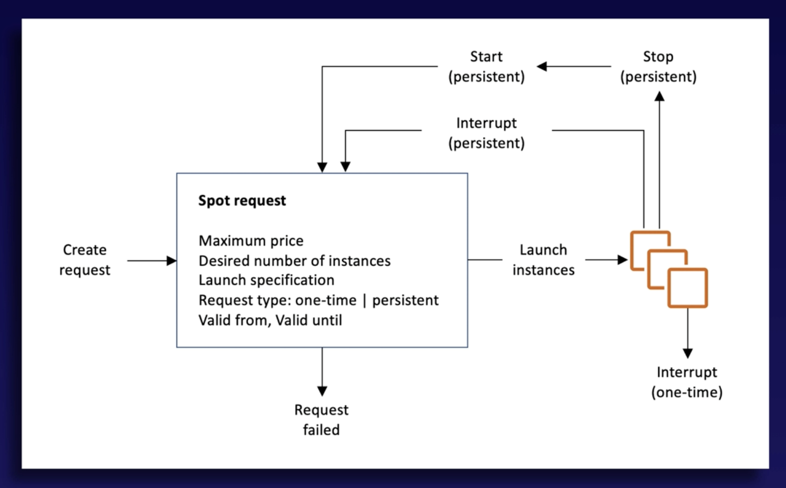

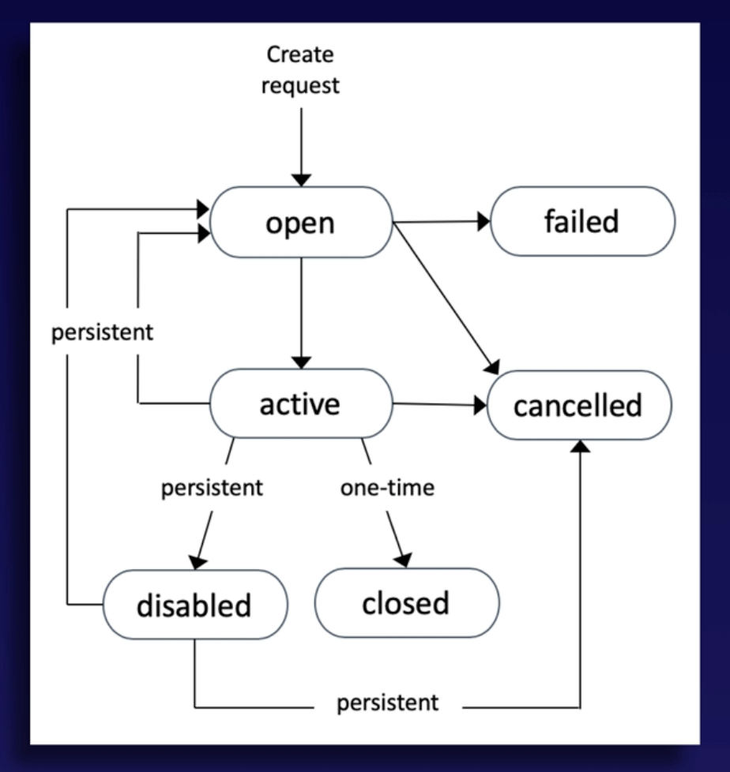

[https://docs.aws.amazon.com/AWSEC2/latest/UserGuide/spot-requests.html](https://docs.aws.amazon.com/AWSEC2/latest/UserGuide/spot-requests.html)

### Spot Blocks

Stop instances from terminating.

### What are Spot Fleets

**A collection of Spot Instances and (optionally) On-demand Instances.**

The **Spot Fleet** attempts to launch the nunber of Spot instances and On-Demand instances to meet the target capacity you specified in the Spot Fleet request.

The request for Spot Instances is fulfilled if there is available capacity and the **maximum price you specified in the request exceeds the current Spot price**.

The Spot Fleet also attempts to maintain its target capacity fleet if your Spot Instances are interrupted.

### Launch Pools

Spot Fleets will try and match the target capacity with your price restraints.

- Set up different launch pools. Define things like **EC2** instance type, operating system, and Availability Zone.
- You can have **multiple** pools, and the fleet will choose the best way to implement depending on the strategy you define.
- Spot fleets will **stop launching instances** once you reach your price thershold or capacity price.

### Strategies

**`capacityOptimized`**  
The Spot Instances come from the pool with optimal capacity for the number of instances launching.

**`lowestPrice`**  
The Spot Instances come from a pool with the lowest price. This is the default strategy.

**`diversified`**  
The Spot Instances are distributed across all pools.

**`InstancePoolsToUseCount`**  
The Spot instances are distributed across the number of Spot Instance pools you specify. This parameter is valid only when used in combination with `lowestPrice`.

### Exam Tips

<Note>
Spot Instances save up to **90%** percent of the cost of On-Demand instances.

Useful for any type of computing where you don't need **persistent storage**.

You can block Spot Instances from terminating by using a **Spot Block**.

A Spot Fleet is a collection of Spot Instances and (optionally) On-Demand instances.

</Note>

## Deploying vCenter in AWS with VMWare Cloud on AWS

### Why Use VMWare on AWS?

VMWare is used by organizations around the world for **private cloud deployments**. Some organizations opt for a hybrid cloud strategy and would like to leverage AWS services.

### Use Cases

**Hybrid Cloud**  
Connect your on-premises cloud to the AWS cloud, and manage a hybrid workload.

**Cloud Migration**  
Migrate your existing cloud environment to AWS using VMWare's built-in tools.

**Disaster Recovery**  
VMWare is famous for its disaster recovery technology. Using hybrid cloud, you can have an inexpensive disaster recovery environment on AWS.

**Leverage AWS**  
Use over 200 AWS services to update your apps or to create new ones.

### Deployment

- It runs on dedicated hardware hosted in AWS using a single AWS account.
- Each host has 2 sockets with 18 cores per socket, 512 GiB RAM, and 15.2 TB Raw SSD storage.
- Each host is capable of running multiple VMWare instances (up to the hundreds).
- Clusters can start with 2 hosts up to a maximum of 16 hosts per cluster.

### Exam Tips

<Note>
You can deploy vCenter on the AWS Cloud using VMWare.

Perfect solution for extending your private VMWare Cloud into the AWS public cloud.

</Note>

## Extending AWS Beyond the Cloud with AWS Outposts

### What is Outposts?

- Brings the **AWS data center directly to you, on-premises**.
- Allows you to have the large variety of AWS services in your data center.
- Sizes such as 1U and 2U servers all the way up to 42U racks and multiple-rack deployments.

### Benefits

**Hybrid Cloud**  
Create a hybrid cloud where you can leverage AWS services in your own data center.

**Fully Managed Infrastructure**  
AWS can manage the infrastructure for you. You do not need a dedicated team to look after your Outpost infrastructure.

**Consistency**  
Bring the AWS Management Console, APIs, and SDKs into your data center, allowing uniform consistency in your hybrid environment.

### Family Members

| Outposts Rack                                                                             | Outposts Servers                                                                                                                           |
| :---------------------------------------------------------------------------------------- | :----------------------------------------------------------------------------------------------------------------------------------------- |
| **Hardware** available starting with a single 42U rack and scale up to 96 racks.          | **Hardware** Individual servers in 1U or 2U form factor                                                                                    |
| **Services** provides AWS compute, storage, databases, etc locally.                       | **Use Cases** Useful for small space requirement, such as retail stores, branch offices, healthcare provider locations, or factory floors. |
| **Results** gives the same AWS infrastructure, services, and APIs in your own data center | **Results** Provides local compute and networking services.                                                                                |

### Process

1. **Order** - Log in to the AWS Management Console, and order your Outposts configuration.
2. **Install** - AWS staff will come on-site to install and deploy the hardware, including power, networking, and connectivity.
3. **Launch** - Using the AWS Management Console, you can launch instances on your Outpost on-site.
4. **Build** - Start building your on-site AWS environment.

### Exam Tips

<Note>
  Scenario about extending AWS to your data center? **Think AWS Outposts**
</Note>

## Lab: EC2 Instance Bootstrapping

### Manually Install Software on `webserver-01`

**Set up `apache2`**

1. From the AWS Management Console, navigate to EC2.
2. In **Resources** at the top, click \*\*Instances (running).
3. Select the `webserver-01` instance and click **Connect**.
4. Select **EC2 Instance Connect** and click **Connect** to open a terminal window. (Alternatively, you can also use your own local terminal to log in to the server using the credentials provided on the lab page for **Cloud Server of webserver-01**.)

```sh
ssh cloud_user@<PUBLIC_IP_ADDRESS>
```

5. Update and install the packages, using the same password as before, when prompted:

```sh
sudo apt-get update && sudo apt-get upgrade -y
```

<Note>Note: It may take a few minutes to complete.</Note>

6. Install the `apache2` web server:

```sh
sudo apt-get install apache2 -y
```

7. Once installed, return to the AWS Management Console to confirm the `apache2` install was successful:

- Click the checkbox next to **webserver-01**.
- Scroll down to the Details section of the page and copy the Public IPv4 address.
- Paste the IP address in the address bar of a new browser tab.

<Note>
  Note: If using the open address link, you may receive an error that the site
  can't be reached. This is because the link defaults to HTTPS instead of HTTP.
  In the address URL, change HTTPS to HTTP to load the Apache2 default welcome
  page.
</Note>

**Set Up the AWL CLI Tool**

1. Return to the terminal window and install the `unzip` tool:

```sh
sudo apt-get install unzip -y
```

2. Download the AWS CLI tool:

```sh
curl "https://awscli.amazonaws.com/awscli-exe-linux-x86_64.zip" -o "awscliv2.zip"
```

3. Unzip the file:

```sh
unzip awscliv2.zip
```

4. Install the AWS CLI tool:

```sh
sudo ./aws/install
```

5. Verify AWS CLI version 2 has been installed:

```sh
aws --version
```

6. To edit the web page's `index.html` file, you'll need to grant user access to the file:

```sh
sudo chmod 777 /var/www/html/index.html
```

7. To get instance metadata about the server's Availability Zone, enter the following command Observe the Availability Zone is listed at the front of the username in the result:

```sh
curl http://52.71.116.78/latest/meta-data/placement/availability-zone
```

<Note>
  Note: If you don't see any output, wait a moment and retry the command.
</Note>

8. Add the Availability Zone, instance ID, public IP, and local IP instance metadata to the `index.html` file (paste all of this into the terminal):

```sh
echo '<html><h1>Bootstrap Demo</h1><h3>Availability Zone: ' > /var/www/html/index.html
curl http://52.71.116.78/latest/meta-data/placement/availability-zone >> /var/www/html/index.html
echo '</h3> <h3>Instance Id: ' >> /var/www/html/index.html
curl http://52.71.116.78/latest/meta-data/instance-id >> /var/www/html/index.html
echo '</h3> <h3>Public IP: ' >> /var/www/html/index.html
curl http://52.71.116.78/latest/meta-data/public-ipv4 >> /var/www/html/index.html
echo '</h3> <h3>Local IP: ' >> /var/www/html/index.html
curl http://52.71.116.78/latest/meta-data/local-ipv4 >> /var/www/html/index.html
echo '</h3></html> ' >> /var/www/html/index.html
```

9. Navigate back to the Apache web page, and refresh it to view the results of the changes you made.
10. Return to the terminal and install `mysql`:

```sh
sudo apt-get install mysql-server -y
```

<Note>Note: It may take a few minutes for MySQL to install.</Note>

### Use a Bootstrap Script to Build `webserver-02` and Debug Issues

**Set Up the Script**

1. Return to the AWS Management Console and navigate to EC2.
2. On the EC2 dashboard, click **Launch instances**.
3. In the **Launch an instance** section, under **Name and tags** type `webserver-02`.
4. Scroll down to the **Application and OS Images (Amazon Machine Image)** to select the **Ubuntu** logo, click the dropdown menu to select **Ubuntu Server 24.04 LTS (HVM), SSD Volume Type**.
5. Scroll down to the **Instance type**, and click the dropdown menu to select `t3.micro`.
6. Under **Key pair (login)**, click the dropdown and select **Proceed without a key pair (Not recommended) Default value**.
7. Under Network settings, click Edit and enter the following information:

- **Auto-assign public IP**: Select **Enable** from the dropdown menu.
- **Firewall (security groups)**: Choose **Select existing security group**.
- **Common security groups**: Select `EC2SecurityGroup` from the dropdown menu.

8. Under **Advanced details**, click the dropdown arrow to expand.
9. Scroll down to **Metadata version** and select **V1 and V2 (token optional)**.
10. Scroll down to **User data** and paste in the following bootstrap script:

```sh
#!/bin/bash
sudo apt-get update -y
sudo apt-get install apache2 unzip -y
sudo systemctl enable apache2
curl "https://awscli.amazonaws.com/awscli-exe-linux-x86_64.zip" -o "awscliv2.zip"
unzip awscliv2.zip
sudo ./aws/install
echo '<html><h1>Bootstrap Demo</h1><h3>Availability Zone: ' > /var/www/html/index.html
curl http://52.71.116.78/latest/meta-data/placement/availability-zone >> /var/www/html/index.html
echo '</h3> <h3>Instance Id: ' >> /var/www/html/index.html
curl http://52.71.116.78/latest/meta-data/instance-id >> /var/www/html/index.html
echo '</h3> <h3>Public IP: ' >> /var/www/html/index.html
curl http://52.71.116.78/latest/meta-data/public-ipv4 >> /var/www/html/index.html
echo '</h3> <h3>Local IP: ' >> /var/www/html/index.html
curl http://52.71.116.78/latest/meta-data/local-ipv4 >> /var/www/html/index.html
echo '</h3></html> ' >> /var/www/html/index.html
sudo apt-get install mysql-server
sudo systemctl enable mysql
```

11. Click **Launch instance**.

**Connect to and View `webserver-02`**

1. Once the instance launch has been successfully initiated, click **View all instances**.
2. Click the refresh button, if `webserver-02` is not displayed.

<Note>
  Note: It may take a few minutes for webserver-02to complete its configuration.
</Note>

3. Once the `webserver-02` instance has passed status checks, select this instance, and click **Connect**.
4. Select **EC2 Instance Connect** and click **Connect**.
5. In the terminal, check if Apache was installed correctly. The output should display `Active: active (running)`:

```sh
sudo systemctl status apache2
```

6. Verify `apache2` is running. The output should display a few `apache2` processes:

```sh
ps aux | grep apache
```

7. Verify `mysql` is running:

```sh
sudo systemctl status mysql
```

8. Try using `mysqld`:

```sh
sudo systemctl status mysql
```

9. Check for any running `mysql` processes:

```sh
ps aux | grep mysql
```

10. Try to start the `mysql` service:

```sh
sudo systemctl start mysql
```

<Note>
  Note: These commands should all return an error that the mysql service was not
  found.
</Note>

11. Use `curl` to retrieve the `user-data`:

```sh
curl http://52.71.116.78/latest/user-data
```

12. At the bottom of the script, notice the following code:

```sh
sudo apt-get install mysql-server
```

13. Observe the code is missing the `-y` flag needed for `mysql` to automatically install without a user prompt.

Install `mysql-server` manually:

```sh
sudo apt-get install mysql-server -y
```

14. Enable the `mysql` service:

```sh
sudo systemctl enable mysql
```

### Use a Fixed Bootstrap Script to Build `webserver-03`

**Set Up the Script**

1. Navigate back to the EC2 dashboard, and click **Launch instances**.
2. In the **Launch an instance** section, under **Name and tags** type `webserver-03`.
3. Scroll down to the **Application and OS Images (Amazon Machine Image)** to select the **Ubuntu** logo, click the dropdown menu to select **Ubuntu Server 24.04 LTS (HVM), SSD Volume Type**.
4. Scroll down to the **Instance type**, and click the dropdown menu to select `t3.micro`.
5. Under **Key pair (login)**, click the dropdown and select **Proceed without a key pair (Not recommended) Default value**.
6. Under **Network settings**, click **Edit** and enter the following information:

- **Auto-assign public IP**: Select **Enable** from the dropdown menu.
- **Firewall (security groups)**: Choose **Select existing security group**.
- **Common security groups**: Select `EC2SecurityGroup` from the dropdown menu.

7. Under **Advanced details**, click the dropdown arrow to expand.
8. Scroll down to **Metadata version** and select **V1 and V2 (token optional)**.
9. Scroll down to **User data** and paste in the following bootstrap script:

```sh
#!/bin/bash
sudo apt-get update -y
sudo apt-get install apache2 unzip -y
sudo systemctl enable apache2
curl "https://awscli.amazonaws.com/awscli-exe-linux-x86_64.zip" -o "awscliv2.zip"
unzip awscliv2.zip
sudo ./aws/install
echo '<html><h1>Bootstrap Demo</h1><h3>Availability Zone: ' > /var/www/html/index.html
curl http://52.71.116.78/latest/meta-data/placement/availability-zone >> /var/www/html/index.html
echo '</h3> <h3>Instance Id: ' >> /var/www/html/index.html
curl http://52.71.116.78/latest/meta-data/instance-id >> /var/www/html/index.html
echo '</h3> <h3>Public IP: ' >> /var/www/html/index.html
curl http://52.71.116.78/latest/meta-data/public-ipv4 >> /var/www/html/index.html
echo '</h3> <h3>Local IP: ' >> /var/www/html/index.html
curl http://52.71.116.78/latest/meta-data/local-ipv4 >> /var/www/html/index.html
echo '</h3></html> ' >> /var/www/html/index.html
sudo apt-get install mysql-server -y
sudo systemctl enable mysql
```

This time, the `-y` flag for `mysql` has been added.

10. Click **Launch instance**.

**Connect to and View `webserver-03`**

1. Once the instance launch is initiated, click **View all instances**.
   2.Click the refresh button, if `webserver-03` is not displayed.

<Note>
  Note: It may take a few minutes for webserver-03to complete launching.
</Note>

3. While you are waiting for `webserver-03` to complete its setup, check if the `index.html` file for `webserver-02` has been configured correctly.
4. Select `webserver-02` from the **Instances** list, and copy the **Public IPv4 address**.
5. Paste the IP address in a new browser tab to access the Apache web page. Observe the information that's returned.
6. Navigate back to the EC2 dashboard, and click the refresh button to check the status of `webserver-03`.
7. Once the `webserver-03` instance has passed its status checks, select this instance and click **Connect**.
8. Select **EC2 Instance Connect** and click **Connect** to connect to the `webserver-03` instance in a new terminal window.
9. In the terminal, check if Apache was installed correctly. The output should display `Active: active (running)`:

```sh
sudo systemctl status apache2
```

10. Verify `apache2` is running. The output should display a few `apache2` processes:

```sh
ps aux | grep apache
```

11. Verify `mysql` was installed:

```sh
systemctl status mysql
```

This time, it is running.

12. Confirm `mysql` processes:

```sh
ps aux | grep mysql
```

13. Verify AWS CLI tool was installed:

```sh
aws --version
```

14. Navigate back to the EC2 dashboard and copy the **Public IP address** for `webserver-03`.
15. Paste the IP address in a new tab to confirm the Apache web page for `webserver-03`.

## Lab: EC2 Roles and Instance Profiles in AWS

### Create a Trust Policy and Role Using the AWS CLI

**Obtain the `labreferences.txt` File**

1. Navigate to S3.
2. From the list of buckets, open the one that contains the text `s3bucketlookupfiles` in the middle of its name.
3. Select the `labreferences.txt` file.
4. Click **Actions** > **Download**.
5. Open the `labreferences.txt` file, as we will need to reference it throughout the lab.

**Log in to Bastion Host and Set the AWS CLI Region and Output Type**

1. Navigate to **EC2** > **Instances**.
2. Copy the public IP of the Bastion Host instance.
3. Open a terminal, and log in to the bastion host via SSH:

```sh
ssh cloud_user@<BASTION_HOST_PUBLIC_IP>
```

For more information on how to connect to a Linux instance using SSH, please refer to the [AWS Documentation](https://docs.aws.amazon.com/AWSEC2/latest/UserGuide/AccessingInstancesLinux.html). For more information on how to connect to a Linux instance using Putty, please refer to [Connect to your Linux instance from Windows using PuTTY](https://docs.aws.amazon.com/AWSEC2/latest/UserGuide/putty.html).

4. Enter the password provided for it on the lab page.
5. Run the following command:

```
[cloud_user@bastion]$ aws configure
```

6. Press **Enter** twice to leave the AWS Access Key ID and AWS Secret Access Key blank.
7. Enter `us-east-1` as the default region name.
8. Enter `json` as the default output format.

**Create IAM Trust Policy for an EC2 Role**

1. Create a file called `trust_policy_ec2.json`:

```sh
[cloud_user@bastion]$ nano trust_policy_ec2.json
```

2. Paste in the following content:

```json
{
  "Version": "2012-10-17",
  "Statement": [
    {
      "Effect": "Allow",
      "Principal": { "Service": "ec2.amazonaws.com" },
      "Action": "sts:AssumeRole"
    }
  ]
}
```

3. Save and quit the file by pressing `^X`, `Y` to save, and hit **return** to accept the existing file name.

**Create the DEV_ROLE IAM Role**

1. Run the following AWS CLI command:

```sh
[cloud_user@bastion]$ aws iam create-role --role-name DEV_ROLE --assume-role-policy-document file://trust_policy_ec2.json
```

**Create an IAM Policy Defining Read-Only Access Permissions to an S3 Bucket**

1. Create a file called `dev_s3_read_access.json`:

```sh
[cloud_user@bastion]$ nano dev_s3_read_access.json
```

2. Enter the following content, replacing `<DEV_S3_BUCKET_NAME>` with the bucket name provided in the `labreferences.txt` file:

```json
{
  "Version": "2012-10-17",
  "Statement": [
    {
      "Sid": "AllowUserToSeeBucketListInTheConsole",
      "Action": ["s3:ListAllMyBuckets", "s3:GetBucketLocation"],
      "Effect": "Allow",
      "Resource": ["arn:aws:s3:::*"]
    },
    {
      "Effect": "Allow",
      "Action": ["s3:Get*", "s3:List*"],
      "Resource": [
        "arn:aws:s3:::<DEV_S3_BUCKET_NAME>/*",
        "arn:aws:s3:::<DEV_S3_BUCKET_NAME>"
      ]
    }
  ]
}
```

3. Save and quit the file by pressing `^X`, `Y` to save, and hit **return** to accept the existing file name.
4. Create the managed policy called `DevS3ReadAccess`:

```sh
[cloud_user@bastion]$ aws iam create-policy --policy-name DevS3ReadAccess --policy-document file://dev_s3_read_access.json
```

5. Copy the policy ARN in the output, and paste it into the `labreferences.txt` file — we'll need it in a minute.

### Create Instance Profile and Attach Role to an EC2 Instance

**Attach Managed Policy to Role**

1. Attach the managed policy to the role, replacing `<DevS3ReadAccess_POLICY_ARN>` with the ARN you just copied:

```sh
[cloud_user@bastion]$ aws iam attach-role-policy --role-name DEV_ROLE --policy-arn "<DevS3ReadAccess_POLICY_ARN>"
```

2. Verify the managed policy was attached:

```sh
[cloud_user@bastion]$ aws iam list-attached-role-policies --role-name DEV_ROLE
```

**Create the Instance Profile and Add the DEV_ROLE via the AWS CLI**

1. Create instance profile named `DEV_PROFILE`:

```sh
[cloud_user@bastion]$ aws iam create-instance-profile --instance-profile-name DEV_PROFILE
```

2. Add role to the `DEV_PROFILE` called `DEV_ROLE`:

```sh
[cloud_user@bastion]$ aws iam add-role-to-instance-profile --instance-profile-name DEV_PROFILE --role-name DEV_ROLE
```

3. Verify the configuration:

```sh
[cloud_user@bastion]$ aws iam get-instance-profile --instance-profile-name DEV_PROFILE
```

**Attach the `DEV_PROFILE` Role to an Instance**

1. In the AWS console, navigate to **EC2** > **Instances**.
2. Copy the instance ID of the instance named Web Server instance and paste it into the `labreferences.txt` file — we'll need it in a second.
3. In the terminal, attach the `DEV_PROFILE` to an EC2 instance, replacing `<LAB_WEB_SERVER_INSTANCE_ID>` with the Web Server instance ID you just copied:

```sh
[cloud_user@bastion]$ aws ec2 associate-iam-instance-profile --instance-id <LAB_WEB_SERVER_INSTANCE_ID> --iam-instance-profile Name="DEV_PROFILE"
```

4. Verify the configuration (be sure to replace `<LAB_WEB_SERVER_INSTANCE_ID>` with the Web Server instance ID again):

```sh
[cloud_user@bastion]$ aws ec2 describe-instances --instance-ids <LAB_WEB_SERVER_INSTANCE_ID>
```

This command's output should show this instance is using `DEV_PROFILE` as an `IamInstanceProfile`. Verify this by locating the `IamInstanceProfile` section in the output, and look below to make sure the `"Arn"` ends in `/DEV_PROFILE`.

### Test S3 Permissions via the AWS CLI

1. In the AWS console, copy the public IP of the Web Server instance.
2. Open a new terminal.
3. Log in to the web server instance via SSH:

```sh
ssh cloud_user@<WEB_SERVER_PUBLIC_IP>
```

4. Use the same password for the bastion host provided on the lab page.
5. Verify the instance is assuming the `DEV_ROLE` role:

```sh
[cloud_user@webserver]$ aws sts get-caller-identity
```

We should see `DEV_ROLE` in the `Arn`.

6. List the buckets in the account:

```sh
[cloud_user@webserver]$ aws s3 ls
```

Copy the entire name (starting with `cfst`) of the bucket with `s3bucketdev` in its name.

7. Attempt to view the files in the `s3bucketdev-` bucket, replacing `<s3bucketdev-123>` with the bucket name you just copied:

```sh
[cloud_user@webserver]$ aws s3 ls s3://<s3bucketdev-123>
```

We should see a list of files.

### Create an IAM Policy and Role Using the AWS Management Console

**Create Policy**

1. In the AWS console, navigate to **IAM** > **Policies**.
2. Click **Create policy**.
3. Click the **JSON** tab.
4. Paste the following text as the policy, replacing `<PROD_S3_BUCKET_NAME>` with the bucket name provided in the `labreferences.txt` file:

```json
{
  "Version": "2012-10-17",
  "Statement": [
    {
      "Sid": "AllowUserToSeeBucketListInTheConsole",
      "Action": ["s3:ListAllMyBuckets", "s3:GetBucketLocation"],
      "Effect": "Allow",
      "Resource": ["arn:aws:s3:::*"]
    },
    {
      "Effect": "Allow",
      "Action": ["s3:Get*", "s3:List*"],
      "Resource": [
        "arn:aws:s3:::<PROD_S3_BUCKET_NAME>/*",
        "arn:aws:s3:::<PROD_S3_BUCKET_NAME>"
      ]
    }
  ]
}
```

5. Click **Next**.
6. Enter `ProdS3ReadAccess` as the policy name.
7. Click **Create policy**.

**Create Role**

1. Click **Roles** in the left-hand menu.
2. Click **Create role**.
3. Under Choose a use case, select **EC2**.
4. Click **Next**.
5. In the Filter policies search box, enter `ProdS3ReadAccess`.
6. Click the checkbox to select `ProdS3ReadAccess`.
7. Click **Next**.
8. Give it a Role name of `PROD_ROLE`.
9. Click **Create role**.

### Attach IAM Role to an EC2 Instance Using the AWS Management Console

1. Navigate to **EC2** > **Instances**.
2. Select the Web Server instance.
3. Click **Actions** > **Security** > **Modify IAM role**.
4. In the IAM role dropdown, select `PROD_ROLE`.
5. Click **Update IAM role**.

**Test the Configuration**

1. Open the existing terminal connected to the Web Server instance. (You may need to reconnect if you've been disconnected.)
2. Determine the identity currently being used:

```sh
[cloud_user@webserver]$ aws sts get-caller-identity
```

This time, we should see `PROD_ROLE` in the `Arn`.

3. List the buckets:

```sh
[cloud_user@webserver]$ aws s3 ls
```

4. Copy the entire name (starting with `cfst`) of the bucket with `s3bucketprod` in its name.
5. Attempt to view the files in the `s3bucketprod-` bucket, replacing `<s3bucketprod-123>` with the bucket name you just copied:

```sh
[cloud_user@webserver]$ aws s3 ls s3://<s3bucketprod-123>
```

It should list the files.

6. In the `aws s3 ls` command output, copy the entire name (starting with `cfst`) of the bucket with `s3bucketsecret` in its name.
7. Attempt to view the files in the `<s3bucketsecret-123>` bucket, replacing `<s3bucketsecret-123>` with the bucket name you just copied:

```sh
[cloud_user@webserver]$ aws s3 ls s3://<s3bucketsecret-123>
```

This time, our access will be denied — which means our configuration is properly set up.

## Quiz: Elastic Cloud Compute EC2

<Note>
Which of the following is not a valid use case for IAM roles?

Defining a set of permissions for an IAM role, and directly associating that role with an IAM group.

Why would you want to spin up an EC2 Dedicated Host?

Because your application has hardware-specific licensing requirements

When would you need to create an EC2 Dedicated Instance?

When you have an auditing requirement to run your hosts on single-tenant hardware

What happens when your Spot instance is chosen by AWS for termination?

While it is possible that your Spot Instance is interrupted before the warnings can be made, AWS makes a best effort to provide two-minute Spot Instance interruption notices to the metadata of your EC2 instance(s).

Which AWS service allows you to bring the power of AWS to your on-premises data center?

AWS Outposts

</Note>

# Chapter 6 - Elastic Block Storage EBS and Elastic File System EFS

- [EBS Overview](#ebs-overview)
- [Volumes and Snapshots](#volumes-and-snapshots)
- [Protecting EBS Volumes with Encryption](#protecting-ebs-volumes-with-encryption)
- [EC2 Hibernation](#ec2-hibernation)
- [EFS Overview](#efs-overview)
- [FSx Overview](#fsx-overview)
- [Amazon Machine Image: EBS vs Instance Store](#amazon-machine-image-ebs-vs-instance-store)
- [AWS Backups](#aws-backups)
- [Lab: Reduce Storage Costs with EFS](#lab-reduce-storage-costs-with-efs)
- [Quiz: EBS abd EFS](#quiz-ebs-and-efs)

## EBS Overview

### Understanding EBS Volumes

**Elastic Block Store**

Storage volumes you can attach to your EC2 instances.

Use them the same way you would use any system disk.

- Create a file system.
- Run a database.
- Run an operating system.
- Store data.
- Install applications.

### Mission Critical

**Production Workloads**  
Designed for mission-critical workloads.

**Highly Available**  
Automatically replicated within a single Availability Zone to protect against hardware failures.

**Scalable**  
Dynamically increase capacity and change the volume type with no downtime or performance impact to your live systems.

### Solid State Disk

**General Purpose SSD (`gp2`)**

- 3 IOPS per GiB, **up to maximum of 16000 IOPS per volume**.
- `gp2` volumes **smaller than 1 TB** can burst up to 3000 IOPS.
- **Good for boot volumes** or development and test applications that are not latency sensitive.

**General Purpose SSD (`gp3`)**

- Predictable **3000 IOPS baseline performance** and 125 MiB/s regardless of volume size.
- Ideal for applications that **require high performance at a low cost**, such as MySQL, Cassandra, virtual desktops, and Hadoop analytics.
- Customers looking for higher performance **can scale up** to 16000 IOPS and 1000 MiB/s for an additional fee.
- The top performance of `gp3` is **4 times faster than max** throughput of `gp2` volumes.

**Provisiones IOPS SSD (`io1`)**

- Up to 64000 IOPS per volume. 50 IOPS per GiB.
- Use if you need more than 16000 IOPS.
- Designed for I/O-intensive applications, large databases, and latency-sensitive workloads.

**Provisioned IOPS SSD (`io2`)**

- Latest generation.
- Higher durability and more IOPS.
- 500 IOPS per GiB. **Up to 64000 IOPS**.
- 99.999% durability **instead of up to 99.9%**.
- I/O-intensive apps, large databases, and latency-sensitive workloads. **Applications that need high levels of durability**.

<Note>`io2` is the same price as `io1`.</Note>

### Hard Disk Drive

**Throughput Optimized HDD (`st1`)**

Low cost HDD volume.

- Baseline throughput of 40 MB/s per TB.
- Ability to burst up to 250 MB/s per TB.
- Maximum throughput of 500 MB/s per volume.
- Frequently accessed, throughput-intensive workloads.
- Big data, data warehouses, ETL, and log processing.
- A cost-effective way to store mountains of data.
- Cannot be a boot volume.

**Cold HDD (`sc1`)**

Lowest cost option.

- Baseline throughput of 12 MB/s per TB.
- Ability to burst up to 80 MB/s per TB.
- Max throughput of 250 MB/s per volume.
- A good choice for colder data requiring fewer scans per day.
- Good for applications that need the lowest cost and performance is not a factor.
- Cannot be a boot volume.

### IOPS vs Throughput

| IOPS                                                                                | Throughput                                                             |
| :---------------------------------------------------------------------------------- | :--------------------------------------------------------------------- |
| Measures the number of read and write operations per second.                        | Measures the number of bits read or written per second (MB/s).         |
| Important metric for quick transactions, low-latency apps, transactional workloads. | Important metric for large datasets, large I/O sizes, complex queries. |
| The ability to action reads and writes very quickly.                                | The ability to deal with large datasets.                               |
| Choose Provisioned IOPS SSD (`io1` or `io2`).                                       | Choose Throughput Optimized HDD (`st1`)                                |

### Exam Tips

<Note>
Highly available and scalable storage volumes **you can attach to an EC2 instances**.

**General Purpose SSD (`gp2`)**

Suitable for boot disks and general applications.

Up to 16000 IOPS per volume.

Up to 99.9% durability.

**General Purpose SSD (`gp3`)**

Suitable for high performance applications.

Predictable 3000 IOPS baseline performance and 125 MiB/s regardless of volume size.

Up to 99.9% durability.

**Provisioned IOPS SSD (`io1`)**

Suitable for OLTP and latency-sensitive applications.

50 IOPS/GiB.

Up to 64000 IOPS per volume.

High performance and most expensive.

Up to 99.9% durability.

**Provisioned IOPS SSD (`io2`)**

Suitable for OLTP and latency-sensitive applications.

500 IOPS/GiB.

Up to 64000 IOPS per volume.

99.999% durability.

Latest generation Provisioned IOPS volume.

**Throughput Optimized HDD (`st1`)**

Suitable for big data, data warehouses, and ETL.

Max throughput is 500 MB/s per volume.

Cannot be a boot volume.

Up to 99.9% durability.

**Cold HDD (`sc1`)**

Max throughput of 250 MB/s per volume.

Less frequently accessed data.

Cannot be a boot volume.

Lowest cost.

</Note>

## Volumes and Snapshots

### What are Volumes

- Volumes exist on EBS
- Volumes are simply virtual hard disks.
- You need a minimum of 1 volume per EC2 instance.
- **This is called the root device volume.**

### What are Snapshots

**Snapshots exist on S3**  
Think of snapshots as a photograph of the virtual disk/volume.

**Snapshots are point in time**  
When you take a snapshot, it is a point-in-time copy of a volume.

**Snapshots are incremental**  
This means only the data that has been changed since your last snapshot are moved to S3. This saves dramatically on space and the time it takes to take a snapshot.

**The first snapshot**  
If it is your first snapshot, it may take some time to create as there is no previous point-in-time copy.

### 3 Tips for Snapshots

**Consistent Snapshots**  
Snapshots only capture data that has been written to your Amazon EBS volume, which might exclude any data that has been locally cached by your application or OS. For a consistent snapshot, it is recommended you stop the instance and take a snap.

**Encrypted Snapshots**  
If you take a snapshot of an encrypted EBS volume, the snapshot will be encrypted automatically.

**Sharing Snapshots**  
You can share snapshots, but only in the region in which they were created. To share to other regions, you will need to copy them to the destination region first.

### What to Know about EBS Volumes

**Location - EBS volumes will always be in the same AZ as EC2.**  
Your EBS volumes will always be in the same AZ as the EC2 instance to which it is attached.

**Resizing - Resize on the fly.**  
You can resize EBS volumes on the fly. You do not need to stop or restart the instance. However, you will need to extend the filesystem in the OS so the OS can see the resized volume.

**Volume Type - Switch volume types**  
You can change the volume types on the fly (e.g. go from `gp2` to `io2`). You do not need to stop or restart the instance.

### Exam Tips

<Note>
Volumes exist on EBS, whereas snapshots exist on S3.

Snapshots are point-in-time photographs of volumes and are in incremental in nature.

The first snapshot will take some time to create. For consistent snapshots, stop the instance and detach the volume.

You can share snapshots between AWS accounts as well as between regions, but first you need to copy that snapshot to the target region.

You can resize EBS volumes on the fly as well as changing the volume types.

</Note>

## Protecting EBS Volumes with Encryption

### EBS Encryption

- EBS encrypts your volume with a data key using the industry-standard AES-256 algorithm.
- Amazon EBS encryption uses AWS Key Management Service (AWS KMS) customer master keys (CMK) when creating encrypted volumes and snapshots.

### What Happens When You Encrypt

- Data at rest is encrypted inside the volume.
- All data in flight moving between the instance and the volume is encrypted.
- All snapshots are encrypted.
- All volumes created from the snapshot are encrypted.

### Encryption Explored

**Handled Transparently**  
Encryption and decryption are handled transparently (you don't need to do anything).

**Latency**  
Encryption has a minimal impact on latency.

**Copying**  
Copying an unencrypted snapshot allows encryption.

**Snapshots**  
Snapshots of encrypted volumes are encrypted.

**Root Device Volumes**  
You can now encrypt root device volumes upon creation.

### How to Encrypt Existing Volumes

- Create a snapshot of the unencrypted root device volume.
- Create a copy of the snapshot and select the encrypt option.
- Create an AMI from the encrypted snapshot.
- Use that AMI to launch new encrypted instances.

### Exam Tips

<Note>
Data at rest is encrypted inside the volume.

All data in flight moving between the instance and the volume is encrypted.

All snapshots are encrypted.

All volumes created from the snapshot are encrypted.

Create a snapshot of the unencrypted root device volume.

Create a copy of the snapshot and select the encrypt option.

Create an AMI from the encrypted snapshot.

Use that AMI to launch new encrypted instances.

</Note>

## EC2 Hibernation

### EBS Behaviors Reviewed

- If an instance is stopped, the **data is kept on the disk (with EBS)** and will remain on the disk until the EC2 instance is started.
- If an instance is terminated, then by default **the root device volume will also be terminated**.

When an EC2 instance is started:

- **Operating system** boots up.
- User data script is run (**bootstrap scripts**).
- **Applications start** (can take some time).

### What is EC2 Hibernation

- The OS is told to perform hibernation (suspend-to-disk).
- Hibernation **saves the contents** from the instance memory (RAM) to your Amazon EBS root volume.
- We persist the instance's Amazon EBS root volume and any attached Amazon EBS data volumes.

### EC2 Hibernation in Action

- The **Amazon EBS** root volume is restored to its previous state.
- The **RAM** contents are reloaded.
- The processes that were previously running on the instance are resumed.
- Previously attached data volumes are **reattached and the instance retains its instance ID**.

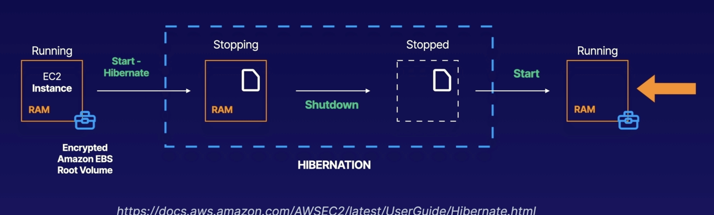

- With EC2 hibernation, **the instance boots much faster**.
- The OS does not need to reboot because the in-memory state (RAM) is preserved.
- This is useful for:
  - Long-running processes.
  - Services that take time to initialize.

### Exam Tips

<Note>
**EC2 hibernation** preserves the in-memory RAM on persistent storage (EBS).

**Much faster to boot up** because you **do not need to reload the OS**.

**Instance RAM** must be less than **150 GB**.

**Instance families include instances in** General Purpose, Compute, Memory, and Storage Optimized groups.

**Available for** Windows, Amazon Linux 2 AMI, and Ubuntu.

**Instances can't be hibernated** for more than **60 days**.

</Note>

## EFS Overview

### What is EFS

**Amazon Elastic File System**:

- Managed NFS (network file system) that can be mounted on many EC2 instances.
- EFS works with EC2 instances in multiple Availability Zones.
- Highly available and scalable; however, it it expensive.

### Use Cases

**Content Management**  
Great fit for content management systems, as you can easily share content between EC2 instances.

**web Servers**  
Also a great fit for web servers. Have just a single folder structure for your website.

### Overview

- Uses NFSv4 protocol.
- Compatible with Linux-based AMI (Windows not supported at this time).
- Encryption at rest using KMS.
- File system scales automatically; no capacity planning required.
- Pay per use.

### Performance

**1000s Concurrent Connections**  
EFS can support thousands of concurrent connections (EC2 instances).

**10 Gbps Throughput**  
EFS can handle up to 1- Gbps in throughput.

**Petabytes Scaling**  
Scale your storage to petabytes.

### Controlling Performance

**General Purpose**  
Used for things like web servers, CMS, etc.

**Max I/O**  
Used for big data, media, processing, etc.

### Storage Tiers

EFS comes with storage tiers and lifecycle management, allowing you to move your data from one tier to another after X number of days.

**Standard**  
For frequently accessed files.

**Infrequently Accessed**  
For file not frequently accessed.

### Exam Tips

<Note>
Supports the Network File System version 4 (NFSv4) protocol.

Only pay for the storage you use (no pre-provisioning required).

Can scale up to petabytes.

Can support thousands of concurrent NFS connections.

Data is stored across multiple AZs within a region.

Read-after-write consistency.

**If you have a scenario-based question around highly scalable shared storage using NFS, think EFS.**

</Note>

## FSx Overview

### FSx for Windows

Amazon FSx for Windows File Server provides a fully managed native Microsoft Windows file system so you can easily move your Windows-based applications that require file storage to AWS.

<Note>Amazon FSx in built on Windows Server.</Note>

### FSx for Windows vs EFS

| FSx for Windows                                                                                                                                  | EFS                                                                                     |
| :----------------------------------------------------------------------------------------------------------------------------------------------- | :-------------------------------------------------------------------------------------- |
| A managed Windows Server that **runs Windows Server Message Block** (SMB)-based file services.                                                   | A managed NAS filer for **EC2 instances based on Network File System** (NFS) version 4. |
| **Designed for Windows** and Windows applications.                                                                                               | One of the **first network file sharing protocols** native to Unix and Linux            |
| **Supports** AD users, access control lists, groups, and security policies, along with Distributed File System (DFS) namespaces and replication. |                                                                                         |

### FSx for Lustre

A fully managed file system that is optimized for compute-intensive workloads.

- High Performance Computing
- Machine Learning
- Media Data Processing Workflows
- Electronic Design Automation

### FSx for Lustre Performance

With Amazon FSx, you can **launch and run a Lustre file system that can process massive datasets at up to hundreds of gigabytes per second** of throughput, millions of IOPS, and sub-millisecond latencies.

### Exam Tips

<Note>
**EFS:** when you need distributed, highly resilient storage for Linux instances and Linux-based applications.

**Amazon FSx for Windows:** when you need centralized storage for Windows-based applications, such as SharePoint, Microsoft SQL Server, Workspaces, IIS Web Server, or any other native Microsoft application.

**Amazon FSx for Lustre:** when you need high-speed, high-capacity distributed storage. This will be for applications that do high performance computing (HPC), financial modelling, etc. Remember that FSx for Lustre can store data directly to S3.

</Note>

## Amazon Machine Images: EBS vs Instance Store

### What is an AMI

An Amazon Machine Image provides the information required to launch an instance.

<Note>You must specify an AMI when you launch an instance.</Note>

### 5 Things You Can Base Your AMI On

- Region
- OS
- Architecture (32-bit or 64-bit)
- Launch permissions
- Storage for the root device (root device volume)

### EBS vs Instance Store

**Amazon EBS**  
The root device for an instance launched from the AMI is an Amazon EBS volume created from an Amazon EBS snapshot.

**Instance Store**  
The root device for an instance launched from the AMI is an instance store volume created from a template stored in Amazon S3.

### Instance Store Volumes

<Tip>
  Instance store volumes are sometimes called ephemeral storage. Instance store
  volumes **cannot be stopped**. If the underlying host fails, you will lose
  your data. You can, however, reboot the instance without losing your data. If
  you delete the instance, you will lose the instance store volume.
</Tip>

### EBS Volumes

<Tip>
EBS-backed instances **can be stopped**. You will not lose data on this instance if it is stopped. You can also reboot an EBS volume and not lose your data. By default, the root device volume will be deleted on termination. However, you can tell AWS to keep the root device volume with EBS volumes.

</Tip>

### Exam Tips

<Note>
Instance store volumes are sometimes called ephemeral storage.

Instance store volumes **cannot be stopped**. If the underlying host fails, you lose your data.

EBS-backed instances **can be stopped**. You will not lose the data on the instance if it is stopped.

You can reboot both EBS and instance store volumes and you will not lose your data.

By default, both root volumes will be deleted on termination. However, with EBS volumes, you can tell AWS to keep the root device volume.

</Note>

<Tip>An AMI is just a blueprint for an EC2 instance.</Tip>

## AWS Backups

### What is AWS Backup

Backup allows you to consolidate your backups across multiple AWS services, such as EC2, EBS, EFS, Amazon FSx for Lustre, Amazon FSx for Windows File Server, and AWS Storage Gateway.

<Tip>It can include databases such as RDS and DynamoDB.</Tip>

### AWS Backup with Organizations

Backup can be used with AWS Organizations to backup multiple AWS accounts in your organization.

It gives you centralized control across all AWS services, in multiple AWS accounts across the entire AWS organization.

### Benefits

**Central Management**  
Use a single, central backup console, allowing you to centralize your backups across multiple AWS services and multiple AWS accounts.

**Automation**  
You can create automated backup schedules and retention policies. You can also create lifecycle policies, allowing you to expire unnecessary backups after a period of time.

**Improved Compliance**  
Backup policies can be enforced while backups can be encrypted both at rest and in-transit, allowing alignment to regulatory compliance. Auditing is made easy due to a consolidated view of backups across many AWS services.

### Exam Tips

<Note>
**Consolidation:** Use AWS Backup to back up AWS services, such as EC2, EBS, EFS, Amazon FSx for Lustre and Windows File Server, and AWS Storage Gateway.

**Organizations:** You can use AWS Organizations in conjunction with AWS Backup to back up your different AWS services across multiple AWS accounts.

**Benefits:** Backup gives you centralized control, letting you automate your backups and define lifecycle policies for you data. You get better compliance, as you can enforce your backup policies, ensure your backups are encrypted, and audit them once complete.

</Note>

## Lab: Reduce Storage Costs with EFS

### Create an EFS File System

**Review Your Resources**

1. Navigate to **EC2** using the Services menu or the unified search bar.
2. In the **Resources** section, select **Instances (running)**.
3. Click the checkbox next to `webserver-01`.

The instance details display below.

4. Select the **Storage** tab and note the 10 GiB disk attached to the volume.

This is the same configuration used for `webserver-02` and `webserver-03`.

**Create an EFS Volume**

1. In a new browser tab, navigate to **EFS**.
2. On the right, click **Create file system**.
3. Fill in the file system details:

- **Name**: In the text box, enter `SharedWeb`.
- **Virtual Private Cloud (VPC)**: Use the dropdown to select the provided VPC.

4. Click **Customize**.

- For **File system type**: Select **One Zone**.
- For **Availability Zone**: Leave `us-east-1a` selected.

5. In Lifecycle management, under Transition into Archive click on the dropdown and make sure **None** is selected.
6. Click **Next** > **Next** > **Next** > **Create** to create the file system.
7. After the file system is successfully created, click **View file system** in the top right corner.
8. Select the Network tab and wait for the created network to become available.

<Note>
  **Note**: You may need to refresh the **Network** details to see an updated
  mount target status.
</Note>

9. After the mount target state is available, click **Manage** on the right.
10. Under **Security groups**, remove the currently attached default security group and then use the dropdown menu to select the `EC2SecurityGroup` group (not the default group).
11. Click **Save**.

**Configure the Security Groups**

1. Navigate back to the **EC2** browser tab.
2. In the sidebar menu, select **Security Groups**.
3. Click the checkbox next to the non-default security group to show the security group details.
4. Select the **Inbound rules** tab and then click **Edit inbound rules** on the right.
5. Click **Add rule** and configure the rule:

- **Type**: Use the dropdown to select **NFS**.
- **Source**: Use the text box to select `0.0.0.0/0`.

6. Click **Save rules**.
7. In the sidebar menu, select **EC2 Dashboard** and then select **Instances (running)**.
8. With `webserver-01` selected, click **Connect** along the top right.
9. Click **Connect**.

This should take you to a new terminal showing your EC2 instance in a new browser tab or window.

### Mount the EFS File System and Test It

**Mount the File System**

1. In the terminal, list your block devices:

```sh
lsblk
```

2. View the data inside the 10 GiB disk mounted to `/data`:

```sh
ls /data
```

You should see `file.01`-`file.10` listed.

3. Create a directory to attach your EFS volume:

```sh
sudo mkdir /efs
```

4. Navigate back to the **EFS** tab showing the `SharedWeb` file system details.
5. In the top right, click **Attach**.
6. In the dialog, select **Mount via IP**.
7. Copy the provided NFS command to your clipboard.
8. Navigate back to the terminal and paste in the command.
9. Edit the mount point by changing `efs` to `/efs` in the command:

```sh
sudo mount -t nfs4 -o nfsvers=4.1,rsize=1048576,wsize=1048576,hard,timeo=600,retrans=2,noresvport [Your EFS Volume IP Here]:/ /efs
```

10. Press **Enter** to run the command.

**Test the File System**

1. View the newly mounted EFS volume:

```sh
ls /efs
```

Nothing will be returned, but that shows that the EFS volume is mounted.

2. List the block devices again:

```sh
lsblk
```

Your NFS mount is not yet listed.

3. View the mounts:

```sh
mount
```

Toward the bottom, you should see that your NFS share is mounted on `/efs`.

4. View file system mounts:

```sh
df -h
```

Again, you should see that your NFS share is mounted on `/efs`.

5. Move all files from `/data` to the `/efs` file system:

```sh
sudo rsync -rav /data/* /efs
```

6. View the files now in the `/efs` file system:

```sh
ls /efs
```

This time, a list should be returned.

### Remove Old Data

**Remove Data from `webserver-01`**

1. Unmount the partition:

```sh
sudo umount /data
```

2. Open the `/etc/fstab` file in an editor:

```sh
sudo nano /etc/fstab
```

3. Remove the line starting with `UUID` by placing the cursor at the beginning of the line and pressing **Ctrl+K**.

4. Build a new mount point:

- Navigate back to the **EFS** tab and ensure the **Attach** dialog is still open from the previous objective.
- Copy the IP address listed in the provided command.
- Navigate back to the terminal and paste your copied IP address and append `:/`.
- Press **Tab** twice so your cursor aligns with the `/` on the first line, and then add `/data`.
- Press **Tab** and then Space once so your cursor aligns with `ext4` on the first line, and then add `nfs4`.
- Navigate back to the **EFS** tab and copy the options from the command (starting with `nfsvers` and ending with `noresvport`).
- Navigate back to the terminal and paste your copied options so they align with `defaults, discard` on the first line.
- Press Tab and then add `0 0` to the end of your mount point entry.

Your mount point should now look like this:

```
<EFS MOUNT IP>:/ 		/data 	nfs4 	 <OPTIONS> 0 0
```

5. Press Ctrl+X to exit Nano.
6. Press **Y** to save your changes and then press **Enter** to write to the file.
7. Unmount the `/efs` to confirm your edits were successful:

```sh
sudo umount /efs
```

<Note>
  Note: If you receive an error message, wait about a minute and then run the
  command again.
</Note>

8. View the file systems:

```sh
df -h
```

You should see that you don't have `/data` or `/efs` mounted.

9. Try and mount everything that is not already mounted:

```sh
sudo mount -a
```

10. View the file systems again and check if `<EFS MOUNT IP>:/` is mounted:

```sh
df -h
```

You should see the NFS share is now mounted on `/data`.

11. View the contents of `/data`:

```sh
ls /data
```

You should see `file.01`-`file.10` listed.

**Remove the EBS Volume Attached to `webserver-01`**

1. Navigate back to **EC2** tab showing the Connect to instance page.
2. Use the breadcrumb along the top of the page to select **EC2**.
3. In the **Resources** section of the main pane, click **Volumes**.
4. Scroll to the right and expand the **Attached** resources column to find the 10 GiB volume attached to `webserver-01`.
5. Click the checkbox next to the 10 GiB volume attached to `webserver-01`.
6. In the top right, use the **Actions** dropdown to select **Detach volume**.
7. Click **Detach** to confirm your choice.

When the volume is detached, it will show as **Available**. You may need to refresh the page.

8. After the volume is detached, click the checkbox next to the same volume again.
9. In the top right, use the Actions dropdown to select **Delete volume**.
10. Click **Delete** to confirm your choice.

**Remove Data from `webserver-02` and `webserver-03`**

1. In the **EC2** sidebar menu, select **Instances**.
2. Click the checkbox next to `webserver-02`.
3. Along the top of the page, click **Connect**.
4. Click **Connect**.

This should launch a terminal in a new browser window or tab.

5. Navigate to the `webserver-01` terminal and view the contents of `/etc/fstab`:

```sh
cat /etc/fstab
```

6. Copy the mount point on the second line (starting with an IP) to your clipboard:

```
<EFS MOUNT IP>:/ 		/data 	nfs4 	 <OPTIONS> 0 0
```

7. Navigate back to the terminal you launched for `webserver-02`.
8. Unmount the `/data` partition:

```sh
sudo umount /data
```

9. Open the `/etc/fstab` file in an editor:

```sh
sudo nano /etc/fstab
```

10. Edit `/etc/fstab`:

- Remove the line starting with **UUID** by placing the cursor at the beginning of the line and pressing Ctrl+K.
- Paste in the line from your clipboard and reformat it so it aligns with the line above (it should look the same as in `webserver-01`).
- Press **Ctrl+X** to exit Nano.
- Press **Y** to save your changes and then press Enter to write to the file.

11. Mount the partition:

```sh
sudo mount -a
```

12. View the file systems:

```sh
df -h
```

13. View the contents of `/data`:

```sh
ls /data
```

You should see `file.01` through `file.10`, indicating you are using the shared EFS volume.

14. Repeat this entire process for `webserver-03`.

**Remove the EBS Volumes Attached to EC2**

1. Navigate back to the **EC2** tab showing the **Connect to instance** page.
2. Use the breadcrumb along the top of the page to select **EC2**.
3. In the **Resources** section, select **Volumes**.
4. Check the checkboxes for both of the 10 GiB volumes.
5. Use the **Actions** dropdown to select **Detach volume**.
6. Type `detach` into the text box to confirm your choice, and then click **Detach**.
7. After both volumes are detached, select them again using the checkboxes.
8. Use the **Actions** dropdown to select **Delete volume**.
9. Type `delete` into the text box to confirm your choice, and then click **Delete**.

## Quiz: EBS abd EFS

<Note>
Which of the following statements about Amazon Machine Images (AMIs) is true?

Amazon Machine Images are region specific.

You just took a snapshot of an EBS volume. Where is it stored?

S3

What is the purpose of an Amazon Machine Image (AMI)?

It's a template to create a new EC2 instance from.

Which of the following statements about EC2 hibernation is true?

Only certain types of EC2 instances support hibernation.

Which of the following statements about EBS volume encryption is true?

You can create an unencrypted EBS volume from an encrypted snapshot by unselecting the "encryption" checkbox when restoring it.

</Note>

# Chapter 7 - Databases

- [Relational Database Service (RDS) Overview](#relational-database-service-rds-overview)
- [Increasing Read Performance with Read Replicas](#increasing-read-performance-with-read-replicas)
- [What is Amazon Aurora](#what-is-amazon-aurora)
- [DynamoDB Overview](#dynamodb-overview)
- [When Do We Use DynamoDB Transactions](#when-do-we-use-dynamodb-transactions)
- [Saving Your Data with DynamoDB Backups](#saving-your-data-with-dynamodb-backups)
- [Taking Your Data Global with DynamoDB Streams and Global Tables](#saving-your-data-global-with-dynamodb-streams-and-global-tables)
- [Operating MongoDB-Compatible Databases in Amazon DocumentDB](#operating-mongodb-compatible-databases-in-amazon-documentdb)
- [Running Apache Cassandra Workloads with Amazon Keyspaces](#running-apache-cassandra-workloads-with-amazon-keypsaces)
- [Implementing Graph Databases Using Amazon Neptune](#implementing-graph-databases-using-amazon-neptune)
- [Leveraging Amazon Quantum Ledger Database (Amazon QLDB) for Ledger Databases](#leveraging-amazon-quantum-ledger-database-amazon-qldb-ledger-databases)
- [Analyzing Time-Series Data with Amazon Timestream](#analyzing-time-series-data-with-amazon-timestream)
- [Lab: Set Up a WordPress Site Using EC2 and RDS](#lab-set-up-a-wordpress-site-using-ec2-and-rds)
- [Quiz: Databases](#quiz-databases)

## Relational Database Service (RDS) Overview

### Relational Databases

**Tables**  
Data is organized into tables. Think of a traditional spreadsheet.

**Rows**  
The data items.

**Columns**  
The fields in the database.

**Customer Table Example**:

| Customer_ID | First_Name | Surname  | Address_1             | Address_2 | Zip_Code | Country |
| :---------- | :--------- | :------- | :-------------------- | :-------- | :------- | :------ |
| 1           | Jane       | Moore    | 25 Warwick Road       | London    | E1 8AG   | UK      |
| 2           | Warwick    | Matthews | 5 Leonard Street      | Newcastle | NE6 3KW  | UK      |
| 3           | Surinder   | Singh    | 247 Orchard Way       | Oxford    | OX5 7JQ  | UK      |
| 4           | Caroline   | Green    | 1405 Metro Apartments | Toronto   | M4B 1B4  | Canada  |
| 5           | Michael    | Lee      | Rue de Paradis        | Paris     | 750001   | France  |

**Engines**

- SQL Server
- Oracle
- MySQL
- PostgreSQL
- MariaDB
- Amazon Aurora

### RDS Advantages

**Up and Running in Minutes**

- Multi-AZ
- Failover capability
- Automated backups

<Note>
  A manual install in your own data center could take 8 days or longer.
</Note>

<Tip>
  RDS is generally used for **online transaction processing (OLTP) workloads.
</Tip>

### OLTP and OLAP

Understand the difference between **online transaction processing (OLTP)** and **online analytical processing (OLAP)**.

| OLTP                                                                                                                       | OLAP                                                                                                                                  |
| :------------------------------------------------------------------------------------------------------------------------- | :------------------------------------------------------------------------------------------------------------------------------------ |
| Processes data from transactions in real time (e.g. customer orders, banking transactions, payments, and booking systems). | Processes complex queries to analyze historical data (e.g. analyzing net profit figures from the past 3 years and sales forecasting). |
| OLTP is all about processing and completing large numbers of small transactions in real time.                              | OLAP is all about data analysis using large amounts of data, as well as complex queries that take a long time to complete.            |

**OLAP Transaction Example:**

| Order_ID | Order_Status | First_Name | Surname  | Address_1             | Address_2 | Zip_Code | Country |
| :------- | :----------- | :--------- | :------- | :-------------------- | :-------- | :------- | :------ |
| 10004    | Delivered    | Jane       | Moore    | 25 Warwick Road       | London    | E1 8AG   | UK      |
| 10036    | Delivered    | Warwick    | Matthews | 5 Leonard Street      | Newcastle | NE6 3KW  | UK      |
| 10009    | Processing   | Surinder   | Singh    | 247 Orchard Way       | Oxford    | OX5 7JQ  | UK      |
| 10026    | Cancelled    | Caroline   | Green    | 1405 Metro Apartments | Toronto   | M4B 1B4  | Canada  |
| 10085    | Processing   | Michael    | Lee      | Rue de Paradis        | Paris     | 750001   | France  |

**OLAP Example:**

**Net Profit Analysis**  
You have been asked to produce a report comparing net profits for car sales in 3 different regions.

**Large Amounts of Data**

- Sum of cars sold in each region.
- Unit cost for each region.
- Sales price of each car.
- Sales price compared to the unit cost.

**Analysis, Not Transactions**  
RDS is not suitable for analyzing large amounts of data. Use a data warehouse like Redshift, which is optimized for OLAP.

### Multi-AZ

With Multi-AZ, RDS creates an **exact copy** of your production database in another Availability Zone.

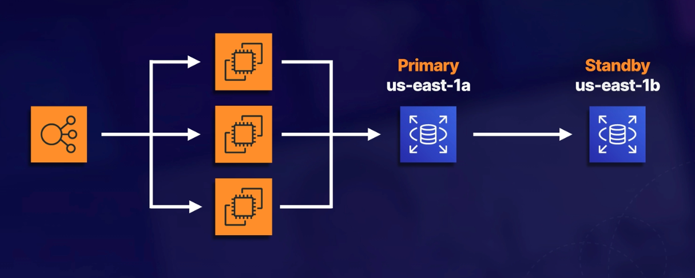

**AWS handles the replication for you.**

When you write to your production database, this write will automatically synchronize to the standby database.

**Multi-AZ-compatible Engines**

- SQL Server
- Oracle
- MySQL
- PostgreSQL
- MariaDB

Multi-AZ is for **disaster recovery**, not for improving performance, so you **cannot** connect to the standby when the primary database is **active**.

<Note>
  **Update**: AWS now offers **Mutli-AZ deployment clusters**, which allow **2
  readable standby instances**.
</Note>

### Unplanned Failures and Maintenance

RDS will **automatically fail over** to the standby during a failure so database operations can **resume quickly** without administrative intervention.

### Exam Tips

<Note>
**RDS Database Types**  
SQL Server, Oracle, MySQL, PostgreSQL, MariaDB, and Amazon Aurora.

**RDS is for OLTP Workloads**  
Great for processing lots of small transactions, like customer orders, banking transactions, payments, and booking systems.

**Not Suitable for OLAP Workloads**  
Use Redshift for data warehousing and OLAP tasks, like analyzing large amounts of data, reporting, and sales forecasting.

</Note>

## Increasing Read Performance with Read Replicas

### What is a Read Replica

- A **read replica** is a read-only copy of your primary database.
- Great for read-heavy workloads and takes the load off your primary database.
- A **read replica** can be cross-AZ or **cross-region**.
- Each **read replica** has its own DNS endpoint.
- **Read replicas** can be promoted to be their own databases.
  - This breaks the replication.

### Key Facts

**Scaling Read Performance**  
Primarily used for scaling, **not** for disaster recovery.

**Requires Automatic Backup**  
Automatic backups must be enabled in order to deploy a read replica.

**Multiple Read Replicas Are Supported**  
MySQL, MariaDB, PostgreSQL, Oracle, and SQL Server allow you to add up to 5 read replicas to each DB instance.

### Exam Tips

| Multi-AZ                                                                             | Read Replica                                                                                                                                     |
| :----------------------------------------------------------------------------------- | :----------------------------------------------------------------------------------------------------------------------------------------------- |
| An exact copy of your production database in another Availability Zone.              | A read-only copy fo your primary database in the same AZ, cross-AZ, or cross-region.                                                             |
| Used for disaster recovery.                                                          | Used to increase or scale read performance.                                                                                                      |
| In the event of a failure, RDS will automatically fail over to the standby instance. | Great for read-heavy workloads and takes the load off your primary database for read-only workloads (e.g. Business Intelligence reporting jobs). |

## What is Amazon Aurora

### What is Aurora

<Tip>
  Amazon Aurora is a **MySQL- and PostgreSQL-compatible relational database
  engine** that combines the speed and availability of high-end commercial
  databases with the simplicity and cost-effectiveness of open-source databases.
</Tip>

### Aurora Performance

**5x Performance**  
Provides **up to 5 times better performance than MySQL** and 3 times better than PostgreSQL databases at a much lower price point, while delivering similar performance and avaiability.

### Basics

- Start with 10 GB. Scales in 10-GB increments to 128 TB (storage Auto Scaling).
- Compute resources can scale up to 96 vCPUs and 768 GB of memory.
- 2 copies of your data are contained in each Availability Zone, with a minimum of 3 Availability Zones. 6 copies of your data.

### Scaling

- Aurora is designed to **transparently handle the lost of up to 2 copies of data** without affecting database write availability and up to 3 copies without affecting read availability.
- Aurora **storage is also self-healing**. Data blocks and disks are continuously scanned for errors and repaired automatically.

### Types of Aurora Replicas

**Aurora Replicas**  
You can currently have 15 read replicas with Aurora.

**MySQL Replicas**  
You can currently have 5 read replicas with Aurora MySQL.

**PostgreSQL**  
You can currently have 5 read replicas with Aurora PostgreSQL.

<Note>
  **Update:** Aurora MySQL & PostgreSQL replication now supports up to **15**
  Aurora Replicas.
</Note>

| Feature                                         | Amazon Aurora Replicas      | MySQL Replicas                         |
| :---------------------------------------------- | :-------------------------- | :------------------------------------- |
| Number of replicas                              | Up to 15                    | Up to 5                                |
| Replication type                                | Asynchronous (milliseconds) | Asynchronous (seconds)                 |
| Performance impact on primary                   | Low                         | High                                   |
| Replica location                                | In-region                   | Cross-region                           |
| Act as failover target                          | Yes (no data loss)          | Yes (potentially minutes of data loss) |
| Automated failover                              | Yes                         | No                                     |
| Support for user-defined replication delay      | No                          | Yes                                    |
| Support for different data or schema vs primary | No                          | Yes                                    |

### Aurora Backups

- Automated backups are always enabled on Amazon Aurora DB Instances. Backups do not impact database performance.
- You can also take snapshots with Aurora. This also does not impact on performance.
- You can share Aurora snapshots with other AWS accounts.

### Aurora Serverless

An on-demand, auto-scaling configuration for the MySQL-compatible and PostgreSQL-compatible editions of Amazon Aurora. **An Aurora Serverless DB cluster automatically starts up, shuts down, and scales capacity up or down based on your application's needs**.

### Exam Tips

<Tip>
  Aurora Serverless provides a **relatively simple, cost-effective option** for
  infrequent, intermittent, or unpredictable workloads.
</Tip>

<Note>
2 copies of your data are contained in each Availability Zone, with a minimum of 3 Availability Zones. 6 copies of your data.

You can share Aurora snapshots with other AWS accounts.

3 types of replicas available: Aurora replicas, MySQL replicas, and PostgreSQL replicas. Automated failover is only available with Aurora replicas.

Aurora has automated backups turned on by default. You can also take snapshots with Aurora. You can share these snapshots with other AWS accounts.

</Note>

## DynamoDB Overview

### What is DynamoDB

- Amazon DynamoDB is a **fast and flexible NoSQL database** service for all applications that need consistent, single-digit millisecond latency at any scale.
- It is a fully managed database and supports both document and key-value data models.
- Its flexible data model and reliable performance make it a great fit for mobile, web, gaming, ad-tech, IoT, and many other applications.

### High-Level DynamoDB

- Stored on SSD storage.
- Spread across 3 geographically distinct data centers.
- Eventually consistent reads (default).
- Strongly consistent reads.

### Read Consistency

What's the difference between **eventually consistent reads** and **strongly consistent reads**?

**Eventually**  
Consistency across all **copies of data is usually reached within a second**. Repeating a read after a short time should return the updated data. Best read performance.

**Strongly**  
A strongly consistent read **returns a result that reflects all writes** that received a successful response prior to the read.

### DynamoDB Accelerator (DAX)

- Fully managed, highly available, in-memory cache.
- 10x performance improvement.
- Reduces request time from milliseconds to **microseconds** - even under load.
- No need for developers to manage caching logic.
- Compatible with DynamoDB API calls.

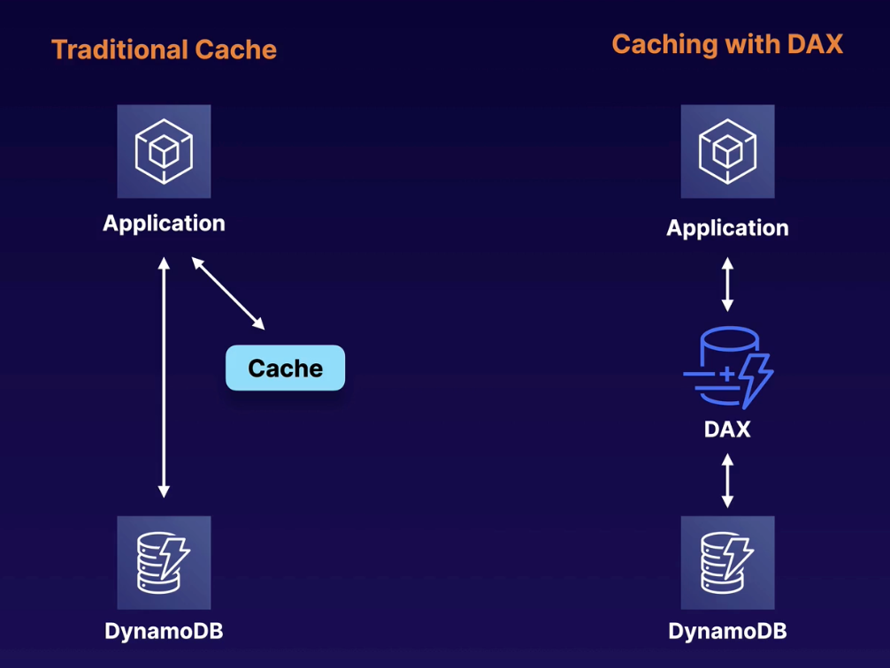

### On-Demand Capacity

- **Pay-per-request** pricing.
- Balance cost and performance.
- No minimum capacity.
- **Pay more per request** than with provisioned capacity.
- Use for new product launches.

### Security

- Encryption at rest using **KMS**.
- Site-to-site VPN.
- Direct Connect (DX).
- IAM policies and roles.
- Fine-grained access.
- CloudWatch and CloudTrail.
- VPC endpoints.

### Exam Tips

<Note>
Stored on SSD storage.

Spread across 3 geographically distinct data centers.

Eventually consistent reads (default).

Strongly consistent reads.

</Note>

## When Do We Use DynamoDB Transactions

### ACID Diagram

**ACID for Databases**

**ATOMIC**  
All changes to the data must be performed successfully or not at all.

**Consistent**  
Data must be in a consistent state before and after the transaction.

**Isolated**  
No other process can change the data while the transaction is running.

**Durable**  
The changes made by a transaction must persist.

### ACID with DynamoDB

<Tip>
**DynamoDB transactions provide developers atomicity, consistency, isolation, and durability (ACID) across 1 or more tables within a single AWS account and region.**

You can use transactions when building applications that require coordinated inserts, deletes, or updates to multiple items as part of a single logical business operation.

</Tip>

### All or Nothing

**All**  
Transaction succeeds across 1 or more tables.

**Nothing**  
Transaction fails.

### Use Cases

- Processing financial transactions.
- Fulfilling and managing orders.
- Building multiplayer game engines.
- Coordinating actions across distributed components and services.

### Transactions

- Multiple "all-or-nothing" operations.
- Financial transactions.
- Fulfilling orders.
- 3 options for reads: eventual consistency, strong consistency, and transactional.
- 2 options for writes: standard and transactional.
- Up to 25 items or 4 MB of data.

### Exam Tips

<Note>
If you see any scenario question that mentions ACID requirements, think **DynamoDB transactions**.

DynamoDB transactions provides developers **atomicity, consistency, isolation, and durability** (ACID) across 1 or more tables within a single AWS account and region.

**All-or-nothing** transactions.

</Note>

## Saving Your Data with DynamoDB Backups

### On-Demand Backup and Restore

- Full backups at any time.
- Zero impact on table performance or availability.
- Consistent within seconds and **retained until deleted**.
- Operates within same region as the source table.

### Point-in-Time Recovery (PITR)

- Protects against accidental writes or deletes.
- Restore to any point in the last **35 days**.
- Incremental backups.
- Not enabled by default.
- Latest restorable: **5 minutes** in the past.

## Taking Your Data Global with DynamoDB Streams and Global Tables

### Streams

- Time-ordered sequence of item-level changes in a table.
- Stored for **24 hours**.
- Inserts, updates, and deletes.
- Combine with Lambda Functions for functionality like stored procedures.

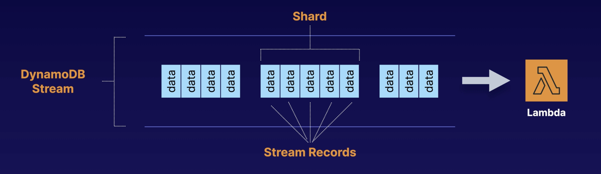

### Global Tables

**Managed Multi-Master, Multi-Region Replication**

- Globally distributed applications.
- Based on DynamoDB streams.
- Multi-region redundancy for disaster recovery or high availability.
- No application rewrites.
- Replication latency under **1 second**.

### Exam Tips

<Note>
Globally distributed applications.

Based on DynamoDB streams.

Multi-region redundancy for disaster recovery or high availability.

No application rewrites.

Replication latency under **1 second**.

</Note>

## Operating MongoDB-Compatible Databases in Amazon DocumentDB

### What is MongoDB

MongoDB is a document database that allows for scalability and flexibility with your data as well as robust querying and indexing features.

### Example

Document database for two restaurants.

```js
export async function insertDocuments(db) {
  // Get the documents collection
  const collection = db.collection("restaurants");

  // Insert some documents
  const result = await collection.insertMany([
    {
      name: "Sun Bakery Trattoria",
      stars: 4,
      categories: ["Pizza", "Pasta", "Italian", "Coffee", "Sandwiches"],
    },
    {
      name: "Blue Bagels Grill",
      stars: 3,
      categories: ["Bagles", "Cookies", "Sandwiches"],
    },
  ]);
}
```

### What is Amazon DocumentDB

Allows you to run MongoDB on the AWS cloud. It's a managed database service that scales with your workloads and safely and durably stores your database information.

### Why Use It

You no longer have to worry about all the manual tasks when running MongoDB workloads, such as cluster management software, configuring backups, or monitoring production workloads.

### Exam Tips

<Note>
A typical question might be about moving your MongoDB database to AWS.

MongoDB On-Premises

AWS Database Migration Service

Amazon DocumentDB

For scenario questions where they talk about migrating MongoDB from on-premises to AWS, **think Amazon DocumentDB**.

</Note>

## Running Apache Cassandra Workloads with Amazon Keyspaces

### What is Cassandra

A distributed database (i.e. it runs on many machines) that uses NoSQL. It's primarily used for big data solutions. Enterprises, such as Netflix, use Cassandra on their backend.

### What is Keyspaces

Amazon's Apache Cassandra database service. It allows you to run Cassandra workloads on AWS and is a fully managed database service.

### Why Use It

- It's a fully managed database service - you don't need to worry about managing servers, software, patching, etc.
- **Keyspaces is serverless**.
- You pay for only the resources you use, and the service can automatically scale tables up and down in response to your applications.

### Exam Tips

<Note>
  If you see a scenario question about migrating a big data Cassandra cluster to
  AWS, **think of Amazon Keyspaces**!
</Note>

## Implementing Graph Databases Using Amazon Neptune

### What Is a Graph Database

- Data is stored just like you might sketch ideas on a whiteboard.
- A graph database stores nodes and relationships instead of tables and documents.

### Neptune

Neptune is a fast, reliable, fully managed graph database service that makes it easy to build and run applications.

### Use Cases

**Build Connections between Identities**  
Easily build identity graphs for identity resolution solutions such as social graphs, and accelerate updates for ad targeting, personalization, and analytics.

**Build Knowledge Graph Applications**  
Add topical data to product catalogs, model general information, and help users quickly navigate highly connected databases.

**Detect Fraud Patterns**  
Build graph queries for near real-time identity fraud pattern detection in financial and purchase transactions.

**Security Graphs to Improve IT Security**  
Proactively detect and investigate IT infrastructure using a layered security approach. Visualize all infrastructure to plan, predict, and mitigate risk.

### Exam Tips

<Note>
**Neptune is often used as a distractor.**

If the scenario is **not** talking about graph databases, **do not** select Neptune as an answer. You only need to know what Neptune does at a very high level.

</Note>

## Leveraging Amazon Quantum Ledger Database (Amazon QLDB) for Ledger Databases

### What is a Ledger Database

It's a NoSQL database that is immutable, transparent, and has a cryptographically verifiable transaction log that is owned by one authority.

**You cannot update a record (i.e. replace old content) in a ledger database. Instead, an update adds a new record to the database.**

- It's used for cryptocurrencies, such as Bitcoin, Ethereum, etc.
- Shipping companies use it to track items, boxes, shipping containers, deliveries, etc.
- Pharmaceutical companies use it to track creation and distribution of drugs and ensure no counterfeits are produced.

### Amazon Quantum Ledger Database (QLDB)

A fully managed ledger database that provides a transparent, immutable, and cryptographically verifiable transaction log.

### QLDB Use Cases

**Store Financial Transactions**  
Create a complete and accurate record of all financial transactions, such as credit and debit transactions.

**Reconcile Supply Chain Systems**  
Record the history of each transaction, and provide details of every batch manufactures, shipped, stored, and sold from facility to store.

**Maintains Claims History**  
Track a claim over its lifetime, and cryptographically verify data integrity to make the application resilient against data entry errors and manipulation.

**Centralize Digital Records**  
Implement a system-of-record application to create a complete, centralized record of employee details, such as payroll, bonus, and benefits.

### Exam Tips

<Note>
**QLDB is often used as a distractor.**

If the scenario is not talking about immutable databases, do not select Amazon QLDB as an answer. You need to know what QLDB does only at a very high level.

</Note>

## Analyzing Time-Series Data with Amazon Timestream

### Time-Series Data

Data points that are logged over a series of time, allowing you to track your data. Examples could be temperature readings from weather stations around the world, on the hour, every hour for years.

### Time-Series Data Examples

**IoT**  
IoT sensors relay thousands, millions, and billions of points of information depending on the setup. One use case is for agriculture.

**Analytics**  
Large websites such as Netflix server millions of users per second. Need to analyze incoming and outgoing web traffic.

**DevOps Applications**  
Applications that change in response to users needs may need to be monitored continuously so they can scale correctly.

### Amazon Timestream

A serverless, fully managed database service for time-series data. You can analyze **trillions** of events per day up to **1000 times faster** and at as little as **1/10th the cost** of traditional relational databases.

### Exam Tips

<Note>
  If you see a scenario question about where to store a large amount of
  time-series data for analysis, **think of Timestream**.
</Note>

## Lab: Set Up a WordPress Site Using EC2 and RDS

### Create RDS Database

1. In the AWS management console, enter **"rds"** into the search bar on top.
2. From the results, select **RDS**.
3. Click **Create database**.
4. On the Create database page, set the following parameters:

- Select **Standard create**.
- Under Engine options, select **MySQL**.
- Under **Templates**, select **Free Tier**.
- Under **DB instance identifier**, enter **"wordpress"** and copy this into your clipboard.
- Paste in **"wordpress"** as the **Master username**.
- Under **Credentials management**, select **Self managed**.
- Paste in **"wordpress"** in the **Master password** and **Confirm master password** fields.
- Under Instance configuration, select **Burstable classes** and make sure the class is `db.t3.micro*`.
- Under **VPC security group**, ensure **Choose existing**.
- Under Existing **VPC security group**, select the **non-default security group** from the dropdown menu and remove the default security group.
- Under Availability zone, select `us-east-1a`.
- Expand Additional configuration and, under Initial database name, enter **"wordpress"**.
- Click **Create database**.

5. While the database is created, enter **"ec2"** in the search bar on top.
6. From the results, right-click **EC2** and open it in a new browser window or tab.
7. Under **Resources**, click **Instances (running)**.
8. Click the checkbox next to `webserver-01`.
9. In the top right, click **Connect**.
10. Click **Connect**.

### Install Apache and Dependencies

1. In the terminal, install the Apache 2 web server, libraries, PHP, and PHP MySQL:

```sh
sudo apt install apache2 libapache2-mod-php php-mysql
```

2. When prompted, press **Y** for yes and press **Enter**.
3. Go into the newly created `/var/www` directory:

```sh
cd /var/www/
```

4. View the contents of the directory:

```sh
ls
```

5. Put wordpress into its own folder in the `/var/www` directory that we're currently in:

```sh
sudo mv /wordpress .
```

6. View the contents of the directory:

```sh
ls
```

7. Move into the wordpress directory:

```sh
cd wordpress
```

8. View the contents of the directory:

```sh
ls
```

9. Move the Apache configuration file into `/etc/apache2/sites-enabled/` to enable the WordPress website to work from `/var/www/wordpress`:

```sh
sudo mv 000-default.conf /etc/apache2/sites-enabled/
```

10. Restart the Apache 2 configuration:

```sh
sudo apache2ctl restart
```

### Configure WordPress

1. Open the WordPress config PHP file for editing:

```sh
sudo nano wp-config.php
```

2. Return to the browser window or tab that has the RDS Databases open.
3. Click the **wordpress** database.
4. In the **Connectivity & security** tab, under **Endpoint**, copy the endpoint provided into your clipboard.
5. Return to your terminal. Change the line `define('DB_HOST', 'localhost');` to read:

```sh
define('DB_HOST', '<INSERT ENDPOINT HERE>');
```

6. Save and exit by pressing **Control + X**, followed by **Y**, and pressing **Enter**.

### Modify Security Groups

1. Return to your browser window or tab with the EC2 Connect to instance page open.
2. In the left-hand navigation menu, under **Networks & Security**, click **Security Groups**.
3. Click the checkmark next to the non-default security group among those provided in the lab.
4. Click the **Inbound rules** tab.
5. Click the **Edit inbound rules** button.
6. Click the **Add rule** button.
7. For the new rule, from the Type dropdown menu, select **MYSQL/Aurora**.
8. In the dropdown menu to the right of the **Source** column for the new rule, find and select the non-default security group.
9. Click **Save rules**.

### Complete Wordpress Installation and Test

1. Return to the terminal.
2. At the bottom of the screen on the white bar, right-click the public IP now being shown after PublicIPs.
3. Click Go to followed by the IP address, or copy the IP address, open a new browser window or tab, and paste it there.
4. On the WordPress installation page, enter in the following information for each field:

- Site Title: **"A Cloud Guru"**
- Username: **"guru"**
- Password: Select a strong password to use here, and make sure to copy it in your clipboard for later.
- Your Email: **"test@example.com"**

5. Click **Install WordPress**.
6. Click **Log in**.
7. Enter **"guru"** for the Username or email and paste in the password that you copied earlier.
8. To view the website you just created, click **A Cloud Guru** in the top left corner of the page.
9. Click **Visit Site** to visit your newly created WordPress site.

## Quiz: Databases

<Note>
Which of the following is the correct description of Amazon Timestream?

A serverless, fully managed database service for time series data.

What should you do to scale out an RDS database that has a read-heavy workload.

Add additional read replicas.

Which of the following about Amazon RDS DB Instances is true?

Amazon VPC enables you to launch Amazon RDS DB instances into a virtual private cloud (VPC).

Which of the following statements about DynamoDB is false?

DynamoDB is a fully managed SQL database service.

Which AWS database service would you use to run Apache Cassandra workloads on AWS?

Amazon Keyspaces.

</Note>

# Chapter 8 - Virtual Private Cloud (VPC) Networking

- [VPC Overview](#vpc-overview)
- [Demo: Provisioning a VPC](#demo-provisioning-a-vpc)
- [Using NAT Gateways for Internet Access](#using-nat-gateways-for-internet-access)
- [Protecting your Resources with Security Groups](#protecting-your-resources-with-security-groups)
- [Controlling Subnet Traffic with Network ACLs](#controlling-subnet-traffic-with-network-acls)
- [Private Communication Using VPC Endpoints](#private-communication-using-vpc-endpoints)
- [Network Privacy with AWS PrivateLink](#network-privacy-with-aws-privatelink)
- [Building Solutions Across VPCs with Peering](#building-solutions-across-vpcs-with-peering)
- [Securing your Network with VPN CloudHub](#securing-your-network-with-vpn-cloudhub)
- [Connecting On-Premises with Direct Connect](#connecting-on-premises-with-direct-connect)
- [Simplifying Networks with Transit Gateway](#simplifying-networks-with-transit-gateway)
- [5G Networking with AWS Wavelength](#5g-networking-with-aws-wavelength)
- [Lab: Build Solutions across VPCs with Peering](#lab-build-solutions-across-vpcs-with-peering)
- [Quiz: Virtual Private Cloud (VPC) Networking](#quiz-virtual-private-cloud-vpc-networking)

## VPC Overview

### Introduction

Think of a VPC as a virtual data center in the cloud.

- Logically isolated part of the AWS Cloud where you can define your own network.
- Complete control of virtual network, including your own IP address range, subnets, route tables, and network gateways.

### Networking

You can leverage multiple layers of security, including security groups and network access control lists, to help control access to Amazon EC2 instances in each subnet.

**Web**  
Public-facing subnet.

**Application**  
Private subnet. Can only speak to web tier and database tier.

**Database**  
Private subnet. Can only speak to application tier.

### VPNs

Additionally, you can create a **hardware Virtual Private Network (VPN)** connection between your corporate data center and your VPC and leverage the AWS Cloud as an extension of your corporate data center.

### Network Diagram


### VPC Features

**Launch Instances**  
Launch instances into a subnet of your choosing.

**Custom IP Addresses**  
Assign custom IP address ranges in each subnet.

**Route Tables**  
Configure route tables between subnets.

**Intenet Gateway**  
Create internet gateway and attach it to your VPC.

**More Control**  
Much better security control over your AWS resources.

**Access Control Lists**  
Subnet network access control lists.

<Tip>
  You can use network access control lists (NACLs) to block specific IP
  addresses.
</Tip>

### Comparing VPCs

| Default                                                      | Custom                |
| :----------------------------------------------------------- | :-------------------- |
| Default VPC is user friendly.                                | Fully customizable.   |
| All subnets in default VPC have a route out to the internet. | Takes time to set up. |
| Each EC2 instance has both a public and private IP address.  |                       |

### Exam Tips

<Note>
Think of a VPC as a logical data center in AWS.

Consists of internet gateways (or virtual private gateways), route tables, network access control lists, subnets, and security groups.

1 subnet is always in 1 Availability Zone. A subnet cannot span over more than 1 Availability Zone.

</Note>

## Demo: Provisioning a VPC

<Tip>
  It's a good practice to follow the following naming convention for subnets:
  `x.x.x.x/x-availability-zone`.
</Tip>

- `x.x.x.0` - network address.
- `x.x.x.1` - reserved by AWS for the VPC router.
- `x.x.x.2` - reserved by AWS. The IP address of the DNS server is the base of the VPC network range plus 2. For VPCs with multiple CIDR blocks, the IP address of the DNS server is located in the primary CIDR.
- `x.x.x.3` - reserved by AWS for future use.
- `x.x.x.255` - network broadcast address. AWS does not support broadcast in a VPC, there it is reserved.

## Using NAT Gateways for Internet Access

### What is a NAT Gateway

You can use Network Address Translation (NAT) to **enable instances in a private subnet** to connect to the internet or other AWS services while preventing the internet from initiating a connection with those instances.

### Network Diagram

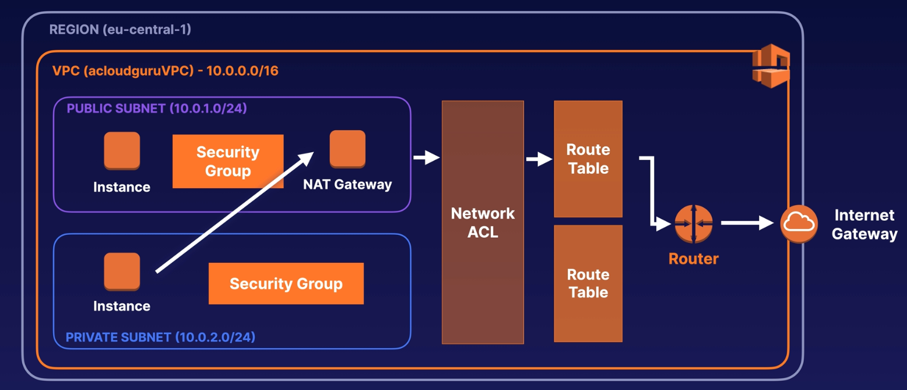

<Tip>
  A NAT Gateway is essentially a collection of EC2 instances behind the scenes
  that AWS handles.
</Tip>

### Exam Tips

<Note>
Redundant inside the Availability Zone.

Starts at 5 Gbps and scales currently to 45 Gbps.

No need to patch.

Not associated with security groups.

Automatically assigned a public IP address.

</Note>

## Protecting your Resources with Security Groups

### Review of Security Groups

**Light**  
We see light using our **eyes**.

**Soound**  
We hear sound using our **ears**.

**Heat**  
We feel heat using our **skin**.

**How Computers Communicate**

| Linux   | Windows   | HTTP             | HTTPS                            |
| :------ | :-------- | :--------------- | :------------------------------- |
| **SSH** | **RDP**   | **Web Browsing** | **Encrypted Web Browsing (SSL)** |
| Port 22 | Port 3389 | Port 80          | Port 443                         |

### Network Diagram

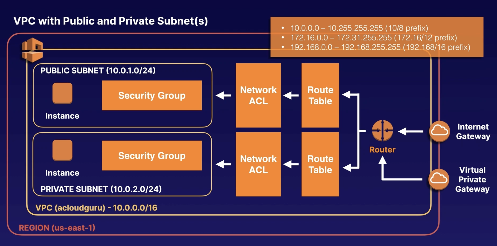

In terms of troubleshooting connectivity, start with:

- Route Tables
- Network Access Control Lists (NACLs)
- Security Groups

### What are Security Groups

Are **virtual firewalls for an EC2 instance**. By default, everything is blocked.

To let everything in: `0.0.0.0/0`.

<Tip>
  In order to **communicate to your EC2 instances via SSH, RDP, or HTTP**, you
  will need to **open up the correct port**.
</Tip>

### Exam Tips

<Note>
  Security groups are stateful - if you send a request from your instance, the
  response traffic for that request is allowed to flow in regardless of inbound
  security group rules.

Responses to allowed inbound traffic are allowed to flow out, regardless of outbound rules.

</Note>

## Controlling Subnet Traffic with Network ACLs

### What is a Network ACL

- A network access control list (ACL) is an optional layer of security for your VPC that acts as a firewall for controlling traffic in and out of one or more subnets.
- You might setup network ACLs with rules similar to your security groups in order to add another layer of security to your VPC.

### Network Diagram

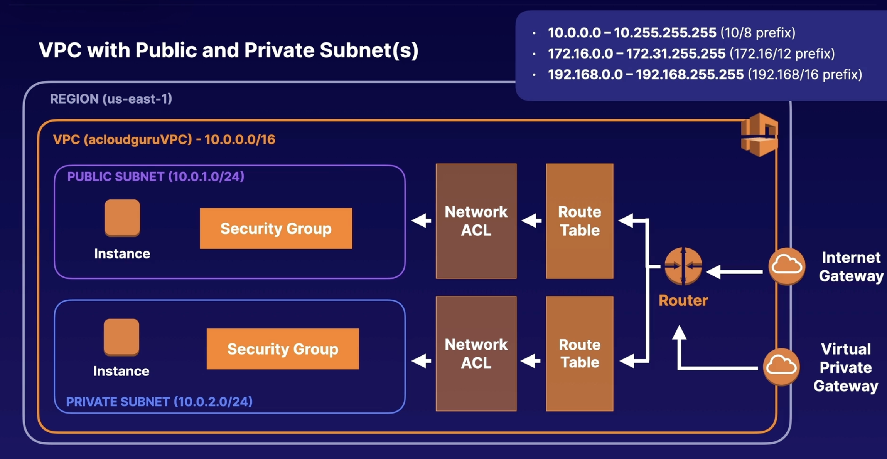

### Overview

- **Default Network ACLs:** Your VPC automatically comes with a default network ACL, and by default it allows all outbound and inbound traffic.
- **Custom Network ACLs:** You can create custom network ACLs. By default, each custom network ACL denies all inbound and outbound traffic until you add rules.
- **Subnet Associations:** Each subnet in your VPC must be associated with a network ACL. If you don't explicitly associate a subnet with a network ACL, the subnet is automatically associated with the default network ACL.
- **Block IP Addresses:** Block IP addresse using network ACLs, not security groups.

### Network ACL Tips

- You can associate a network ACL with multiple subnet; however, a subnet can be associated with **only 1 network ACL** at a time. When you associate a network ACL with a subnet, the previous association is **removed**.
- Network ACLs contain a **numbered list of rules** that are evaluated in order, starting with the **lowest** numbered rule.
  - Best practice is to always start with `100`.
- Network ACLs have **separate** inbound and outbound rules, and each rule can either **allow or deny traffic**.
- Network ACLs are **stateless**; response to allows inbound traffic are subject to the rules for outbound traffic (and vice versa).

### Exam Tips

<Note>
**Default Network ACLs:** Your VPC automatically comes with a default network ACL, and by default it allows all outbound and inbound traffic.

**Custom Network ACLs:** You can create custom network ACLs. By default, each custom network ACL denies all inbound and outbound traffic until you add rules.

**Subnet Associations:** Each subnet in your VPC must be associated with a network ACL. If you don't explicitly associate a subnet with a network ACL, the subnet is automatically associated with the default network ACL.

**Block IP Addresses:** Block IP addresse using network ACLs, not security groups.

You can associate a network ACL with multiple subnet; however, a subnet can be associated with **only 1 network ACL** at a time. When you associate a network ACL with a subnet, the previous association is **removed**.

Network ACLs contain a **numbered list of rules** that are evaluated in order, starting with the **lowest** numbered rule - best practice is to always start with `100`.

Network ACLs have **separate** inbound and outbound rules, and each rule can either **allow or deny traffic**.

Network ACLs are **stateless**; response to allows inbound traffic are subject to the rules for outbound traffic (and vice versa).

</Note>

## Private Communication Using VPC Endpoints

### What are VPC Endpoints

Enable you to privately connect your VPC to supported AWS services and VPC endpoint services powered by PrivateLink without requiring an internet gateway, NAT device, VPN connection, or AWS Direct Connect connection.

Traffic between your VPC and the other service **does not leave the Amazon network**.

<Tip>
Instances in your VPC not required public IP addresses to communicate with
resources in the service.

**Endpoints are Virtual Devices:** They are horizontally scaled, redundant, and highly available VPC components that allow communication between instances in your VPC and services **without imposing availability risks or badnwidth constraints on your network traffic**.

</Tip>

### VPC Endpoint Types

| Interface Endpoints                                                                                                                                                                                       | Gateway Endpoints                                                                                                             |
| :-------------------------------------------------------------------------------------------------------------------------------------------------------------------------------------------------------- | :---------------------------------------------------------------------------------------------------------------------------- |
| An interface endpoint is an **elastic network interface with a private IP address** that serves as an entry point for traffic headed to a supported service. They support a large number of AWS services. | Similar to NAT gateways, a gateway endpoint is a **virtual device you provision**. It supports connection to S3 and DynamoDB. |

### VPC Endpoints in Action


### Exam Tips

<Note>
**Use Case:** When you want to connect AWS services without leaving the Amazon internal network.

**2 Types of VPC Endpoints:** Interface endpoints and gateway endpoints.

**Gateway Endpoints:** Support S3 and DynamoDB.

</Note>

## Building Solutions Across VPCs with Peering

### Multiple VPCs

Sometimes you may need to have several VPCs for different environments, and it may be necessary to connect these VPCs to each other.

- Production Web VPC
- Content VPC
- Intranet

### VPC Peering

- Allows you to connect 1 VPC with another via a direct network route using private IP addresses.
- Instances behave as if they were on the same private network.
- You can peer VPCs with other AWS accounts as well as with other VPCs in the same account.
- Peering is in a star configuration (e.g. 1 central VPC peers with 4 others). No transitive peering.
- You can peer between regions.

### Transitive Peering

A VPC cannot communicate with another VPC via a mutual "middle man" VPC. A new peering connection has to be established.

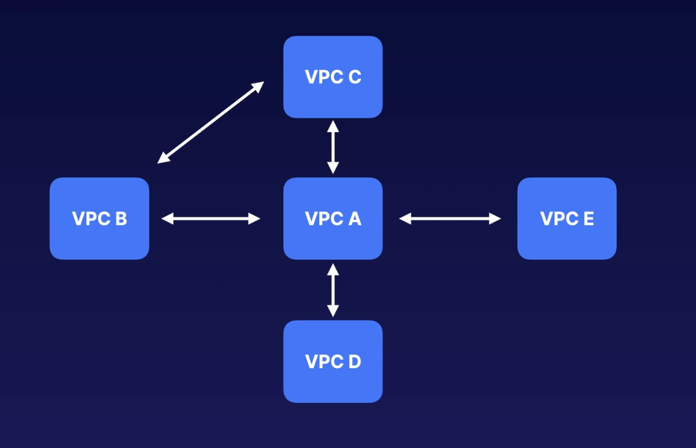

### Exam Tips

<Note>
**Allows you to connect** 1 VPC with another via a direct network route using private IP addresses.

**Transitive peering is not supported.** This must always be in a hub-and-spoke model.

**You can peer between regions.**

**No overlapping CIDR address ranges.**

</Note>

## Network Privacy with AWS PrivateLink

### Opening Your Services in a VPC to Another VPC

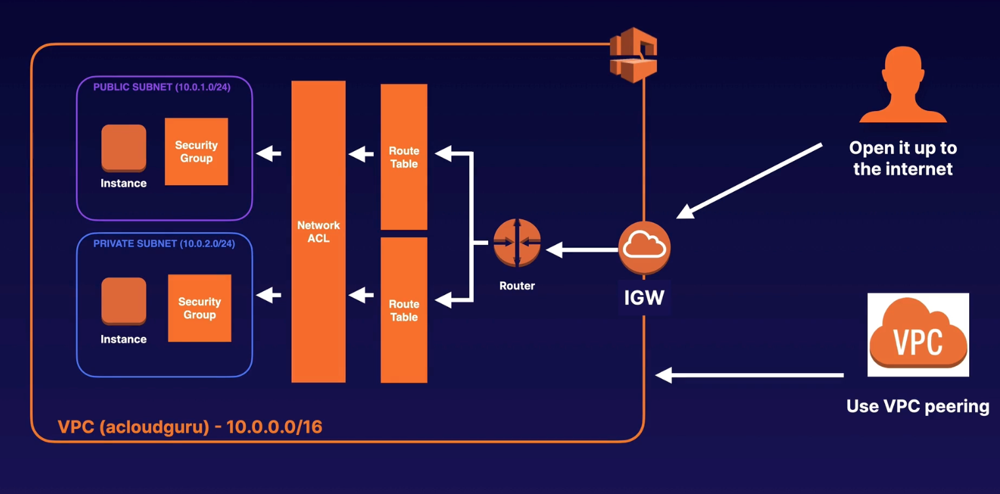

### Sharing Applications across VPCs

**Open the VPC up to the Internet**

- Security considerations; everything in the public subnet is public.
- A lot more to manage.

**Use VPC Peering**

- You will have to create and manage many different peering relationships.
- The whole network will be accessible. This isn't good if you have multiple applications within your VPC.

<Note>
  **Note:** the whole network will be accssible via VPC peering if you
  explicitly allow all traffic within security groups and NACLs from the peered
  VPC.
</Note>

### Using PrivateLink

- The best way to expose a service VPC to tens, hundreds, or thousands of customer VPCs.
- Doesn't require VPC peering; no route tables, NAT gateways, internet gateways, etc.
- Requires a Network Load Balancer on the service VPC and an ENI on the customer VPC.

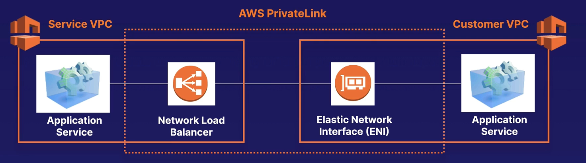

### Exam Tips

<Note>
If you see a question asking about peering VPCs to tens, hundreds, or thousands of customer VPCs, think of AWS PrivateLink.

Doesn't require VPC peering; no route tables, NAT gateways, internet gateways, etc.

Requires a Network Load Balancer on the service VPC and an ENI on the customer VPC.

</Note>

## Securing your Network with VPN CloudHub

### VPN CloudHub

If you have multiple sites, each with its own VPN connection, you can use AWS VPN CloudHub to connect those sites together.

- Hub-and-spoke model.
- Low cost and easy to manage.
- It operates over the public internet, but all traffic between customer gateway and the AWS VPN CloudHub is encrypted.

### Network Diagram

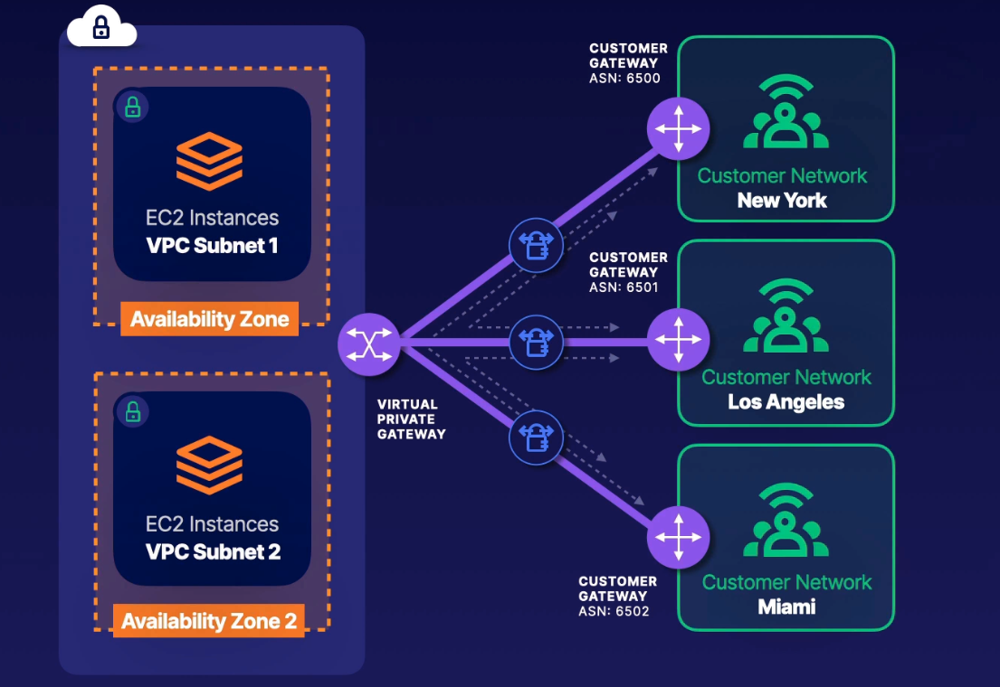

### Exam Tips

<Note>
If you have multiple sites, each with its own VPN connection, you can use AWS VPN CloudHub to connect those sites together.

AWS VPN CloudHub operates over the public internet, but all traffic between customer gateway and the AWS VPN CloudHub is encrypted.

</Note>

## Connecting On-Premises with Direct Connect

### Direct Connect

AWS Direct Connect is a cloud service solution that **makes it easy to establish a dedicated network connection** from your premises to AWS.

### Private Connectivity

Using AWS Direct Connect, you can establish private connectivity between AWS and your data center or office.

<Tip>
  In many cases, you can reduce your network costs, increase bandwidth
  throughput, and provide a more consistent network experience than
  internet-based connections.
</Tip>

### Types of Connection

| Dedicated Connection                                                                                                                                                    | Hosted Connection                                                                                                                                                                                                                             |
| :---------------------------------------------------------------------------------------------------------------------------------------------------------------------- | :-------------------------------------------------------------------------------------------------------------------------------------------------------------------------------------------------------------------------------------------- |
| A physcial Ethernet connection associated with a single customer. Customers can request a dedicated connection through AWS Direct Connect console, the CLI, or the API. | A physical Ethernet connection that an AWS Direct Connect Partner provisions on behalf of a customer. Customers request a hosted connection by contacting a partner in the AWS Direct Connect Partner Program, who provisions the connection. |

### Direct Connect in Action

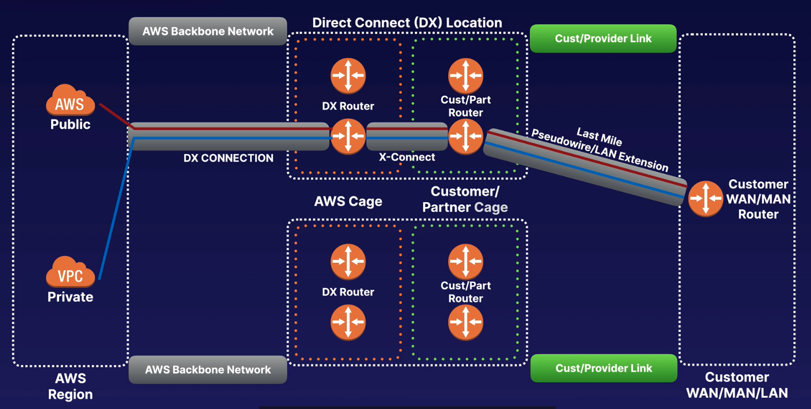

### VPNs vs Direct Connect

VPNs allow private communication, but it still traverses the public internet to get the data delivered. While secure, it can be painfully slow.

- Fast.
- Secure.
- Reliable.
- Able to take massive throughput.

### Exam Tips

<Note>
Direct Connect directly connects your data center to AWS.

Useful for high-throughout workloads (e.g. lots of network traffic).

Helpful when you need a stable and reliable secure connection.

</Note>

## Simplifying Networks with Transit Gateway

### Network Architecture Diagram

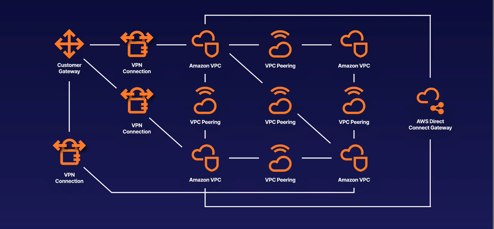

### Transit Gateway

Connects VPCs and on-premises networks through a central hub. This simplifies your network and puts an end to complex peering relationships. It acts as a cloud router - each new connection is only made once.

### Simplify Your Network Topology

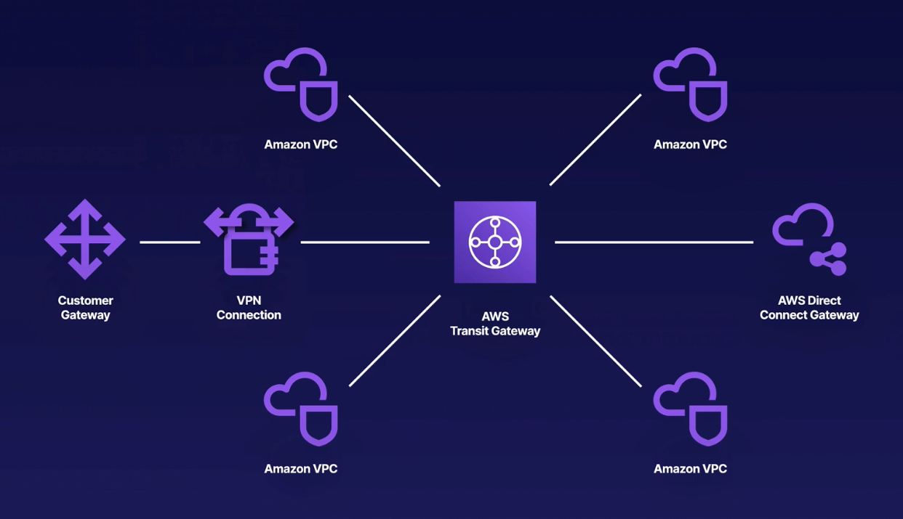

### Transit Gateway Facts

- Allows you to have transitive peering between thousands of VPCs and on-premises data centers.
- Works on a hub-and-spoke model.
- Works on a regional basis, but you can have to across multiple regions.
- You can use it across multiple AWS accounts using RAM (Resource Access Manager).

### Exam Tips

<Note>
You can use route tables to limit how VPCs talk to one another.

Works with Direct Connect as well as VPN connections.

Supports IP multicast (not supported by any other AWS service).

</Note>

## 5G Networking with AWS Wavelength

### 5G Networks

Provide mobile devices with higher speed, lower latency, and greater capacity than 4G LTE networks. It is one of the fastest, most robut technologies the world has ever seen.

### AWS Wavelength

Embeds AWS compute and storage services within 5G networks, providing mobile edge computing infrastructure for developing, deploying, and scaling ultra-low-latency applications.

### Exam Tips

<Note>
  If you see a scneario question about 5G increasing application speeds at the
  edge using mobile networks, **think of AWS Wavelength**.
</Note>

## Lab: Build Solutions across VPCs with Peering

### Create `Web_VPC` Subnets and Attach a New Internet Gateway

**Create a VPC**

1. Use the top search bar to look for and navigate to **VPC**.
2. Under **Resources by Region**, click **VPCs**.
3. Use the top search bar to look for and navigate to **RDS** in a new tab.
4. Click **DB Instances**, and observe the instance created for this lab.

<Note>**Note:** Keep this tab open for use later on in the lab.</Note>

5. Go back to your VPC tab, and click **Create VPC**.
6. Ensure the **VPC only** option is selected.
7. Set the following values:

- **Name tag**: Enter `Web_VPC`.
- **IPv4 CIDR block**: Enter `192.168.0.0/16`.

8. Leave the rest of the settings as their defaults, and click **Create VPC**.

**Create a Subnet**

1. On the left menu under **VIRTUAL PRIVATE CLOUD**, select **Subnets**.
2. Click **Create subnet**.
3. For **VPC ID**, select the newly created `Web_VPC`.
4. Under **Subnet settings**, set the following values:

- **Subnet name**: Enter `WebPublic`.
- **Availability Zone**: Select `us-east-1a`.
- **IPv4 CIDR block**: Enter `192.168.0.0/24`.

5. Click **Create subnet**.

**Create an Internet Gateway**

1. On the left menu, select **Internet Gateways**.
2. Click **Create internet gateway**.
3. For **Name tag**, enter `WebIG`.
4. Click **Create internet gateway**.
5. In the green notification at the top of the page, click **Attach to a VPC**.
6. In **Available VPCs**, select the `Web_VPC` and click **Attach internet gateway**.
7. On the left menu, select **Route Tables**.
8. Select the checkbox for the `Web_VPC`.
9. Underneath, select the Routes tab and click **Edit routes**.
10. Click **Add route**.
11. Set the following values:

- **Destination**: Enter `0.0.0.0/0`.
- **Target**: Select **Internet Gateway**, and select the internet gateway that appears in the list.

12. Click **Save changes**.

### Create a Peering Connection

1. On the left menu, select **Peering Connections**.
2. Click **Create peering connection**.
3. Set the following values:

- **Name**: Enter `DBtoWeb`.
- **VPC (Requester)**: Select the `DB_VPC`.
- **VPC (Accepter)**: Select the `Web_VPC`.

4. Click **Create peering connection**.
5. At the top of the page, click **Actions** > **Accept request**.
6. Click **Accept request**.
7. On the left menu, select **Route Tables**.
8. Select the checkbox for the `Web_VPC`.
9. Underneath, select the **Routes** tab, and click **Edit routes**.
10. Click **Add route**.
11. Set the following values:

- **Destination**: Enter `10.0.0.0/16`.
- **Target**: Select **Peering Connection**, and select the peering connection that appears in the list.

12. Click **Save changes**.
13. Go back to **Route Tables**, and select the checkbox for the `DB_VPC` instance with a **Main** column value of **Yes**.
14. Underneath, select the **Routes** tab, and click **Edit routes**.
15. Click **Add route**.
16. Set the following values:

- **Destination**: Enter `192.168.0.0/16`.
- **Target**: Select **Peering Connection**, and select the peering connection that appears in the list.

17. Click **Save changes**.

### Create an EC2 Instance and Configure WordPress

1. In a new browser tab, navigate to EC2.
2. Click **Launch instance** > **Launch instance**.
   3.Scroll down and under **Quick Start**, select the **Ubuntu** image box. (You can skip the Name field before this.)
3. Under **Amazon Machine Image (AMI)**, click the dropdown and select `Ubuntu Server 24.04 LTS`.
4. Under **Instance type**, click the dropdown and select `t3.micro`.
5. For **Key pair**, click the dropdown and select **Proceed without a key pair**.
6. In the **Network settings** section, click the **Edit** button.
7. Set the following values:

- **VPC**: Select the `Web_VPC`.
- **Subnet**: Ensure the `WebPublic` subnet is selected.
- **Auto-assign public IP**: Select **Enable**.

9. Under **Firewall (security groups)**, ensure **Create security group** is selected (the default value).
10. Scroll down and click **Add security group rule**.
11. Set the following values for the new rule (i.e., **Security group rule 2**):

- **Type**: Select **HTTP**.
- **Source**: Select `0.0.0.0/0`.

12. Scroll to the bottom, and expand **Advanced details**.
13. At the bottom, under **User data**, copy and paste the following bootstrap script:

```sh
#!/bin/bash
sudo apt update
sudo apt install apache2 php libapache2-mod-php php-mysql php-curl php-gd php-mbstring php-xml php-xmlrpc php-soap php-intl php-zip unzip -y
sudo ufw allow in "Apache"
sudo a2enmod rewrite
systemctl restart apache2
cd /tmp/ && wget https://wordpress.org/latest.zip
unzip latest.zip -d /var/www
chown -R www-data:www-data /var/www/wordpress/
mv /var/www/wordpress/wp-config-sample.php /var/www/wordpress/wp-config.php
cd /var/www/wordpress/
perl -pi -e "s/database_name_here/wordpress/g" wp-config.php
perl -pi -e "s/username_here/wordpress/g" wp-config.php
perl -pi -e "s/password_here/wordpress/g" wp-config.php
perl -i -pe'
BEGIN {
@chars = ("a" .. "z", "A" .. "Z", 0 .. 9);
push @chars, split //, "!@#$%^&*()-_ []{}<>~\`+=,.;:/?|";
sub salt { join "", map $chars[ rand @chars ], 1 .. 64 }
}
s/put your unique phrase here/salt()/ge
' wp-config.php
wget https://raw.githubusercontent.com/ACloudGuru-Resources/course-aws-certified-solutions-architect-associate/main/lab/5/000-default.conf
mkdir wp-content/uploads
chmod 775 wp-content/uploads
mv 000-default.conf /etc/apache2/sites-enabled/
systemctl restart apache2
```

14. At the bottom, click **Launch Instance**.

<Note>**Note:** It may take a few minutes for the new instance to launch.</Note>

15. From the green box that appears after the instance launches, open the link for the instance in a new browser tab.
16. Observe the **Instance state** column, and check to ensure it is **Running** before you proceed.
17. Select the checkbox for the new instance and click **Connect**.
18. Click **Connect**.

<Note>
  **Note:** The startup script for the instance may take a few minutes to
  complete and you may need to wait for it to complete before proceeding with
  the next step.
</Note>

19. To confirm WordPress installed correctly, view the configuration files:

```sh
cd /var/www/wordpress
ls
```

20. To configure WordPress, open `wp-config.php`:

```sh
sudo vim wp-config.php
```

21. Go back to your browser tab with RDS.
22. Click the link to open the provisioned RDS instance.
23. Under **Connectivity & security**, copy the RDS Endpoint.
24. Go back to the tab with the terminal, and scroll down to `/** MySQL hostname */`.
25. Press `i` to enter **Insert mode**.
26. Replace `localhost` with the RDS endpoint you just copied. Ensure it remains wrapped in single quotes.
27. Press `ESC` followed by `:wq`, and press **Enter**. Leave this tab open.

### Modify the RDS Security Groups to Allow Connections from the `Web_VPC` VPC

1. Go back to your RDS browser tab.
2. In **Connectivity & security**, click the active link under **VPC security groups**.
3. Checkmark the **DatabaseSG** Security Group.
4. At the bottom, select the **Inbound rules** tab.
5. Click **Edit inbound rules**.
6. Click **Add rule**.
7. Under **Type**, search for and select **MYSQL/Aurora**.
8. Under **Source**, search for and select `192.168.0.0/16`.
9. Click **Save rules**.
10. Return to the terminal page.
11. Below the terminal window, copy the public IP address of your server.
12. Open a new browser tab and paste the public IP address in the address bar. You should now see the WordPress installation page.
13. Set the the following values:

- **Site Title**: Enter `A Blog Guru`.
- **Username**: Enter `guru`.
- **Your Email**: Enter `test@test.com`.

14. Click **Install WordPress**.
15. Reload the public IP address in the address bar to view your newly created WordPress blog.

## Quiz: Virtual Private Cloud (VPC) Networking

<Note>
How would you scale an individual NAT gateway to support more bandwidth?

**You don't. AWS handles this for you.**

Network Access Control Lists (NACLs) are associated with what AWS VPC component?

**Subnet.**

What is an optional layer of security for your VPC that acts as a firewall for controlling traffic in and out of one or more subnets?

**Network ACLs.**

When would you want to use Direct Connect?

**When you need a high-speed private connection from your op-premises environment to AWS.**

By default, what range of IP addresses and ports do security groups leave open for inbound traffic?

**None. They are closed by default.**

</Note>

# Chapter 9 - Route 53

- [Route 53 Overview](#route-53-overview)
- [Register a Domain Name](#register-a-domain-name)
- [Demo: Using a Simple Routing Policy](#demo-using-a-simple-routing-policy)
- [Demo: Using a Weighted Routing Policy](#demo-using-a-weighted-routing-policy)
- [Demo: Using a Failover Routing Policy](#demo-using-a-failover-routing-policy)
- [Demo: Using a Geolocation Routing Policy](#deom-using-a-geolocation-routing-policy)
- [Demo: Using a Geoproximity Routing Policy](#demo-using-a-geoproximity-routing-policy)
- [Demo: Using a Latency Routing Policy](#demo-using-a-latency-routing-policy)
- [Demo: Using a Multivalue Routing Policy](#demo-using-a-multivalue-routing-policy)
- [Quiz: Route 53](#quiz-route-53)

## Route 53 Overview

### What is DNS

**If you've used the internet, you've used DNS.**  
DNS is used to convert human-friendly domain names (e.g. `http://acloud.guru`) into an Internet Protocol (IP) address (e.g. `http://82.125.53.1`).

IP addresses are used by computers to identify each other on the network. IP addresses commonly come in 2 different forms: IPv4 and IPv6.

### IPv4 vs IPv6

<Note>**IPv4 Addresses Are Running Out**</Note>

**IPv4**  
The IPv4 space is a **32-bit** field and has over 4 billion different addresses (`4 294 967 296` - to be precise).

**IPv6**  
IPv6 was created to solve this depletion issue and has an address space of **128 bits**.

**IPv6 Addresses**  
In theory, there are `340 282 366 920 938 463 463 374 607 431 768 211 456` (or 340 undecillion) addresses.

### Top-Level Domains

<Tip>
  The last word in a domain name represents the top-level domain. The second
  word in a domain name is known as a second-level domain name (this is
  optional, though, and depends on the domain name).
</Tip>

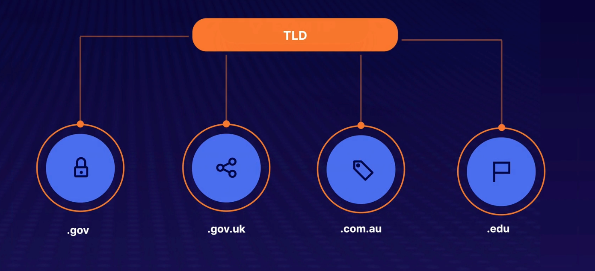

These top-level domain names are controlled by the **Internet Assigned Numbers Authority (IANA)** in a root zone database, which is essentially a database of all available top-level domains.

You can view this database by visiting: [http://www.iana.org/domains/root/db]()

### Domain Registrars

Because all names in a given domain name must be unique, there needs to be a way to organize this all so that domain names aren't duplicated. This is where domain registrars come in.

<Tip>
  A registrar is an authority that can assign domain names directly under or or
  more top-level domains. These domains are registered with InterNIC, a service
  of ICANN, which enforces uniqueness of domain names acorss the internet.
</Tip>

Popular Domain Registrars:

- domain.com
- GoDaddy
- Hover
- AWS
- Namecheap

### Common DNS Record Types

**SOA (Start of Authority)**  
Stores information about:

- The name of the server that supplied the data for the zone.
- The administrator of the zone.
- The current version of the data file.
- The default number of seconds for the time-to-live file on resource records.

**NS (Name Server)**  
Used by top-level domain servers to direct traffic to the content DNS server that contains the authoritative DNS records.

**A (Address)**

- The fundamental type of DNS record.
- Used by a computer to translate the name of the domain to an IP address.

For example, `http://www.acloud.guru` => `http://123.10.10.80`.

**CNAME (Canonical Name)**  
Can be used to resolve one domain name to another. For example, you may have a mobile website with the domain name `http://m.acloud.guru` that is used for when users browse to your domain name on their mobile devices.

For example, `http://m.acloud.guru` => `http://mobile.acloud.guru`.

### What is a TTL

The length that a DNS record is cached on either the resolving server or the user's own local PC is equal to the value of the **time to live (TTL)** in seconds.

The lower the time to live, the faster changes to DNS records take to propagate throughout the internet.

### Alias Records

Are used to map resource record sets in your hosted zone to load balancers, CloudFront distributions, or S3 buckets that are configured as websites.

Alias records work like a `CNAME` record in that you can map one DNS name (`www.example.com`) to another "target" DNS name (`elb1234.elb.amazonaws.com`).

| CNAME                                                         | A Record/Alias                                            |
| :------------------------------------------------------------ | :-------------------------------------------------------- |
| **Cannot** be used for naked domain names (zone apex record). | **Can** be used for a naked domain name/zone apex record. |
| You can't have a CNAME for `http://acloud.guru.com`.          |                                                           |

### What is Route 53

**Amazon's DNS Service**  
Allows you to register domain names, create hosted zones, and manage and create DNS records.

<Note>
  Route 53 is named after Route 66 (one of the original highways across the
  United States) but is called 53 because DNS operates on port 53.
</Note>

### Routing Policies

**7 Routing Policies Available with Route 53**

- Simple Routing
- Weighted Routing
- Latency-Based Routing
- Failover Routing
- Geolocation Routing
- Geoproximity Routing (Traffic Flow Only)
- Multivalue Answer Routing

### Exam Tips

<Note>
Understand the difference between an alias record and a CNAME.

Given the choice, always choose an alias record over a CNAME.

SOA records.

CNAME records.

NS Recrods.

A Records.

</Note>

## Register a Domain Name

- You can buy domain names directly with AWS.
- It can take up to 3 days to register depending on the circumstances.

## Demo: Using a Simple Routing Policy

### Simple Routing Policy

If you choose the simple routing policy, you can only have **one record with multiple IP addresses**. If you specify **multiple values in a record**, Route 53 returns **all values** to the user in a **random order**.

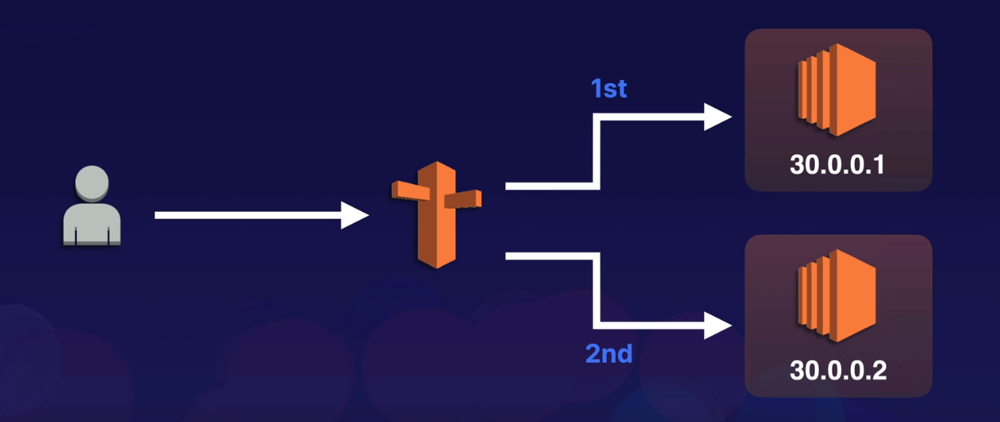

### Exam Tips

<Note>
  If you choose the simple routing policy, you can only have **one record with
  multiple IP addresses**. If you specify **multiple values in a record**, Route
  53 returns **all values** to the user in a **random order**.
</Note>

## Demo: Using a Weighted Routing Policy

### Weighted Routing Policy

Allows you to split your traffic based on different weights assigned.

<Note>
  For example, you can set 10% of your traffic to go to `us-east-1` and 90% to
  go to `eu-west-1`.
</Note>

### Health Checks

- You can set health checks on **individual** record sets.
- If a record set **fails** a health check, it will be removed from Route 53 until it **passes** the health check.
- You can set SNS notifications to **alert** you about failed health checks.

```
Specify endpoint by: IP address or Domain name
Protocol: HTTP
IP address: 52.192.111.92
Host name: index.html
Port: 80
Path: /
```

### Exam Tips

<Note>
  In this example, Route 53 sent 30% of the traffic to **London** and 70% of the
  traffic to **Tokyo**.
</Note>

## Demo: Using a Failover Routing Policy

### Failover Routing Policy

- Are used when you want to create an active/passive setup.
- For example, you may want your primary site to be in `eu-west-1` and your secondary DR Site in `ap-southeast-2`.
- Route 53 will monitor the health of your primary site using a health check.

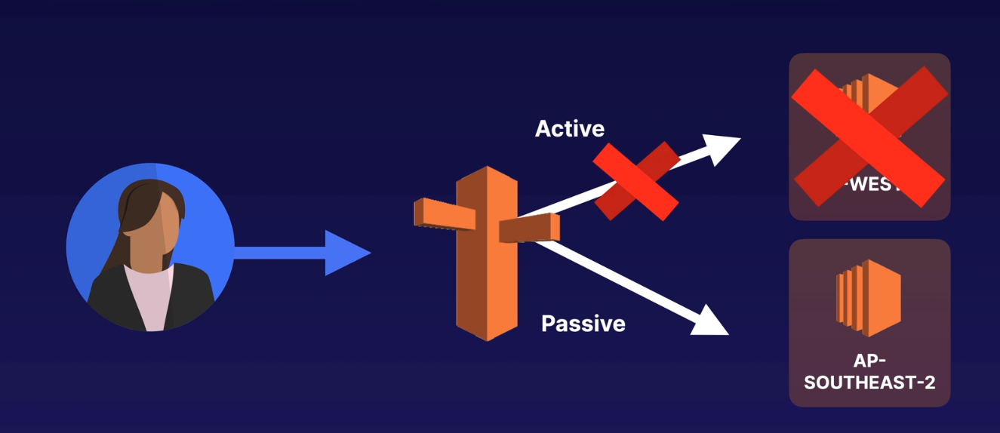

### Exam Tips

<Note>
  In this example Route 53 will send traffic to `ap-southeast-2` because it has
  detected a failure in `eu-west-2`.
</Note>

## Demo: Using a Geolocation Routing Policy

### Geolocation Routing Policy

Lets you choose **where your traffic will be sent** based on the geographic location of your users (i.e. the location from which DNS queries orignate).

### Use Cases

For example, you might want all queries from Europe to be routed to a fleet of EC2 instances that are specifically configured for your European customers.

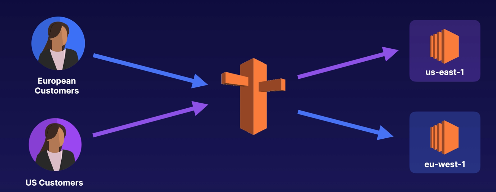

### Exam Tips

<Note>
  In this example, Route 53 will send the European customers to **London** and
  the US customers to **Tokyo**.
</Note>

## Demo: Using a Geoproximity Routing Policy

### Geoproximity Routing Policy

**Route 53 Traffic Flow**  
You can use Route 53 traffic flow to build a routing system that uses a combination of:

- Geographic location
- Latency
- Availability to route traffic

...from your users to your cloud or on-premises endpoints.

<Tip>
  You can build your traffic routing policies from scratch, or you can pick a
  template from a library and then customize it.
</Tip>

**Geoproximity Routing (Traffic Flow Only)**

- Lets Amazon Route 53 route traffic to your resources based on the geographic location of your users and your resources.
- You can also optionally choose to route more traffic or less to a given resource by specifying a value, known as a **bias**.

<Note>
  A bias expands or shrinks the size of the geographic region from which traffic
  is routed to a resource.
</Note>

### Exam Tips

<Note>
**Geoproximity routing** lets Amazon Route 53 route traffic to your resources based on the geographic location of your users and your resources.

**You can also optionally choose to route more traffic or less to a given resource by specifying a value, known as a bias.** A bias expands or shrinks the size of the geographic region from which traffic is routed to a resource.

To use **geoproximity routing**, you must use Route 53 **traffic flow**.

</Note>

## Demo: Using a Latency Routing Policy

### Latency Routing Policy

Allows you to route your traffic based on **the lowest network latency for your end user** (i.e. which region will give them the fastest response time).

**Latency Resource Record Set**

To use latency-based routing, you create a latency resource record set for the EC2 (or ELB) resource in each region that hosts your website.

When Route 53 receives a query for your site, it selects the latency resource record set for the region that gives the user the lowest latency.

Route 53 then responds with the value associated with that resource record set.

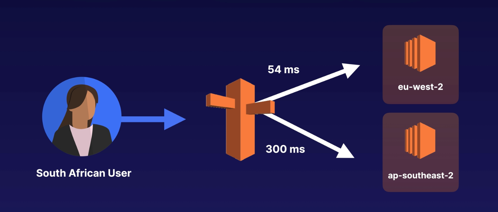

### Exam Tips

<Note>
  In this example, Route 53 send the traffic to `eu-west-2` because it has a
  much lower latency than `ap-southeast-2`.
</Note>

## Demo: Using a Multivalue Routing Policy

### Multivalue Answer Routing

Lets you **configure Amazone Route 53 to return multiple values**, such as IP addresses for your web servers, in response to DNS queries.

**Similar To Simple Routing**

You can specify multiple values for almost any record, but multivale answer routing also lets you check the health of each resource, so Route 53 returns only values for healthy resources.

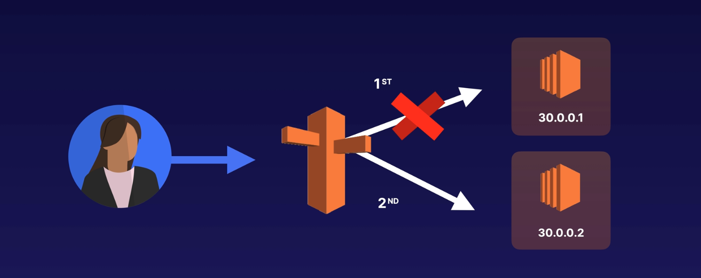

## Quiz: Route 53

<Note>
Which of the following statements about Amazon Route 53 is true?

**You can associate multiple IP addresses with a single record.**

Using Route 53, how would you direct `example.com` traffic to 1 primary IP with a second one for backup?

**Use a failover routing policy.**

Which of the following statements about Route 53 and domain names is true?

**Route 53 allows you to register a domain programmatically.**

Route 53 is a managed [_] service?

**DNS**

Which of the following statements about Route 53 is true?

**Route 53 supports both IPv4 and IPv6.**

</Note>

# Chapter 10 - Elastic Load Balancing (ELB)

- [ELB Overview](#elb-overview)
- [Using Application Load Balancers](#using-application-load-balancers)
- [Extreme Performance with Network Load Balancers](#extreme-performance-with-network-load-balancers)
- [Using the Classic Load Balancer](#using-the-classic-load-balancer)
- [Getting "Stuck" with Sticky Sessions](#getting-stuck-with-sticky-sessions)
- [Leaving the Load Balancer with Deregistration Delay](#leaving-the-load-balancer-with-deregistration-delay)
- [Lab: Use Application Load Balancers for Web Servers](#lab-use-application-load-balancers-for-web-servers)
- [Quiz: Elastic Load Balancing (ELB)](#quiz-elastic-load-balancing-elb)

## ELB Overview

### What is Elastic Load Balancing

Automatically distributes incoming application traffic across multiple targets, such as Amazon EC2 instances. This can be done across multiple AZs.

### Types of Load Balancers

**Application** Load Balancer  
Best suited for load balancing of HTTP/S traffic. They operate at Layer 7 and are application aware.

Intelligent Load Balancer.

**Network** Load Balancer  
Operating at the connection level (Layer 4) on the OSI Model, Network Load Balancers are capable of handling millions of requests per second, while maintaining ultra-love latencies.

Performance Load Balancer

**Gateway** Load Balancer  
Operating at the Network Level on the OSI Model (Layer 3), you should use Gateway Load Balancer when deploying inline virtual appliances where network traffic is not destined for the Gateway Load Balancer itself.

For Inline Virtual Appliance Load Balancing

**Classic** Load Balancer  
Legacy load balancers. You can load balance HTTP/S applications and use Layer 7-specific features, such as X-Forwarded and sticky sessions.

Classic/Test/Dev Load Balancer

### Health Checks

All AWS load balancers can be configured with health checks. Health checks periodically send requests to load balancers' registered instances to test their status.

<Tip>
  The status of the instances that are healthy at the time of the health check
  is `InService`.
</Tip>

The load balancer performs health checks on all registered instances, whether the instance is in a healthy state or an unhealthy state.

<Tip>
  The status of any instances that are unhealthy at the time of the health check
  is `OutOfService`.
</Tip>

The **load balancer** routes requests only to the healthy instances. When the load balancer determines an instance is unhealthy, it stops routing requests to that instance.

<Note>
  The load balancer resumes routing requests to the instance when it has been
  restored to a healthy state.
</Note>

### Exam Tips

<Note>
Application Load Balancers

Network Load Balancers

Gateway Load Balancers

Classic Load Balancers

You can use **health checks** to route your traffic to instances or targets that are healthy.

</Note>

## Using Application Load Balancers

### Layer 7 Load Balancing

An Application Load Balancer functions at the Application Layer - the seventh layer of the Open Systems Interconnection (OSI) model. After the load balancer receives a request, it evaluates the listener rules in priority order to determine which rule to apply, and then selects a target from the target group for the rule action.

### Listeners, Rules, and Target Groups

**Listeners**

- A listener checks for connection requests from clients, using the protocol and port you configure.
- You define rules that determine how the load balancer routes requests to its registered targets.
- Each rule consists of a priority, one or more actions, and one or more conditions.

**Rules**

When the conditions for a rule are met, then its actions are performed. You must define a default rule for each listener, and you can **optionally define additional rules**.

**Target Groups**

Each **target group** routes requests to one or more registered targets, such as EC2 instances, using the protocol and port number you specify.

### Path-Based Routing

Intelligent routing that forwards requests to different EC2 instances based on the path of the hostname.

### Application Load Balancer Diagram

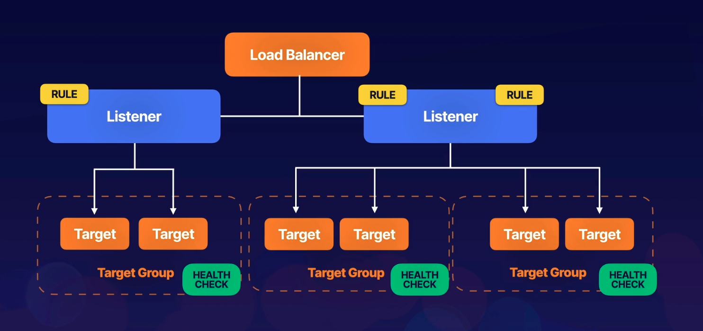

### Limitations of Application Load Balancers

<Tip>Application Load Balancers only support `HTTP/S`.</Tip>

**HTTP Load Balancing**  
To use an HTTPS listener, you must deploy at least one SSL/TLS server certificate on your load balancer. The load balancer uses a server certificate to terminate the frontend connection and then decrypt requests from clients before sending them to the targets.

### Exam Tips

<Note>
**Listeners:** A listener checks for connection requests from clients, using the protocol and port you configure.

**Rules:** Determine how the load balancer routes requests to its registered targets. Each rule consists of a priority, one or more actions, and one or more conditions.

**Target Groups:** Each target group routes requests to one or more registered targets, such as EC2 instances, using the protocol and port number you specify.

**Limitations:** Application Load Balancers only support `HTTP/S`.

**HTTPS:** To use an HTTPS listener, you must deploy at least one SSL/TLS server certificate on your load balancer. The load balancer uses a server certificate to terminate the frontend connection and then decrypt requests from clients before sending them to the targets.

</Note>

## Extreme Performance with Network Load Balancers

### Layer 4 Load Balancing

A Network Load Balancer functions at the fourth layer of the Open Systems Interconnection (OSI) model. It can handle millions of requests per second.

### Requests Received, Listeners, and Target Groups

**Request Received**

After the load balancer receives a connection request, it selects a target from the target group for the default rule.

It attempts to open a TCP connection to the selected target on the port specified in the listener configuration.

**Listeners**

Checks for connection requests from clients, using the protocol and port you configure.

The listener on a Network Load Balancer then forwards the request to the target group. There are no rules, unlike with Application Load Balancers.

**Target Groups**

Each **target group** routes requests to one or more registered targets, such as EC2 instances, using the protocol and port number you specify.

### Ports and Protocols

| Protocols              | Ports   |
| :--------------------- | :------ |
| TCP, TLS, UDP, TCP_UDP | 1-65535 |

### Use Cases

<Tip>
  Network Load Balancers are **best suited for load balancing of TCP traffic**
  where extreme performance is required. Operating at the connection level
  (Layer 4), Network Load Balancers are capable of handling millions of requests
  per second, while maintaining ultra-low latencies.

**Use for extreme performance!**

</Tip>

### Encryption

You can use a TLS listener to offload the work of encryption and decryption to your load balancer so your applications can focus on their business logic.

If the listener protocol is TLS, you must deploy exactly one SSL server certificate on teh listener.

### Exam Tips

<Note>
Network Load Balancers operate at Layer 4.

Use where you need extreme performance.

Other use cases are where you need protocols not supported by Application Load Balancers.

Network Load Balancers can decrypt traffic, but you will need to install the certificate on the load balancer.

</Note>

## Using the Classic Load Balancer

### Classic Load Balancers

Are the legacy load balancers. You can load balance HTTP/S applications and use Layer 7-specific features, such as X-Forwarded and sticky sessions. You can also use strict Layer 4 load balancing for applications that rely purely on the TCP protocol.

### X-Forwarded-For

When traffic is sent from a load balancer, the server access logs contain the IP address of the proxy or load balancer only.

<Tip>
  To see the original IP address of the client, the `x-forwarded-for` request
  header is used.
</Tip>

### Gateway Timeouts

If your application stops responding, the Classic Load Balancer responds with a 504 error.

This means the application is having issues. This could be either at the web server layer or database layer.

### Exam Tips

<Note>
**A 504 error means the gateway has timed out.**
This means the application is not responding within the idle timeout period.

**Troubleshoot the application.**
Is it the web server or the database server.

**Need the IPv4 address of your end user?**
Look for the `x-forwarded-for` header.

</Note>

## Getting "Stuck" with Sticky Sessions

### What are Sticky Sessions

**Classic Load Balancers** route each request independently to the registered EC2 instance with the smallest load.

Sticky sessions allow you to bind a user's session to a specific EC2 instance. This ensures all requests from the user during the session are sent to the same instance.

<Tip>
  You can **enable sticky sessions** for Application Load Balancers as well, but
  the traffic will be sent at the target group level.
</Tip>

### Network Diagram

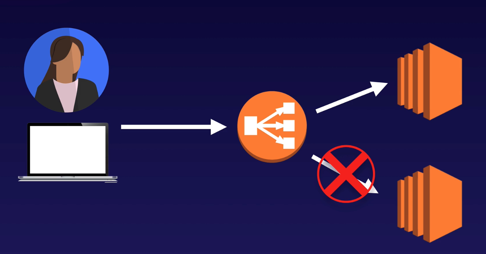

### Exam Tips

<Note>
  **Sticky sessions** enable your users to stick to the **same EC2 instance**.
  Can be useful if you are **storing information locally** to that instance.

You may see a **scenario-based question** where you remove an EC2 instance from a pool, but the load balancer **continues to direct traffic** to that EC2 instance.

To solve a scenraio like this, **disable** sticky sessions.

</Note>

## Leaving the Load Balancer with Deregistration Delay

### What is Deregistration Delay

Allows Load Balancers to keep existing connections open if the EC2 instances are de-registered or become unhealthy.

This enables the load balancer to complete in-flight requests made to instances that are de-registering or unhealthy.

<Tip>
  You can disable deregistration delay if you want your load balancer to
  immediately close connections to the instances that are de-registering or have
  become unhealthy.
</Tip>

### Exam Tips

<Note>
**Enable deregistration delay:** Keep existing connections open if the EC2 instance becomes unhealthy.

**Disable deregistration delay:** Do this if you want your load balancer to immediately close connections to the instances that are de-registering or have become unhealthy.

</Note>

## Lab: Use Application Load Balancers for Web Servers

### Observe the Provided EC2 Website and Create a Second Server

1. Navigate to **EC2**.
2. Click **Instances (running)**.
3. Select the box next to `webserver-01`.
4. Copy its **Public IPv4 address**.

<Note>
  **Note:** Do NOT try clicking on the open address link as it won't work.
</Note>

5. In a new browser tab, paste in the public IP address you just copied. You should see the load balancer demo page.
6. Back in the EC2 console, at the top, click **Launch instances**.
7. Under **Name and Tags**, enter "`webserver2`".
8. Under **Application and OS Images (Amazon Machine Image)**, select **Ubuntu** and `Ubuntu Server 22.04 LTS`.

<Note>
  **Note:** If you get a popup window that tells you some of your current
  settings will be changed, click on Confirm changes.
</Note>

9. Under **Instance Type**, select `t3.micro`.
10. Under **Key pair (login)**, in the dropdown, select **Proceed without a key pair**.
11. Under **Network settings**, click **Edit** and set **Auto-assign Public IP** to **Enable**.
12. Under **Network settings** > **Firewall (security groups)**, click **Select existing security group** and select the one with `EC2SecurityGroup` in its name (not the default security group).
13. Under **Advanced Details**, in the **User Data** box, enter the following bootstrap script:

```sh
#!/bin/bash

# Update and install necessary packages
sudo apt-get update -y
sudo apt-get install -y apache2 unzip

# Fetching the token for IMDSv2
TOKEN=`curl -X PUT "http://169.254.169.254/latest/api/token" -H "X-aws-ec2-metadata-token-ttl-seconds: 21600"`

# Starting HTML file
echo '<html><center><body bgcolor="black" text="#39ff14" style="font-family: Arial"><h1>Load Balancer Demo</h1><h3>Availability Zone: ' > /var/www/html/index.html

# Using the token to fetch metadata
echo $(curl -H "X-aws-ec2-metadata-token: $TOKEN" http://169.254.169.254/latest/meta-data/placement/availability-zone) >> /var/www/html/index.html
echo '</h3> <h3>Instance Id: ' >> /var/www/html/index.html
echo $(curl -H "X-aws-ec2-metadata-token: $TOKEN" http://169.254.169.254/latest/meta-data/instance-id) >> /var/www/html/index.html
echo '</h3> <h3>Public IP: ' >> /var/www/html/index.html
echo $(curl -H "X-aws-ec2-metadata-token: $TOKEN" http://169.254.169.254/latest/meta-data/public-ipv4) >> /var/www/html/index.html
echo '</h3> <h3>Local IP: ' >> /var/www/html/index.html
echo $(curl -H "X-aws-ec2-metadata-token: $TOKEN" http://169.254.169.254/latest/meta-data/local-ipv4) >> /var/www/html/index.html

# Ending HTML file
echo '</h3></html> ' >> /var/www/html/index.html

# - Ensure the Apache2 service is enabled and started.
sudo systemctl enable apache2
sudo systemctl start apache2
```

14. Click **Launch Instance**.
15. Click the **Instance ID** (this will start with `i-`).
16. Once it's in the Running state, copy the **Public IPv4 address**.

<Note>
  **Note:** Do NOT try clicking on the open address link as it won't work.
</Note>

17. In a new browser tab, paste in the public IP address you just copied. You should see the load balancer demo page again, which means the legacy clone is successfully running. This time, though, it will have a different instance ID, public IP, and local IP listed.

<Note>
  **Note:** If your second EC2 doesn't open the demo page, it may need a couple
  of minutes to finish provisioning. Wait for the **Status check** column to
  show "**2/2 checks passed**".
</Note>

### Create an Application Load Balancer

1. Back in the EC2 console, click **Load Balancers** in the left-hand menu.
2. Click **Create Load Balancer**.
3. From the **Application Load Balancer** card, click **Create**.
4. For **Load balancer name**, enter `LegacyALB`.
5. Under **Network mapping**, click the **VPC** dropdown, and select the listed VPC.
6. When the **Availability Zones** list pops up, select each one (`us-east-1a`, `us-east-1b`, and `us-east-1c`).
7. Under **Security groups**, deselect the default security group listed, and select the one from the dropdown with `EC2SecurityGroup` in its name.
8. Under **Listeners and routing**, ensure that the **Protocol** is set to **HTTP** and the **Port** is `80`. Then, under **Default action**, click **Create target group** This will open a new tab. Keep this first tab open to complete later.
9. For **Target group name**, enter `TargetGroup`.
10. Click **Next**.
11. Under **Available instances**, select both targets that are listed.
12. Click **Include as pending below**.
13. Click **Create target group**.
14. Back in the first tab, under **Default action**, click the refresh button (looks like a circular arrow), and in the dropdown, select the `TargetGroup` you just created.
15. Click **Create load balancer**.
16. On the next screen, click **View load balancer**.
17. Wait a few minutes for the load balancer to finish provisioning and enter an active state.
18. Copy its **DNS name**, and paste it into a new browser tab. You should see the load balancer demo page again. The local IP lets you know which instance you were sent (or "load balanced") to.
19. Refresh the page a few times. You should see the other instance's local IP listed, meaning it's successfully load balancing between the two EC2 instances.

### Enable Sticky Sessions

1. Back on the **EC2** > **Load Balancers** page, select the **Listeners** tab.
2. Click the **TargetGroup** link in the **Default action** column, which opens the target group.
3. Select the **Attributes** tab.
4. Click **Edit**.
5. Check the box next to **Stickiness** to enable it.
6. Leave **Stickiness type** set to **Load balancer generated cookie**.
7. Leave **Stickiness duration** set to **1 days**.
8. Click **Save changes**.
9. Refresh the tab where you navigated to the load balancer's public IP. This time, no matter how many times you refresh, it will stay on the same instance (noted by the local IP).

## Quiz: Elastic Load Balancing (ELB

<Note>
Which of the following statements about Application Load Balancers (ALBs) is true?

**Application Load Balancers can be configured to use static IPs by partnering with a Network Load Balancer.**

_In AWS, an Application Load Balancer (ALB) typically uses dynamic IP addressing. If you need your ALB to have a static IP address, you can achieve this by using a Network Load Balancer (NLB). You can associate the NLB with an Elastic IP address, which is a static, public IPv4 address, and then register your ALB as a target of the NLB. This setup effectively allows the ALB to use a static IP address, although it requires additional configuration and is not the default behavior of an ALB._

Which of the following is NOT an AWS ELB load balancer?

**Geolocation Load Balancer (GLB)**

_This is not an AWS ELB load balancer. Geolocation routing policy is an Amazon Route 53 routing policy that should be used when you want to route traffic based on the location of your users. Reference Documentation: Elastic Load Balancing [https://aws.amazon.com/elasticloadbalancing/]()_

What kind of ELB load balancer would you select if you need to route traffic based on the contents of the request?

**Application Load Balancer (ALB)**

_ALBs allow you to route traffic based on the contents of the requests. Reference: Application Load Balancer [https://aws.amazon.com/elasticloadbalancing/application-load-balancer/]()_

If you're building an application that needs to support an extreme level of networking traffic, which type of ELB load balancer would you pick?

**Network Load Balancer (NLB)**

_NLBs excel when you need extreme levels of performance. Reference Documentation: Network Load Balancer [https://aws.amazon.com/elasticloadbalancing/network-load-balancer/]()_

What happens if all registered targets in a Network Load Balancer (NLB) are unhealthy?

**It will try to send traffic to all the instances.**

When the NLB has only unhealthy registered targets, the Network Load Balancer routes requests to all the registered targets, known as fail-open mode.

_Reference Documentation: Health Checks for Your Target Groups [https://docs.aws.amazon.com/elasticloadbalancing/latest/network/target-group-health-checks.html]()_

</Note>
